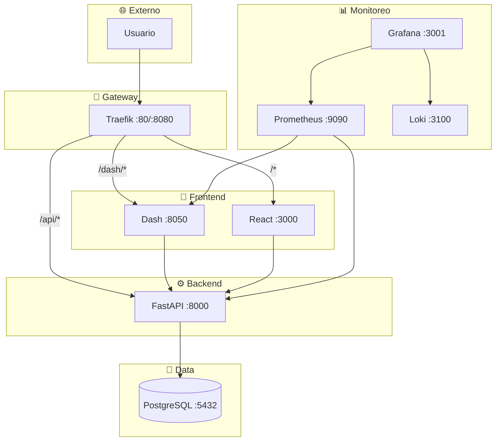

# 🚀 Cloud-Native Microservices Learning Platform


## 🌟 Visión General

Este proyecto implementa una plataforma cloud-native basada en microservicios, diseñada para operar sistemas distribuidos utilizando un stack tecnológico moderno y relevante en la industria.


Características principales:
- Múltiples servicios containerizados (FastAPI, Dash, React)
- API Gateway con Traefik para enrutamiento dinámico
- Base de datos PostgreSQL persistente
- Frontend React TypeScript y Dashboard interactivo con Dash Python
- Sistema de monitoreo completo con Prometheus, Grafana y Loki
- Pipeline CI/CD automatizado con GitHub Actions
- Despliegue a Kubernetes en Google Cloud Platform (GCP)

Este repositorio contiene la planificación, arquitectura y configuración completa del sistema en `docs/MICROSERVICES_MASTER_PLAN.md`.


## 🛠️ Stack Tecnológico

| Componente          | Tecnología                               |
| :------------------ | :--------------------------------------- |
| **API Backend**     | FastAPI (Python)                         |
| **Dashboard**       | Dash + Plotly (Python)                   |
| **Frontend SPA**    | React + TypeScript + Vite                |
| **Base de Datos**   | PostgreSQL 16                            |
| **API Gateway**     | Traefik v2.5                              |
| **Monitoreo**       | Prometheus, Grafana, Loki                |
| **CI/CD**           | GitHub Actions                           |
| **Infraestructura** | Kubernetes (GKE), Docker, Terraform      |
| **Lenguajes**      | Python, TypeScript                       |

## 🗺️ Arquitectura General



## 📚 Documentación

### Inicio Rápido
- [Planificación y Arquitectura](docs/MICROSERVICES_MASTER_PLAN.md) - Documento maestro del proyecto
- [Credenciales de Desarrollo](docs/DEVELOPMENT_CREDENTIALS.md) - Acceso a servicios locales

### Base de Datos
- **[Guía Completa de Base de Datos](docs/DATABASE_GUIDE.md)** - 📘 Documentación centralizada (diseño, ERD, crear tablas, comandos)
- [Crear Nueva Tabla](docs/DATABASE_NEW_TABLE_GUIDE.md) - Guía paso a paso
- [Cheatsheet de BD](docs/DATABASE_CHEATSHEET.md) - Comandos rápidos

### Desarrollo
- [Workflow con Claude Code](docs/CLAUDE_CODE_WORKFLOW.md) - Flujo de trabajo y mejores prácticas
- [Workflow de Base de Datos](docs/WORKFLOW_DATABASE.md) - Ciclo completo de desarrollo

### Infraestructura
- [Configuración de Traefik](docs/TRAEFIK_ROUTING_CONFIG.md) - Enrutamiento y gateway

Ver [documentación completa](docs/README.md) para más recursos.

## 🚀 Inicio Rápido

```bash
# Clonar el repositorio
git clone https://github.com/JavierArriagada/Cloud-Native-Microservices-Learning-Platform.git
cd Cloud-Native-Microservices-Learning-Platform

# Levantar todos los servicios
docker compose -f infrastructure/docker/docker-compose.yml up -d

# Aplicar migraciones de base de datos
cd services/api && make db-migrate

# Cargar datos de ejemplo
make db-seed
```

### Acceso a Servicios

| Servicio | URL | Descripción |
|----------|-----|-------------|
| React App | http://localhost | Frontend principal |
| FastAPI | http://localhost/api | Backend API |
| API Docs | http://localhost/api/docs | Documentación interactiva |
| Dash Dashboard | http://localhost/dash | Dashboard de métricas |
| Traefik Dashboard | http://localhost:8080 | Gateway y enrutamiento |
| Grafana | http://localhost:3001 | Monitoreo y visualización |
| Prometheus | http://localhost:9090 | Métricas del sistema |
| Adminer | http://localhost:8080 | Administrador de BD |

Ver [credenciales de desarrollo](docs/DEVELOPMENT_CREDENTIALS.md) para usuarios y contraseñas.

## 🗄️ Base de Datos

El proyecto usa PostgreSQL 16 con:
- SQLAlchemy para migraciones (Alembic)
- Queries SQL puras con asyncpg (runtime)
- Pydantic para validación de esquemas

### Tablas Actuales
- `users` - Usuarios del sistema
- `roles` - Roles para RBAC
- `user_roles` - Relación many-to-many users-roles
- `sessions` - Sesiones JWT
- `audit_logs` - Auditoría de acciones

Ver [diagrama ERD completo](docs/DATABASE_GUIDE.md#diagrama-entidad-relación).

### Crear Nueva Tabla

```bash
# Opción 1: Script interactivo (recomendado)
./services/api/scripts/create_table.sh

# Opción 2: Makefile automatizado
make -f services/api/Makefile.database db-new-table
```

Ver [guía completa de base de datos](docs/DATABASE_GUIDE.md) para más detalles.

## 🤝 Contribuir

1. Fork el proyecto
2. Crea una rama para tu feature (`git checkout -b feature/AmazingFeature`)
3. Commit tus cambios (`git commit -m 'Add some AmazingFeature'`)
4. Push a la rama (`git push origin feature/AmazingFeature`)
5. Abre un Pull Request

## 📝 Licencia

Este proyecto está bajo la Licencia MIT. Ver archivo `LICENSE` para más detalles.

## 👥 Autores

- **Javier Arriagada** - [GitHub](https://github.com/JavierArriagada)