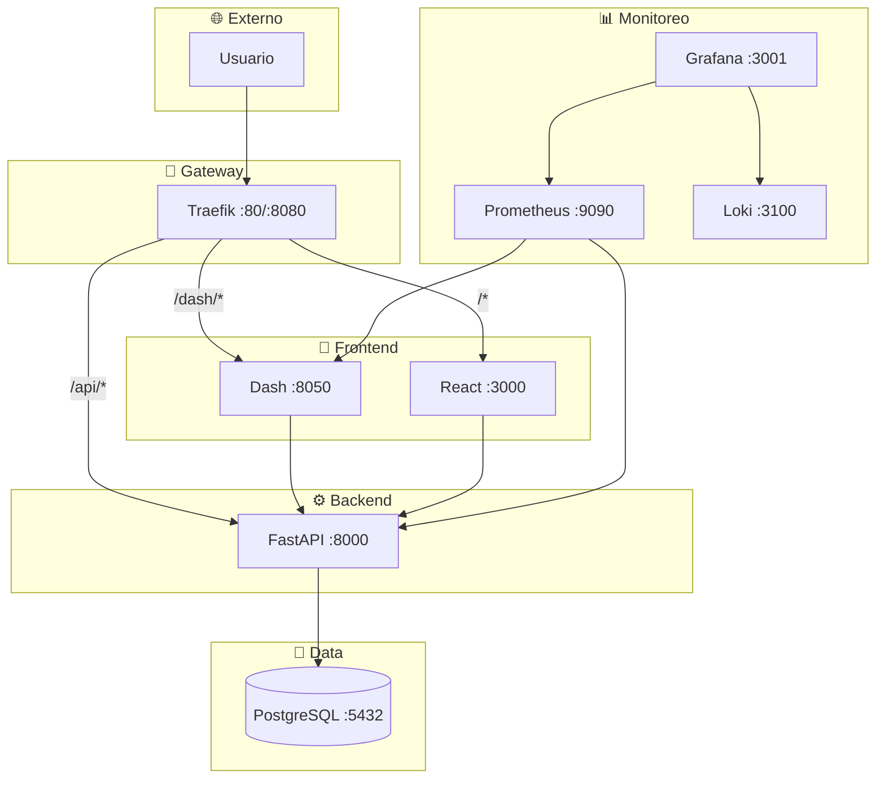

# 🚀 Cloud-Native Microservices Learning Platform

## 🌟 Visión General

Este proyecto es una **plataforma de aprendizaje práctica** diseñada para dominar arquitecturas de microservicios cloud-native. A través de la implementación de una aplicación completa, los usuarios aprenderán a construir, desplegar y operar sistemas distribuidos utilizando un stack tecnológico moderno y relevante en la industria.

La plataforma incluye:

-   ✅ Múltiples servicios containerizados (FastAPI, Dash, React)
-   ✅ API Gateway con Traefik para enrutamiento dinámico
-   ✅ Base de datos PostgreSQL persistente
-   ✅ Frontend React TypeScript y un Dashboard interactivo con Dash Python
-   ✅ Sistema de monitoreo completo con Prometheus, Grafana y Loki
-   ✅ Pipeline CI/CD automatizado con GitHub Actions
-   ✅ Despliegue a Kubernetes en Google Cloud Platform (GCP)

Este repositorio sirve como una guía paso a paso, acompañada de un documento maestro de planificación (`docs/MICROSERVICES_MASTER_PLAN.md`), para construir cada componente desde cero.

## 🎯 Objetivos de Aprendizaje

Al completar este proyecto, desarrollarás competencias clave en:

-   **Containerización y Orquestación:** Docker, Docker Compose, Kubernetes.
-   **Desarrollo Backend y Frontend:** FastAPI, React, Dash, PostgreSQL.
-   **DevOps:** CI/CD con GitHub Actions, Infrastructure as Code.
-   **Observabilidad:** Monitoreo con Prometheus, Grafana, Loki.
-   **Cloud:** Despliegue en GCP (GKE), gestión de servicios cloud.

## 🛠️ Stack Tecnológico

| Componente          | Tecnología                               |
| :------------------ | :--------------------------------------- |
| **API Backend**     | FastAPI (Python)                         |
| **Dashboard**       | Dash + Plotly (Python)                   |
| **Frontend SPA**    | React + TypeScript + Vite                |
| **Base de Datos**   | PostgreSQL 16                            |
| **API Gateway**     | Traefik v2.5                              |
| **Monitoreo**       | Prometheus, Grafana, Loki                |
| **CI/CD**           | GitHub Actions                           |
| **Infraestructura** | Kubernetes (GKE), Docker, Terraform      |
| **Lenguajes**      | Python, TypeScript                       |

## 🗺️ Arquitectura General

