# 🚀 Cloud-Native Microservices Learning Platform

## 🌟 Visión General

Este proyecto implementa una plataforma cloud-native basada en microservicios, diseñada para operar sistemas distribuidos utilizando un stack tecnológico moderno y relevante en la industria.

Características principales:
- Múltiples servicios containerizados (FastAPI, Dash, React)
- API Gateway con Traefik para enrutamiento dinámico
- Base de datos PostgreSQL persistente
- Frontend React TypeScript y Dashboard interactivo con Dash Python
- Sistema de monitoreo completo con Prometheus, Grafana y Loki
- Pipeline CI/CD automatizado con GitHub Actions
- Despliegue a Kubernetes en Google Cloud Platform (GCP)

Este repositorio contiene la planificación, arquitectura y configuración completa del sistema en `docs/MICROSERVICES_MASTER_PLAN.md`.

## 🛠️ Stack Tecnológico

| Componente          | Tecnología                               |
| :------------------ | :--------------------------------------- |
| **API Backend**     | FastAPI (Python)                         |
| **Dashboard**       | Dash + Plotly (Python)                   |
| **Frontend SPA**    | React + TypeScript + Vite                |
| **Base de Datos**   | PostgreSQL 16                            |
| **API Gateway**     | Traefik v2.5                              |
| **Monitoreo**       | Prometheus, Grafana, Loki                |
| **CI/CD**           | GitHub Actions                           |
| **Infraestructura** | Kubernetes (GKE), Docker, Terraform      |
| **Lenguajes**      | Python, TypeScript                       |

## 🗺️ Arquitectura General

```mermaid
flowchart TB
    subgraph EXTERNAL["🌐 Externo"]
        USER[Usuario]
    end
    subgraph GATEWAY["🚪 Gateway"]
        TR[Traefik :80/:8080]
    end
    subgraph FRONTEND["🎨 Frontend"]
        DASH[Dash :8050]
        REACT[React :3000]
    end
    subgraph BACKEND["⚙️ Backend"]
        API[FastAPI :8000]
    end
    subgraph DATA["💾 Data"]
        PG[(PostgreSQL :5432)]
    end
    subgraph MONITORING["📊 Monitoreo"]
        PROM[Prometheus :9090]
        GRAF[Grafana :3001]
        LOKI[Loki :3100]
    end
    USER --> TR
    TR -->|/api/*| API
    TR -->|/dash/*| DASH
    TR -->|/*| REACT
    DASH --> API
    REACT --> API
    API --> PG
    PROM --> API
    PROM --> DASH
    GRAF --> PROM
    GRAF --> LOKI
```

