# 🔄 Guía Completa de Alembic

## Document Técnico: Gestión de Migraciones de Base de Datos

**Versión:** 1.0.0
**Fecha:** 2025-12-19
**Propósito:** Guía completa para gestionar migraciones de base de datos con Alembic

---

## 📚 Tabla de Contenidos

| Sección | Contenido |
|---------|-----------|
| [1. ¿Qué es Alembic?](#1-qué-es-alembic) | Introducción y teoría |
| [2. Conceptos Clave](#2-conceptos-clave) | Migraciones, autogenerate, etc. |
| [3. Arquitectura](#3-arquitectura-en-este-proyecto) | Cómo está configurado |
| [4. Comandos](#4-comandos-de-alembic) | Todos los comandos disponibles |
| [5. Workflow](#5-workflow-de-desarrollo) | Flujo de trabajo típico |
| [6. Ejemplos](#6-ejemplos-prácticos) | Casos de uso reales |
| [7. Mejores Prácticas](#7-mejores-prácticas) | Recomendaciones |
| [8. Troubleshooting](#8-troubleshooting) | Problemas comunes |

---

## 1. ¿Qué es Alembic?

### 1.1 Definición

**Alembic** es una herramienta de migración de bases de datos para Python, creada por el autor de SQLAlchemy. Permite gestionar cambios en el esquema de la base de datos de forma versionada y reproducible.

### 1.2 ¿Por qué usar Alembic?

| Problema sin Alembic | Solución con Alembic |
|---------------------|----------------------|
| Cambios manuales en DB (propensos a errores) | Migraciones versionadas y revisables |
| Difícil sincronizar equipos | Migrations en Git, todos sincronizados |
| Rollback complicado | Comando simple: `alembic downgrade` |
| Sin historial de cambios | Historial completo en `alembic_version` table |
| Esquema diferente en dev/staging/prod | Mismo código de migración en todos los ambientes |

### 1.3 Analogía

Think of Alembic como **Git para tu base de datos**:
- **Commits** = Migrations
- **git log** = `alembic history`
- **git revert** = `alembic downgrade`
- **git push** = Aplicar migrations en otro ambiente

---

## 2. Conceptos Clave

### 2.1 Migration (Migración)

Una **migration** es un archivo Python que describe un cambio en el esquema de la base de datos.

**Estructura de una Migration:**
```python
"""create users table

Revision ID: abc123
Revises:
Create Date: 2025-12-19 10:30:00

"""
from alembic import op
import sqlalchemy as sa

# Identificadores
revision = 'abc123'
down_revision = None  # Migration anterior
branch_labels = None
depends_on = None

def upgrade() -> None:
    """Aplicar cambios (forward)"""
    op.create_table(
        'users',
        sa.Column('id', sa.UUID(), primary_key=True),
        sa.Column('email', sa.String(255), nullable=False),
        # ...
    )

def downgrade() -> None:
    """Revertir cambios (backward)"""
    op.drop_table('users')
```

**Componentes:**
- `revision`: ID único de esta migration
- `down_revision`: ID de la migration anterior (crea una cadena)
- `upgrade()`: Qué hacer al aplicar (forward)
- `downgrade()`: Qué hacer al revertir (backward)

### 2.2 Autogenerate

**Autogenerate** es la capacidad de Alembic de **generar migraciones automáticamente** comparando:
1. **Estado actual de la DB** (leyendo tablas existentes)
2. **Modelos SQLAlchemy definidos** (tu código Python)

**Ventaja:** No escribes el código de migración manualmente.

**Ejemplo:**
```bash
# Defines un nuevo modelo en Python
class User(Base):
    __tablename__ = "users"
    id = Column(UUID, primary_key=True)
    email = Column(String(255))

# Alembic detecta el cambio y genera:
alembic revision --autogenerate -m "add users table"

# Resultado: Archivo de migración creado automáticamente
```

### 2.3 Revision (Revisión)

Cada migration tiene un **revision ID** único (ej: `abc123def`).

Las revisiones forman una **cadena secuencial**:
```
None -> abc123 -> def456 -> ghi789 (HEAD)
         ↓         ↓         ↓
      inicial   add users  add roles
```

### 2.4 HEAD

**HEAD** es la **última migration** en la cadena (la más reciente).

```bash
# Ver cuál es el HEAD actual
alembic heads

# Aplicar todas las migrations hasta el HEAD
alembic upgrade head
```

### 2.5 alembic_version Table

Alembic crea una tabla especial `alembic_version` en tu base de datos que almacena:
- Qué migration está aplicada actualmente

```sql
SELECT * FROM alembic_version;
-- | version_num |
-- |-------------|
-- | ghi789      |  <- Migration actual aplicada
```

---

## 3. Arquitectura en este Proyecto

### 3.1 Estructura de Directorios

```
services/api/
├── alembic/
│   ├── versions/               # Migraciones generadas
│   │   ├── abc123_initial_schema.py
│   │   ├── def456_add_roles.py
│   │   └── ...
│   ├── env.py                  # Configuración de Alembic
│   └── script.py.mako          # Template para nuevas migrations
├── alembic.ini                 # Configuración principal
├── app/
│   ├── db_models/              # Modelos SQLAlchemy (SOLO para Alembic)
│   │   ├── __init__.py
│   │   ├── user.py
│   │   ├── role.py
│   │   └── ...
│   ├── models/                 # Pydantic schemas (para API)
│   └── database.py             # asyncpg connection pool
└── requirements.txt
```

### 3.2 Configuración en env.py

El archivo `alembic/env.py` es el **cerebro** de Alembic. Aquí definimos:

```python
# Import metadata from db_models
from app.db_models import metadata as db_metadata

# Tell Alembic to use this metadata for autogenerate
target_metadata = db_metadata

# Database URL from environment
config.set_main_option("sqlalchemy.url", settings.DATABASE_URL)
```

**Flujo:**
1. Alembic lee `target_metadata` (tus modelos SQLAlchemy)
2. Compara con el estado actual de la DB
3. Genera migration con las diferencias

### 3.3 IMPORTANTE: Modelos SQLAlchemy vs Pydantic

En este proyecto usamos **2 tipos de modelos**:

| Tipo | Ubicación | Uso | ORM? |
|------|-----------|-----|------|
| **SQLAlchemy** | `app/db_models/` | SOLO para Alembic autogenerate | ❌ NO usar en runtime |
| **Pydantic** | `app/models/` | Validación de requests/responses API | ✅ Usar en runtime |

**Queries en runtime:** Usar SQL puro con `asyncpg`, NO SQLAlchemy ORM.

```python
# ✅ CORRECTO - Runtime queries
from app.database import fetch_all
users = await fetch_all("SELECT * FROM users WHERE is_active = $1", True)

# ❌ INCORRECTO - No usar en runtime
from app.db_models import User
users = session.query(User).filter(User.is_active == True).all()  # NO!
```

---

## 4. Comandos de Alembic

### 4.1 Comandos Make (Recomendados)

| Comando | Descripción | Ejemplo |
|---------|-------------|---------|
| `make db-migrate-create MSG="mensaje"` | Crear nueva migration | `make db-migrate-create MSG="add users table"` |
| `make db-migrate` | Aplicar migrations pendientes | `make db-migrate` |
| `make db-migrate-down` | Revertir última migration | `make db-migrate-down` |
| `make db-migrate-history` | Ver historial de migrations | `make db-migrate-history` |

### 4.2 Comandos Alembic Directos

Si necesitas usar Alembic directamente (dentro del container):

```bash
# Entrar al container
docker compose exec api /bin/sh

# Ver estado actual
alembic current

# Ver historial
alembic history --verbose

# Crear migration (autogenerate)
alembic revision --autogenerate -m "add users table"

# Aplicar migrations
alembic upgrade head           # Aplicar todas hasta HEAD
alembic upgrade +1             # Aplicar solo la siguiente
alembic upgrade abc123         # Aplicar hasta revision específica

# Revertir migrations
alembic downgrade -1           # Revertir 1 step
alembic downgrade base         # Revertir todas (PELIGRO!)
alembic downgrade abc123       # Revertir hasta revision específica

# Ver migrations pendientes
alembic show head

# Ver diferencias sin aplicar
alembic upgrade head --sql > migration.sql
```

### 4.3 Comandos Útiles

```bash
# Ver cuál es la migration actual aplicada en la DB
alembic current -v

# Ver todas las migrations disponibles
alembic history

# Ver el código SQL que se ejecutará (sin aplicar)
alembic upgrade head --sql

# Crear migration vacía (manual, sin autogenerate)
alembic revision -m "custom migration"

# Marcar una migration como aplicada sin ejecutarla
alembic stamp head
```

---

## 5. Workflow de Desarrollo

### 5.1 Workflow Típico: Agregar Nueva Feature

**Escenario:** Quieres agregar una tabla `products` al sistema.


**Paso a Paso:**

#### 1. Diseñar Esquema
Primero diseña cómo será la tabla (puedes usar docs/DATABASE_SCHEMA_DESIGN.md como referencia).

#### 2. Crear Modelo SQLAlchemy (app/db_models/product.py)
```python
from sqlalchemy import Column, String, Numeric
from sqlalchemy.dialects.postgresql import UUID
import uuid
from . import Base

class Product(Base):
    __tablename__ = "products"
    id = Column(UUID(as_uuid=True), primary_key=True, default=uuid.uuid4)
    name = Column(String(255), nullable=False)
    price = Column(Numeric(10, 2), nullable=False)
```

#### 3. Importar en app/db_models/__init__.py
```python
from .product import Product

__all__ = [..., "Product"]
```

#### 4. Generar Migration
```bash
make db-migrate-create MSG="add products table"
```

#### 5. Revisar Migration Generada
```bash
# Ver archivo generado en: services/api/alembic/versions/abc123_add_products_table.py
cat services/api/alembic/versions/abc123_add_products_table.py
```

Verifica que:
- ✅ `upgrade()` crea la tabla correctamente
- ✅ `downgrade()` la elimina
- ✅ Todas las columnas están presentes
- ✅ Constraints correctos

#### 6. Aplicar Migration
```bash
make db-migrate
```

#### 7. Commit a Git
```bash
git add services/api/alembic/versions/abc123_add_products_table.py
git add services/api/app/db_models/product.py
git commit -m "feat(db): add products table"
git push
```

#### 8. Implementar Lógica
Ahora escribe queries SQL puro para CRUD de products.

### 5.2 Workflow: Modificar Tabla Existente

**Escenario:** Agregar columna `description` a la tabla `products`.

```bash
# 1. Modificar modelo SQLAlchemy
# app/db_models/product.py
description = Column(Text, nullable=True)

# 2. Generar migration
make db-migrate-create MSG="add description to products"

# 3. Revisar migration
cat services/api/alembic/versions/def456_add_description_to_products.py

# 4. Aplicar
make db-migrate

# 5. Commit
git add services/api/alembic/versions/def456_add_description_to_products.py
git commit -m "feat(db): add description column to products"
```

### 5.3 Workflow: Revertir Cambios

**Escenario:** La última migration tiene un bug, necesitas revertirla.

```bash
# 1. Ver migration actual
make db-migrate-history

# 2. Revertir 1 step
make db-migrate-down

# 3. Editar migration (si es necesario)
# services/api/alembic/versions/def456_add_description_to_products.py

# 4. Re-aplicar
make db-migrate

# 5. Verificar que funciona
make db-shell
# mlp_db=# \d products
```

---

## 6. Ejemplos Prácticos

### 6.1 Primera Migration: Esquema Inicial

```bash
# 1. Generar migration con todas las tablas iniciales
make db-migrate-create MSG="initial schema with users, roles, user_roles, sessions"

# 2. Revisar archivo generado
cat services/api/alembic/versions/abc123_initial_schema.py

# 3. Aplicar
make db-migrate

# 4. Verificar en DB
make db-shell
# mlp_db=# \dt
#  Schema |      Name       | Type  |  Owner
# --------+-----------------+-------+----------
#  public | alembic_version | table | mlp_user
#  public | roles           | table | mlp_user
#  public | sessions        | table | mlp_user
#  public | user_roles      | table | mlp_user
#  public | users           | table | mlp_user
```

### 6.2 Agregar Índice

```bash
# 1. Editar modelo SQLAlchemy o crear migration manual
alembic revision -m "add index on users email"

# 2. Editar migration manualmente
def upgrade():
    op.create_index('idx_users_email_active', 'users', ['email', 'is_active'])

def downgrade():
    op.drop_index('idx_users_email_active', 'users')

# 3. Aplicar
make db-migrate
```

### 6.3 Modificar Constraint

```python
# Migration: Agregar constraint de longitud mínima a username
def upgrade():
    op.create_check_constraint(
        'users_username_min_length',
        'users',
        'LENGTH(username) >= 3'
    )

def downgrade():
    op.drop_constraint('users_username_min_length', 'users')
```

### 6.4 Migración de Datos

```python
# Migration: Agregar columna con valor por defecto para filas existentes
def upgrade():
    # 1. Agregar columna nullable
    op.add_column('users', sa.Column('status', sa.String(20), nullable=True))

    # 2. Poblar datos existentes
    connection = op.get_bind()
    connection.execute(
        sa.text("UPDATE users SET status = 'active' WHERE status IS NULL")
    )

    # 3. Hacer columna NOT NULL
    op.alter_column('users', 'status', nullable=False)

def downgrade():
    op.drop_column('users', 'status')
```

### 6.5 Renombrar Tabla

```python
def upgrade():
    op.rename_table('old_products', 'products')

def downgrade():
    op.rename_table('products', 'old_products')
```

---

## 7. Mejores Prácticas

### 7.1 Siempre Revisar Migrations Autogeneradas

❌ **NO hacer:**
```bash
make db-migrate-create MSG="changes"
make db-migrate  # Aplicar sin revisar
```

✅ **SÍ hacer:**
```bash
make db-migrate-create MSG="add products table"
# Revisar archivo generado
cat services/api/alembic/versions/abc123_add_products_table.py
# Verificar upgrade() y downgrade()
make db-migrate
```

### 7.2 Nombrar Migrations Descriptivamente

❌ **Malos nombres:**
- `revision 1`
- `update db`
- `changes`

✅ **Buenos nombres:**
- `add products table`
- `add email index to users`
- `add status column to orders`

### 7.3 Migrations Pequeñas y Atómicas

❌ **Una migration gigante:**
```python
def upgrade():
    # Crea 15 tablas
    # Modifica 20 columnas
    # Agrega 30 índices
    # Migra datos
    # ...
```

✅ **Múltiples migrations pequeñas:**
```bash
make db-migrate-create MSG="add products table"
make db-migrate-create MSG="add product categories table"
make db-migrate-create MSG="add product_category relationship"
```

### 7.4 Siempre Implementar downgrade()

Toda migration DEBE poder revertirse.

❌ **Downgrade incompleto:**
```python
def downgrade():
    pass  # TODO
```

✅ **Downgrade completo:**
```python
def downgrade():
    op.drop_table('products')
    op.drop_index('idx_products_name')
```

### 7.5 Testear Migrations en Dev Primero

```mermaid
flowchart LR
    Dev[Desarrollo] --> Staging[Staging]
    Staging --> Prod[Producción]

    Dev -->|1. Aplicar| Dev
    Dev -->|2. Revertir| Dev
    Dev -->|3. Re-aplicar| Dev
    Dev -->|✅ OK| Staging
```



**Workflow:**
1. Aplicar en dev: `make db-migrate`
2. Revertir: `make db-migrate-down`
3. Re-aplicar: `make db-migrate`
4. Si todo funciona, mergear a main
5. CI/CD aplica en staging automáticamente
6. Revisar staging
7. Deploy manual a producción

### 7.6 No Editar Migrations Ya Aplicadas

❌ **NUNCA hacer:**
```bash
# Migration abc123 ya aplicada en producción
# Editarla ahora causará inconsistencias
vim services/api/alembic/versions/abc123_add_users.py
```

✅ **En su lugar:**
```bash
# Crear nueva migration que corrija el problema
make db-migrate-create MSG="fix users table constraint"
```

### 7.7 Commits Atómicos en Git

```bash
# Buena práctica: Migration + Modelo en un solo commit
git add services/api/alembic/versions/abc123_add_products_table.py
git add services/api/app/db_models/product.py
git commit -m "feat(db): add products table"
```

### 7.8 Backup Antes de Migrations Grandes

```bash
# Backup antes de migration riesgosa
make db-backup

# Aplicar migration
make db-migrate

# Si algo falla, restore backup
# psql -U mlp_user mlp_db < backup_20251219_103000.sql
```

---

## 8. Troubleshooting

### 8.1 Error: "Target database is not up to date"

**Síntoma:**
```
FAILED: Target database is not up to date.
```

**Causa:** Alguien más aplicó una migration que no tienes localmente.

**Solución:**
```bash
# 1. Pull latest changes
git pull

# 2. Aplicar migrations pendientes
make db-migrate
```

### 8.2 Error: "Can't locate revision abc123"

**Síntoma:**
```
Can't locate revision identified by 'abc123'
```

**Causa:** Falta un archivo de migration en `alembic/versions/`.

**Solución:**
```bash
# 1. Verificar archivos de migration
ls services/api/alembic/versions/

# 2. Asegurarte que tengas todos los archivos del repo
git pull

# 3. Si el archivo no existe, alguien lo eliminó por error
git log --all -- services/api/alembic/versions/abc123*
```

### 8.3 Autogenerate No Detecta Cambios

**Síntoma:**
```bash
make db-migrate-create MSG="add column"
# INFO: No changes detected
```

**Causa:** El modelo SQLAlchemy no está importado en `db_models/__init__.py`.

**Solución:**
```python
# services/api/app/db_models/__init__.py
from .product import Product  # Asegurarte que esté importado

__all__ = [
    "Base",
    "metadata",
    "User",
    "Role",
    "Product",  # Agregar aquí
]
```

### 8.4 Migration Falla en Producción

**Síntoma:**
```
alembic.util.exc.CommandError: Can't proceed with --sql mode
```

**Causa:** Hay un error en la migration (SQL inválido, constraint falla, etc.)

**Solución:**
```bash
# 1. Ver el SQL que se ejecutará
alembic upgrade head --sql > migration.sql
cat migration.sql

# 2. Identificar el problema (ej: constraint violation)

# 3. Opción A: Revertir
make db-migrate-down

# 4. Opción B: Editar migration y re-aplicar
# Editar: services/api/alembic/versions/abc123_...py
make db-migrate

# 5. Opción C: Marcar como aplicada sin ejecutar (PELIGRO)
# Solo si ya aplicaste manualmente
alembic stamp head
```

### 8.5 Conflicto de Revisions

**Síntoma:**
```
Multiple head revisions are present
```

**Causa:** Dos personas crearon migrations en paralelo, creando branches en la historia.

**Solución:**
```bash
# 1. Ver heads
alembic heads

# 2. Crear migration de merge
alembic merge heads -m "merge migrations"

# 3. Aplicar
make db-migrate
```

---

## 9. Comandos de Referencia Rápida

```bash
# ============================================================================
# CREAR MIGRATIONS
# ============================================================================
make db-migrate-create MSG="add users table"  # Autogenerate
alembic revision -m "custom migration"         # Manual (vacía)

# ============================================================================
# APLICAR MIGRATIONS
# ============================================================================
make db-migrate                                # Aplicar todas pendientes
alembic upgrade head                           # Igual al anterior
alembic upgrade +1                             # Aplicar solo la siguiente
alembic upgrade abc123                         # Hasta revision específica

# ============================================================================
# REVERTIR MIGRATIONS
# ============================================================================
make db-migrate-down                           # Revertir 1 step
alembic downgrade -1                           # Igual al anterior
alembic downgrade base                         # Revertir todas (PELIGRO!)
alembic downgrade abc123                       # Hasta revision específica

# ============================================================================
# INSPECCIONAR
# ============================================================================
make db-migrate-history                        # Ver historial
alembic current                                # Ver migration actual
alembic heads                                  # Ver últimas migrations
alembic history --verbose                      # Historial detallado
alembic show head                              # Ver detalles del HEAD

# ============================================================================
# DEBUG
# ============================================================================
alembic upgrade head --sql                     # Ver SQL sin aplicar
alembic upgrade head --sql > migration.sql     # Guardar SQL a archivo
alembic stamp head                             # Marcar como aplicada sin ejecutar

# ============================================================================
# UTILIDADES
# ============================================================================
make db-shell                                  # Conectar a PostgreSQL
make db-backup                                 # Backup de DB
make db-reset                                  # Reset completo (PELIGRO!)
```

---

## 10. Recursos Adicionales

### 10.1 Documentación Oficial

- [Alembic Documentation](https://alembic.sqlalchemy.org/)
- [Alembic Tutorial](https://alembic.sqlalchemy.org/en/latest/tutorial.html)
- [Autogenerate Reference](https://alembic.sqlalchemy.org/en/latest/autogenerate.html)

### 10.2 Archivos de Referencia

- `docs/DATABASE_SCHEMA_DESIGN.md` - Diseño del esquema
- `services/api/alembic/env.py` - Configuración de Alembic
- `services/api/app/db_models/` - Modelos SQLAlchemy

---

**FIN DEL DOCUMENTO**
