# Code Generation & Seed Data Workflow

Documentación completa del sistema de generación automática de código y datos de seed para la plataforma.

## Tabla de Contenidos

1. [Arquitectura General](#arquitectura-general)
2. [Scripts Disponibles](#scripts-disponibles)
3. [Flujo de Trabajo Completo](#flujo-de-trabajo-completo)
4. [generate_model.py](#generate_modelpy)
5. [generate_code.py](#generate_codepy)
6. [seed_data.py](#seed_datapy)
7. [seed_mining_data.py](#seed_mining_datapy)
8. [create_table.sh](#create_tablesh)
9. [Ejemplos de Uso](#ejemplos-de-uso)

---

## Arquitectura General

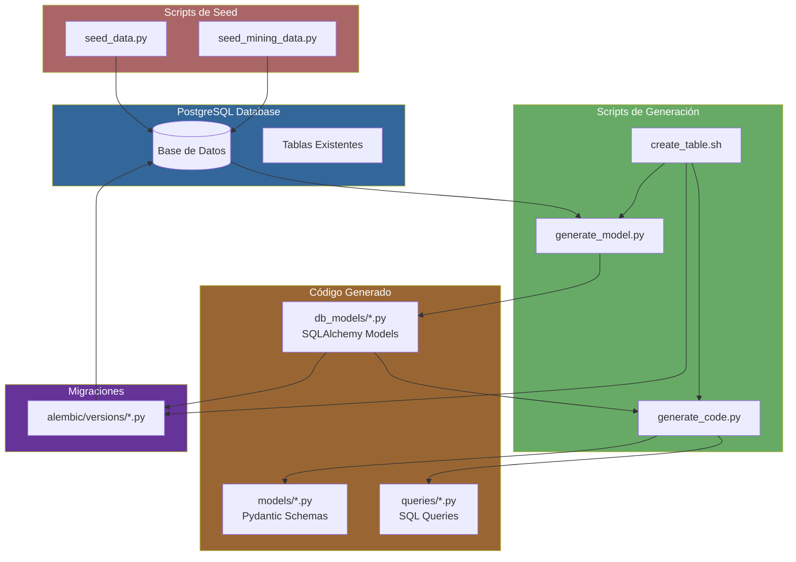

---

## Scripts Disponibles

| Script | Propósito | Entrada | Salida |
|--------|-----------|---------|--------|
| `generate_model.py` | Generar modelo SQLAlchemy desde DB existente | Nombre de tabla | `db_models/{tabla}.py` |
| `generate_code.py` | Generar Pydantic schemas y queries SQL | Nombre de modelo | `models/{tabla}.py`, `queries/{tabla}.py` |
| `seed_data.py` | Poblar datos base (roles, admin, etc.) | - | Datos en DB |
| `seed_mining_data.py` | Poblar datos del dominio minero | - | Datos en DB |
| `create_table.sh` | Workflow interactivo completo | Interactivo | Todo lo anterior |

---

## Flujo de Trabajo Completo

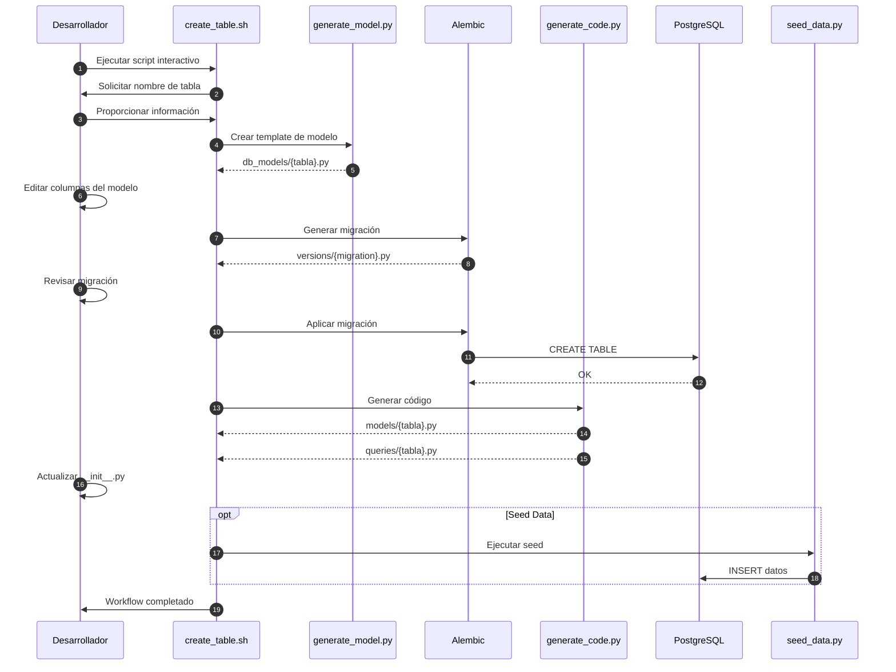

---

## generate_model.py

### Descripción

Genera un modelo SQLAlchemy automáticamente desde una tabla existente en la base de datos usando `sqlacodegen`.

### Diagrama de Flujo

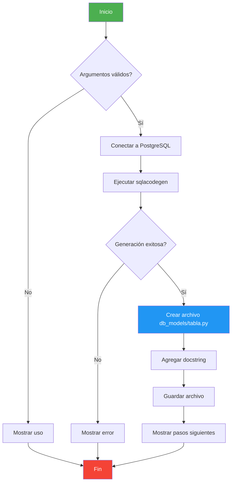

### Uso

```bash
# Desde el contenedor Docker
docker compose exec api python -m scripts.generate_model products

# Directamente (requiere conexión DB)
python scripts/generate_model.py products
```

### Salida Generada

```python
"""
Products SQLAlchemy Model

Generado automáticamente desde la base de datos.
"""

from sqlalchemy import Column, String, DateTime, Boolean
from sqlalchemy.dialects.postgresql import UUID
# ... modelo generado por sqlacodegen
```

---

## generate_code.py

### Descripción

Genera automáticamente:
1. **Pydantic Schemas**: Para validación de requests/responses
2. **SQL Queries**: Operaciones CRUD con asyncpg

### Diagrama de Arquitectura

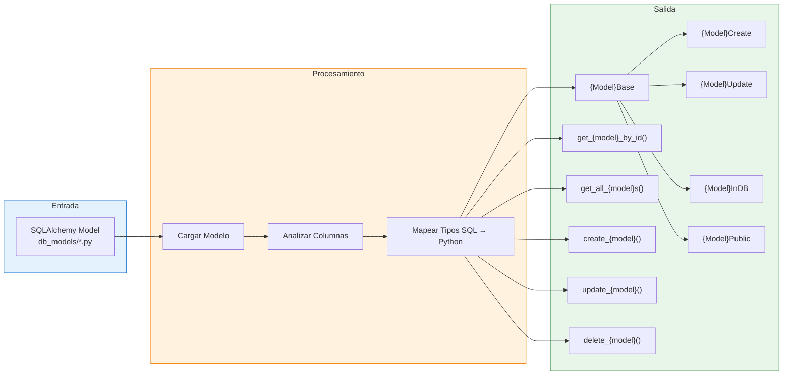

### Mapeo de Tipos

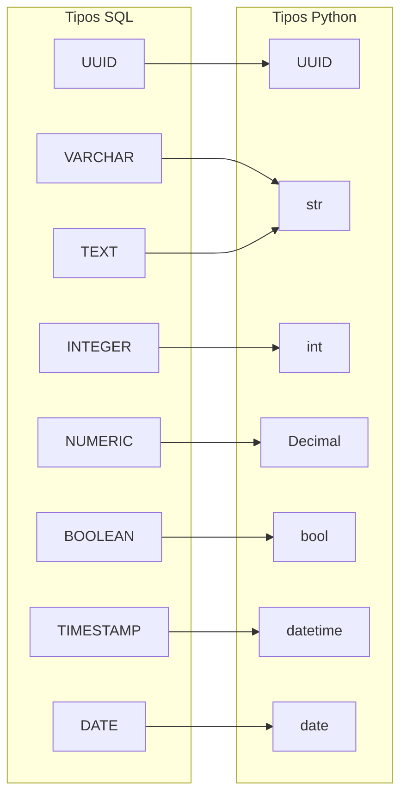

### Uso

```bash
# Generar código para el modelo 'product'
docker compose exec api python -m scripts.generate_code product
```

### Estructura de Schemas Generados

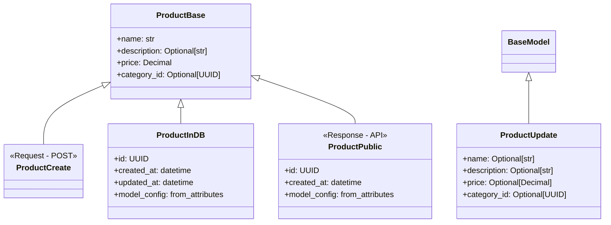

---

## seed_data.py

### Descripción

Pobla la base de datos con datos iniciales esenciales:
- Roles del sistema (ADMIN, MODERATOR, USER, GUEST)
- Usuario administrador por defecto
- Logs de auditoría de ejemplo

### Diagrama de Ejecución

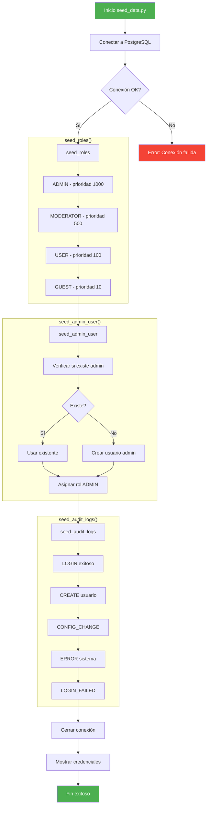

### Datos Creados

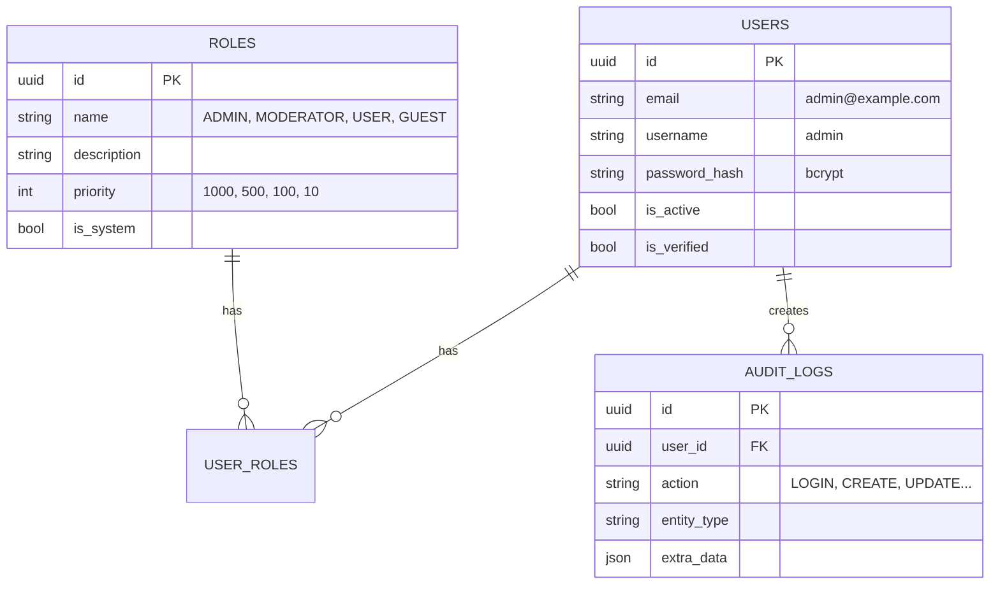

### Uso

```bash
# Ejecutar seed básico
docker compose exec api python -m scripts.seed_data

# Desde Makefile
make db-seed
```

---

## seed_mining_data.py

### Descripción

Pobla la base de datos con datos realistas del dominio minero chileno, incluyendo entidades maestras de Capa 1.

### Jerarquía de Entidades

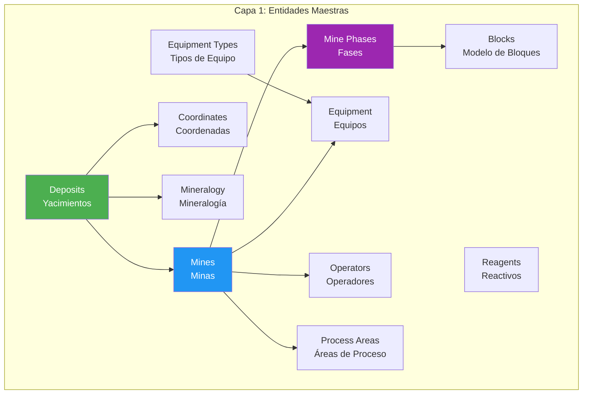

### Orden de Ejecución (Respeta Foreign Keys)

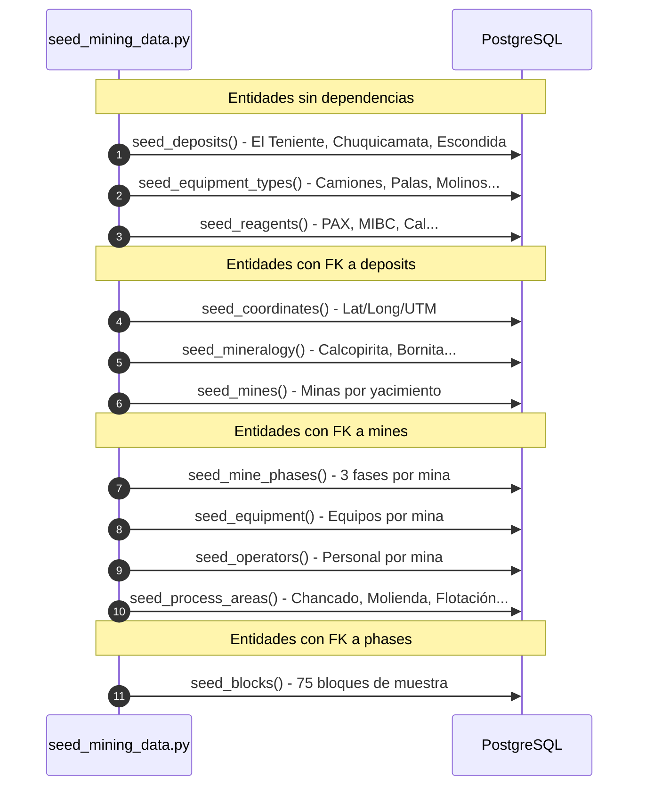

### Datos de Ejemplo (Minería Chilena)

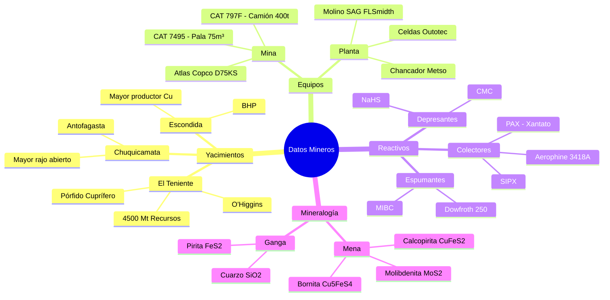

### Uso

```bash
# Ejecutar seed de datos mineros
docker compose exec api python -m scripts.seed_mining_data

# Desde Makefile
make db-seed-mining
```

---

## create_table.sh

### Descripción

Script interactivo que orquesta todo el workflow de creación de una nueva tabla, desde la definición hasta la verificación.

### Flujo Interactivo

```mermaid
stateDiagram-v2
    [*] --> Recopilar: Ejecutar script

    Recopilar --> CrearModelo: Nombre, descripción
    state CrearModelo {
        [*] --> Template
        Template --> Edición: Usuario edita columnas
        Edición --> [*]
    }

    CrearModelo --> ActualizarInit: Modelo listo
    ActualizarInit --> GenerarMigración

    state GenerarMigración {
        [*] --> Autogenerate
        Autogenerate --> Revisar: Migración generada
        Revisar --> Confirmar
        Confirmar --> [*]
    }

    GenerarMigración --> AplicarMigración
    AplicarMigración --> GenerarCódigo

    state GenerarCódigo {
        [*] --> Schemas: Pydantic
        Schemas --> Queries: SQL
        Queries --> [*]
    }

    GenerarCódigo --> Verificar

    state Verificar {
        [*] --> VerificarDB: \\d tabla
        VerificarDB --> [*]
    }

    Verificar --> SeedData: Opcional
    SeedData --> [*]: Completado
    Verificar --> [*]: Sin seed
```

### Archivos Generados

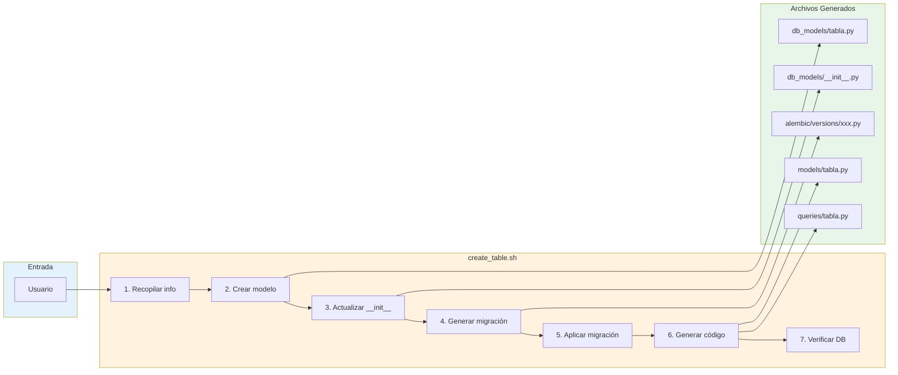

### Uso

```bash
# Ejecutar workflow interactivo
./services/api/scripts/create_table.sh

# Pasos del script:
# 1. Nombre de tabla: product
# 2. Nombre plural: products
# 3. Descripción: Productos del catálogo
# 4. Mensaje migración: add products table
```

---

## Ejemplos de Uso

### Crear Nueva Tabla Completa

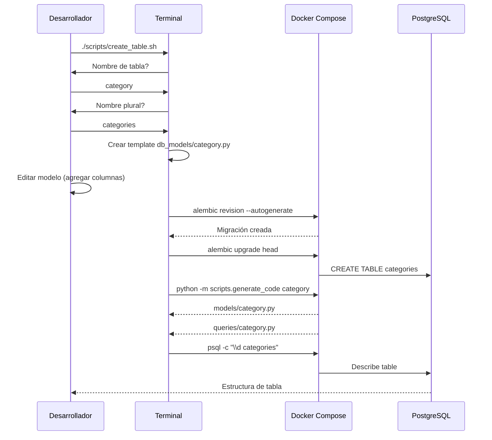

### Poblar Base de Datos Completa

```bash
# 1. Seed datos base (roles, admin)
make db-seed

# 2. Seed datos mineros
make db-seed-mining

# 3. Verificar datos
docker compose exec postgres psql -U mlp_user -d mlp_db -c "
  SELECT 'roles' as tabla, count(*) FROM roles
  UNION ALL
  SELECT 'users', count(*) FROM users
  UNION ALL
  SELECT 'deposits', count(*) FROM deposits
  UNION ALL
  SELECT 'mines', count(*) FROM mines
  UNION ALL
  SELECT 'equipment', count(*) FROM equipment;
"
```

---

## Resumen de Comandos

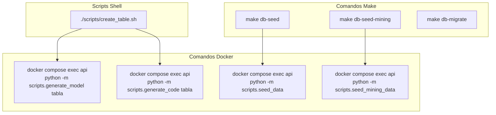

---

## Diagrama de Dependencias de Archivos

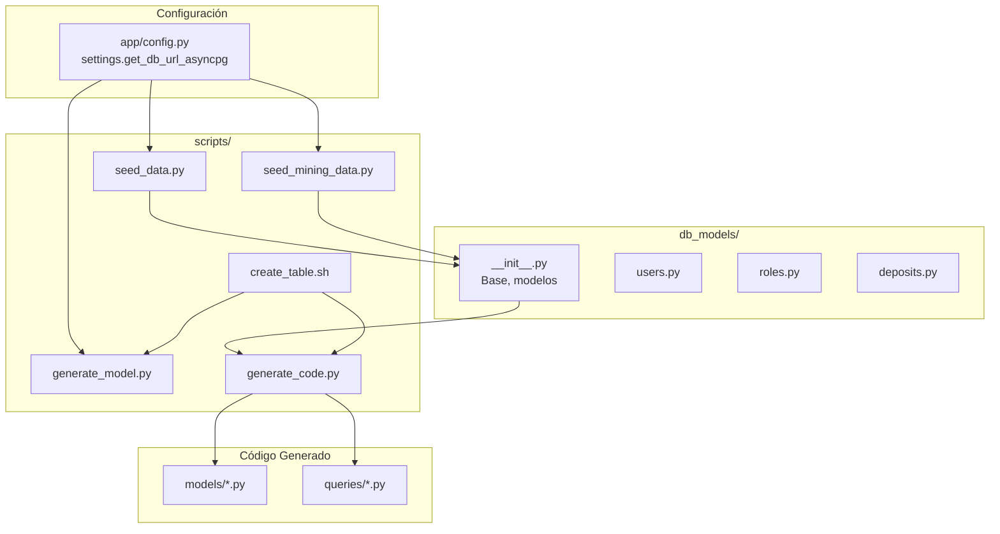
