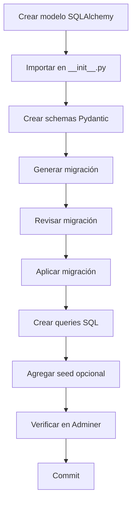
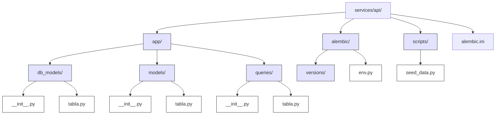
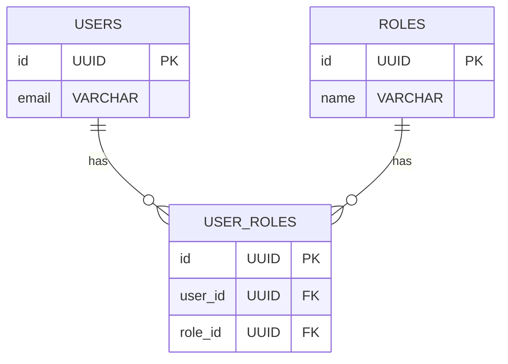

# 📋 Database Cheatsheet - Referencia Rápida

## Comandos Más Usados

### 🔄 Migraciones

```bash
# Generar nueva migración
make db-migrate-create MSG="descripcion del cambio"

# Aplicar migraciones pendientes
make db-migrate

# Revertir última migración
make db-migrate-down

# Ver historial de migraciones
make db-migrate-history

# Ver migración actual
docker compose exec api alembic current -v
```

### 🌱 Seed Data

```bash
# Ejecutar seed data
make db-seed

# Ejecutar seed directamente (debug)
docker compose exec api python -m scripts.seed_data
```

### 🤖 Generación Automática de Código

```bash
# Generar modelo SQLAlchemy desde DB existente
make db-generate-model TABLE=nombre_tabla

# Generar Pydantic schemas + queries desde modelo
make db-generate-code MODEL=nombre_modelo

# Workflow completo (modelo + código)
make db-generate-all TABLE=nombre_tabla
```

### 🔍 Verificación

```bash
# Conectar a PostgreSQL
make db-shell

# Ver todas las tablas
\dt

# Describir estructura de tabla
\d nombre_tabla

# Salir de psql
\q

# Ver en Adminer (navegador)
http://localhost/database
```

### 📦 Backup y Reset

```bash
# Backup de DB
make db-backup

# Reset completo (PELIGRO!)
make db-reset
```

---


## 📝 Checklist: Agregar Nueva Tabla

### 🗺️ Diagrama de Proceso (Mermaid)



```bash
# 1. Crear modelo SQLAlchemy
services/api/app/db_models/nueva_tabla.py

# 2. Importar en __init__.py
services/api/app/db_models/__init__.py

# 3. Crear schemas Pydantic
services/api/app/models/nueva_tabla.py

# 4. Generar migración
make db-migrate-create MSG="add nueva_tabla"

# 5. Revisar migración
cat services/api/alembic/versions/*_add_nueva_tabla.py

# 6. Aplicar
make db-migrate

# 7. Crear queries SQL
services/api/app/queries/nueva_tabla.py

# 8. Agregar seed (opcional)
services/api/scripts/seed_data.py

# 9. Verificar en Adminer
http://localhost/database

# 10. Commit
git add .
git commit -m "feat(db): add nueva_tabla"
```

---


## 🗂️ Estructura de Archivos



---

## 💾 Queries SQL Comunes


### Verificar datos

```sql
-- Contar registros
SELECT COUNT(*) FROM tabla;

-- Ver últimos 10
SELECT * FROM tabla ORDER BY created_at DESC LIMIT 10;

-- Buscar por email
SELECT * FROM users WHERE email = 'admin@example.com';

-- Ver con JOIN
SELECT u.email, r.name as role
FROM users u
JOIN user_roles ur ON u.id = ur.user_id
JOIN roles r ON ur.role_id = r.id;
```


### Verificar estructura

```sql
-- Columnas de tabla
\d tabla

-- Índices
SELECT indexname, indexdef FROM pg_indexes WHERE tablename = 'tabla';

-- Constraints
SELECT constraint_name, constraint_type
FROM information_schema.table_constraints
WHERE table_name = 'tabla';

-- Foreign Keys
SELECT
    tc.constraint_name,
    tc.table_name,
    kcu.column_name,
    ccu.table_name AS foreign_table_name,
    ccu.column_name AS foreign_column_name
FROM information_schema.table_constraints AS tc
JOIN information_schema.key_column_usage AS kcu
    ON tc.constraint_name = kcu.constraint_name
JOIN information_schema.constraint_column_usage AS ccu
    ON ccu.constraint_name = tc.constraint_name
WHERE tc.constraint_type = 'FOREIGN KEY' AND tc.table_name='tabla';
```

---


## 🚨 Problemas Comunes

| Problema | Solución |
|----------|----------|
| Migration no detecta cambios | Verificar que modelo está importado en `db_models/__init__.py` |
| Error `psycopg2` not found | Rebuild API: `make build-api` |
| Archivo de migración no aparece en host | Verificar volumes en `docker-compose.dev.yml` |
| Seed falla por FK | Verificar orden: crear tablas padre antes que hijas |
| Migration falla al aplicar | Ver SQL: `alembic upgrade head --sql` |

---


## 🔗 Enlaces Rápidos

- **Adminer:** http://localhost/database
- **API Docs:** http://localhost/api/docs
- **Traefik:** http://localhost:8080

---


## 📖 Documentos Completos

- `WORKFLOW_DATABASE.md` - Guía completa paso a paso
- `DATABASE_SCHEMA_DESIGN.md` - Diseño del esquema
- `ALEMBIC_GUIDE.md` - Guía de Alembic
- `SETUP_DATABASE.md` - Setup inicial

---

---

## 🗺️ Diagrama ER Básico (Ejemplo Users, Roles, UserRoles)



**Última Actualización:** 2025-12-20
