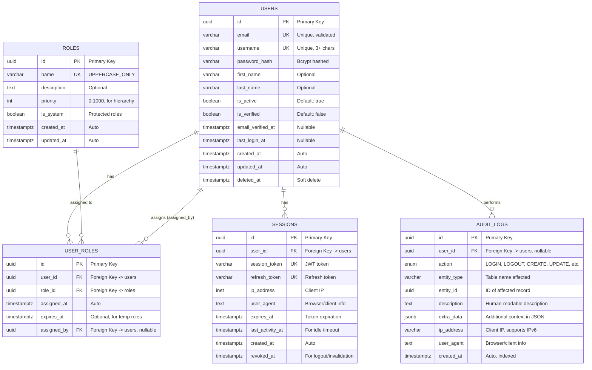
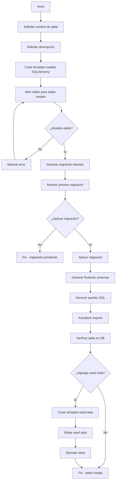

# Guía Completa de Base de Datos

> Documentación centralizada del diseño, uso y gestión de la base de datos del proyecto Cloud Native Microservices Learning Platform

---

## Tabla de Contenidos

1. [Diseño de la Base de Datos](#diseño-de-la-base-de-datos)
2. [Diagrama Entidad-Relación](#diagrama-entidad-relación)
3. [Descripción de Tablas](#descripción-de-tablas)
4. [Crear Nuevas Tablas](#crear-nuevas-tablas)
5. [Comandos Make Disponibles](#comandos-make-disponibles)
6. [Guía de Uso del Script Automatizado](#guía-de-uso-del-script-automatizado)
7. [Mejores Prácticas](#mejores-prácticas)
8. [Troubleshooting](#troubleshooting)

---

## Diseño de la Base de Datos

### Visión General

La base de datos utiliza **PostgreSQL 16** con las siguientes características:

- **ORM**: SQLAlchemy (solo para Alembic)
- **Migraciones**: Alembic
- **Queries**: SQL puro con asyncpg (runtime)
- **Schemas**: Pydantic para validación
- **Tipos**: UUID para IDs, JSONB para datos flexibles
- **Soft Deletes**: Implementado en `users` con `deleted_at`
- **Auditoría**: Tabla `audit_logs` para tracking de acciones

### Tecnologías

```yaml
Base de datos: PostgreSQL 16-alpine
Driver runtime: asyncpg (async)
ORM (migraciones): SQLAlchemy 2.x
Migraciones: Alembic
Validación: Pydantic v2
Pool de conexiones: asyncpg.create_pool
```

---

## Diagrama Entidad-Relación



---

## Descripción de Tablas

### 1. `users` - Tabla de Usuarios

Almacena información de usuarios del sistema.

**Características principales:**
- Soft delete implementado (`deleted_at`)
- Email y username únicos con validación
- Password hasheado con bcrypt
- Tracking de login y verificación de email

**Campos:**

| Campo | Tipo | Descripción | Restricciones |
|-------|------|-------------|---------------|
| `id` | UUID | ID único del usuario | PK, auto-generado |
| `email` | VARCHAR(255) | Email del usuario | UNIQUE, validado por regex |
| `username` | VARCHAR(100) | Nombre de usuario | UNIQUE, 3+ chars, alfanumérico |
| `password_hash` | VARCHAR(255) | Password hasheado | NOT NULL |
| `first_name` | VARCHAR(100) | Nombre | Nullable |
| `last_name` | VARCHAR(100) | Apellido | Nullable |
| `is_active` | BOOLEAN | Usuario activo | Default: true |
| `is_verified` | BOOLEAN | Email verificado | Default: false |
| `email_verified_at` | TIMESTAMPTZ | Fecha de verificación | Nullable |
| `last_login_at` | TIMESTAMPTZ | Último login | Nullable |
| `created_at` | TIMESTAMPTZ | Fecha de creación | Auto |
| `updated_at` | TIMESTAMPTZ | Última actualización | Auto |
| `deleted_at` | TIMESTAMPTZ | Soft delete | Nullable |

**Índices:**
- `users_pkey`: Primary key en `id`
- `ix_users_email`: Unique en `email`
- `ix_users_username`: Unique en `username`
- `idx_users_email`: Index en `email` WHERE `deleted_at IS NULL`
- `idx_users_username`: Index en `username` WHERE `deleted_at IS NULL`
- `idx_users_is_active`: Index en `is_active` WHERE `deleted_at IS NULL`
- `idx_users_created_at`: Index en `created_at`

**Relaciones:**
- **1:N** con `sessions` (un usuario puede tener múltiples sesiones)
- **N:M** con `roles` a través de `user_roles`
- **1:N** con `audit_logs` (acciones realizadas por el usuario)

---

### 2. `roles` - Tabla de Roles

Define los roles del sistema para control de acceso basado en roles (RBAC).

**Características principales:**
- Nombres en UPPERCASE (validado)
- Sistema de prioridades (0-1000) para jerarquía
- Roles de sistema protegidos (`is_system = true`)

**Campos:**

| Campo | Tipo | Descripción | Restricciones |
|-------|------|-------------|---------------|
| `id` | UUID | ID único del rol | PK, auto-generado |
| `name` | VARCHAR(50) | Nombre del rol | UNIQUE, UPPERCASE_ONLY |
| `description` | TEXT | Descripción del rol | Nullable |
| `priority` | INTEGER | Prioridad (jerarquía) | 0-1000, default: 0 |
| `is_system` | BOOLEAN | Rol de sistema | Default: false, protegido |
| `created_at` | TIMESTAMPTZ | Fecha de creación | Auto |
| `updated_at` | TIMESTAMPTZ | Última actualización | Auto |

**Índices:**
- `roles_pkey`: Primary key en `id`
- `ix_roles_name`: Unique en `name`
- `idx_roles_name`: Index en `name`
- `idx_roles_priority`: Index en `priority`

**Roles del Sistema:**
- `ADMIN`: Administrador del sistema (priority: 1000)
- `MODERATOR`: Moderador (priority: 500)
- `USER`: Usuario estándar (priority: 100)
- `GUEST`: Invitado (priority: 10)

**Relaciones:**
- **N:M** con `users` a través de `user_roles`

---

### 3. `user_roles` - Tabla Intermedia User-Role

Tabla de asociación many-to-many entre `users` y `roles`.

**Características principales:**
- Previene duplicados con constraint único
- Soporta roles temporales con `expires_at`
- Tracking de quién asignó el rol

**Campos:**

| Campo | Tipo | Descripción | Restricciones |
|-------|------|-------------|---------------|
| `id` | UUID | ID único | PK, auto-generado |
| `user_id` | UUID | ID del usuario | FK -> users.id |
| `role_id` | UUID | ID del rol | FK -> roles.id |
| `assigned_at` | TIMESTAMPTZ | Fecha de asignación | Auto |
| `expires_at` | TIMESTAMPTZ | Expiración del rol | Nullable (permanente si NULL) |
| `assigned_by` | UUID | Quién asignó el rol | FK -> users.id, nullable |

**Índices:**
- `user_roles_pkey`: Primary key en `id`
- `user_roles_unique`: UNIQUE en (`user_id`, `role_id`)
- `idx_user_roles_user_id`: Index en `user_id`
- `idx_user_roles_role_id`: Index en `role_id`
- `idx_user_roles_expires_at`: Index en `expires_at` WHERE `expires_at IS NOT NULL`

**Relaciones:**
- **N:1** con `users` (user_id)
- **N:1** con `roles` (role_id)
- **N:1** con `users` (assigned_by)

---

### 4. `sessions` - Tabla de Sesiones

Gestiona sesiones de usuario con tokens JWT.

**Características principales:**
- Session token y refresh token únicos
- Soporte para revocación de tokens
- Tracking de actividad y expiración
- Información del cliente (IP, user agent)

**Campos:**

| Campo | Tipo | Descripción | Restricciones |
|-------|------|-------------|---------------|
| `id` | UUID | ID único de la sesión | PK, auto-generado |
| `user_id` | UUID | ID del usuario | FK -> users.id |
| `session_token` | VARCHAR(500) | JWT session token | UNIQUE, NOT NULL |
| `refresh_token` | VARCHAR(500) | JWT refresh token | UNIQUE, nullable |
| `ip_address` | INET | IP del cliente | Nullable |
| `user_agent` | TEXT | Información del navegador | Nullable |
| `expires_at` | TIMESTAMPTZ | Expiración del token | NOT NULL, > created_at |
| `last_activity_at` | TIMESTAMPTZ | Última actividad | Auto-update |
| `created_at` | TIMESTAMPTZ | Fecha de creación | Auto |
| `revoked_at` | TIMESTAMPTZ | Revocación (logout) | Nullable |

**Índices:**
- `sessions_pkey`: Primary key en `id`
- `sessions_session_token_key`: UNIQUE en `session_token`
- `sessions_refresh_token_key`: UNIQUE en `refresh_token`
- `idx_sessions_user_id`: Index en `user_id` WHERE `revoked_at IS NULL`
- `idx_sessions_session_token`: Index en `session_token` WHERE `revoked_at IS NULL`
- `idx_sessions_refresh_token`: Index en `refresh_token` WHERE `revoked_at IS NULL` AND `refresh_token IS NOT NULL`
- `idx_sessions_expires_at`: Index en `expires_at` WHERE `revoked_at IS NULL`

**Relaciones:**
- **N:1** con `users`

---

### 5. `audit_logs` - Tabla de Auditoría

Registra todas las acciones importantes del sistema para auditoría y compliance.

**Características principales:**
- Inmutable (no se modifican una vez creados)
- Datos adicionales en formato JSONB
- Soporte para acciones del sistema (user_id nullable)
- Múltiples índices para queries rápidas

**Campos:**

| Campo | Tipo | Descripción | Restricciones |
|-------|------|-------------|---------------|
| `id` | UUID | ID único del log | PK, auto-generado |
| `user_id` | UUID | ID del usuario | FK -> users.id, nullable |
| `action` | ENUM | Tipo de acción | NOT NULL, indexed |
| `entity_type` | VARCHAR(100) | Tabla afectada | Nullable, indexed |
| `entity_id` | UUID | ID del registro afectado | Nullable |
| `description` | TEXT | Descripción legible | NOT NULL |
| `extra_data` | JSONB | Datos adicionales | Nullable |
| `ip_address` | VARCHAR(45) | IP del cliente | Nullable (IPv6 compatible) |
| `user_agent` | TEXT | Información del cliente | Nullable |
| `created_at` | TIMESTAMPTZ | Fecha de creación | Auto, indexed |

**Tipos de Acciones (ENUM `audit_action_enum`):**
- **Autenticación**: `LOGIN`, `LOGOUT`, `LOGIN_FAILED`
- **CRUD**: `CREATE`, `READ`, `UPDATE`, `DELETE`
- **Configuración**: `CONFIG_CHANGE`, `PERMISSION_CHANGE`
- **Sistema**: `ERROR`, `WARNING`, `INFO`

**Índices:**
- `audit_logs_pkey`: Primary key en `id`
- `ix_audit_logs_action`: Index en `action`
- `ix_audit_logs_entity_type`: Index en `entity_type`
- `ix_audit_logs_created_at`: Index en `created_at`
- `idx_audit_logs_user_created`: Composite en (`user_id`, `created_at`)
- `idx_audit_logs_action_created`: Composite en (`action`, `created_at`)
- `idx_audit_logs_entity`: Composite en (`entity_type`, `entity_id`)
- `idx_audit_logs_created_at`: Index en `created_at` (para limpieza de logs antiguos)

**Relaciones:**
- **N:1** con `users` (ON DELETE SET NULL para preservar logs de usuarios eliminados)

**Ejemplo de uso:**

```json
{
  "action": "LOGIN",
  "description": "User logged in successfully",
  "extra_data": {
    "os": "Linux",
    "browser": "Chrome",
    "login_method": "email"
  }
}
```

---

## Crear Nuevas Tablas

### Opción 1: Script Automatizado (Recomendado)

El script interactivo te guía paso a paso:

```bash
# Dar permisos de ejecución (solo una vez)
chmod +x services/api/scripts/create_table.sh

# Ejecutar el script
./services/api/scripts/create_table.sh
```

**El script hará:**
1. ✅ Solicitar información de la tabla (nombre, descripción)
2. ✅ Crear template del modelo SQLAlchemy
3. ✅ Esperar a que lo edites
4. ✅ Generar migración automáticamente
5. ✅ Aplicar la migración
6. ✅ Generar Pydantic schemas
7. ✅ Generar queries SQL
8. ✅ Actualizar imports automáticamente
9. ✅ Verificar en base de datos
10. ✅ Opcionalmente agregar seed data

### Opción 2: Makefile Automatizado

```bash
# Workflow completo interactivo
make -f services/api/Makefile.database db-new-table

# Workflow rápido (requiere parámetros)
make -f services/api/Makefile.database db-quick-table TABLE=products MSG="add products table"
```

### Opción 3: Manual (Paso a Paso)

Si prefieres el control manual completo:

#### 1. Crear modelo SQLAlchemy

Crear archivo en `services/api/app/db_models/nombre_tabla.py`:

```python
"""
Nombre Tabla SQLAlchemy Model (SOLO PARA ALEMBIC)
"""
from sqlalchemy import Column, String, Integer, ForeignKey, Index
from sqlalchemy.dialects.postgresql import UUID
from sqlalchemy.sql import func
import uuid

from . import Base


class NombreTabla(Base):
    """Modelo SQLAlchemy (solo para Alembic)"""

    __tablename__ = "nombre_tabla"

    # Identificación
    id = Column(UUID(as_uuid=True), primary_key=True, default=uuid.uuid4)

    # Campos
    name = Column(String(100), nullable=False, index=True)

    # Timestamps
    created_at = Column(
        DateTime(timezone=True),
        nullable=False,
        server_default=func.now()
    )

    # Índices compuestos
    __table_args__ = (
        Index("idx_nombre_tabla_name", "name"),
        {
            "comment": "Descripción de la tabla"
        }
    )
```

#### 2. Actualizar imports

En `services/api/app/db_models/__init__.py`:

```python
from .nombre_tabla import NombreTabla
```

#### 3. Generar migración

```bash
cd services/api
make db-migrate-create MSG="add nombre_tabla table"
```

#### 4. Revisar migración generada

```bash
# Ver el archivo generado
ls -lth alembic/versions/ | head -1
cat alembic/versions/XXXXX_add_nombre_tabla_table.py
```

#### 5. Aplicar migración

```bash
make db-migrate
```

#### 6. Verificar en base de datos

```bash
make db-shell
\d nombre_tabla
\q
```

#### 7. Crear Pydantic schemas

```bash
# Generar automáticamente
python scripts/generate_model.py nombre_tabla

# O crear manualmente en services/api/app/models/nombre_tabla.py
```

#### 8. Crear queries SQL

```bash
# Generar automáticamente
python scripts/generate_code.py nombre_tabla

# O crear manualmente en services/api/app/queries/nombre_tabla.py
```

#### 9. Agregar seed data (opcional)

Editar `services/api/scripts/seed_data.py`:

```python
async def seed_nombre_tabla(conn):
    """Seed data para nombre_tabla"""
    # ... implementación
```

---

## Comandos Make Disponibles

### Makefile General (`services/api/Makefile`)

```bash
# Migraciones
make db-migrate                    # Aplicar todas las migraciones pendientes
make db-migrate-create MSG="..."   # Crear nueva migración
make db-migrate-down               # Revertir última migración
make db-migrate-history            # Ver historial de migraciones

# Datos
make db-seed                       # Cargar datos de ejemplo

# Shell
make db-shell                      # Abrir psql interactivo
```

### Makefile Database (`services/api/Makefile.database`)

```bash
# === MIGRACIONES ===
make -f Makefile.database db-migrate              # Aplicar migraciones
make -f Makefile.database db-migrate-create MSG="mensaje"  # Crear migración
make -f Makefile.database db-migrate-down         # Revertir última
make -f Makefile.database db-migrate-history      # Ver historial
make -f Makefile.database db-migrate-current      # Ver versión actual
make -f Makefile.database db-migrate-heads        # Ver heads

# === INSPECCIÓN ===
make -f Makefile.database db-shell                # Abrir psql
make -f Makefile.database db-tables               # Listar todas las tablas
make -f Makefile.database db-describe TABLE=nombre  # Describir tabla
make -f Makefile.database db-indexes TABLE=nombre # Ver índices
make -f Makefile.database db-constraints TABLE=nombre  # Ver constraints
make -f Makefile.database db-count TABLE=nombre   # Contar registros
make -f Makefile.database db-sample TABLE=nombre  # Ver 10 registros de ejemplo

# === WORKFLOWS COMPLETOS ===
make -f Makefile.database db-new-table            # Crear tabla (interactivo)
make -f Makefile.database db-quick-table TABLE=x MSG="y"  # Crear tabla rápido
make -f Makefile.database db-generate-code TABLE=nombre   # Generar código
make -f Makefile.database db-verify               # Verificar estado DB

# === ESTADÍSTICAS ===
make -f Makefile.database db-stats                # Estadísticas generales
make -f Makefile.database db-size                 # Tamaño de la DB
make -f Makefile.database db-table-sizes          # Tamaño de cada tabla
make -f Makefile.database db-connections          # Conexiones activas

# === BACKUP/RESTORE ===
make -f Makefile.database db-backup               # Backup completo
make -f Makefile.database db-backup-schema        # Solo schema
make -f Makefile.database db-backup-data          # Solo datos
make -f Makefile.database db-restore BACKUP=file.sql  # Restaurar

# === LIMPIEZA ===
make -f Makefile.database db-reset                # Resetear DB (¡CUIDADO!)
make -f Makefile.database db-clean-migrations     # Limpiar migraciones viejas
```

---

## Guía de Uso del Script Automatizado

### `create_table.sh` - Asistente Interactivo

Este script te guía paso a paso para crear una nueva tabla completa.

#### Ejecución

```bash
# 1. Dar permisos (solo la primera vez)
chmod +x services/api/scripts/create_table.sh

# 2. Ejecutar
./services/api/scripts/create_table.sh
```

#### Flujo del Script



#### Ejemplo de Uso

```bash
$ ./services/api/scripts/create_table.sh

========================================
  Crear Nueva Tabla - Asistente
========================================

Nombre de la tabla (singular, snake_case): product

Descripción de la tabla: Productos del catálogo

✅ Creando template en: app/db_models/product.py

📝 Template creado. Por favor edita el archivo para definir los campos.

Presiona ENTER cuando hayas terminado de editar...

✅ Generando migración...
INFO  [alembic.autogenerate.compare] Detected added table 'products'

¿Aplicar la migración ahora? (s/n): s

✅ Migración aplicada

✅ Generando Pydantic schemas...
✅ Generando queries SQL...
✅ Actualizando imports...

✅ Verificando tabla en base de datos...
Table "public.products"
...

🎉 ¡Tabla 'products' creada exitosamente!

¿Agregar seed data de ejemplo? (s/n): s

✅ Template de seed data creado
Edita el archivo y presiona ENTER...

✅ Seed data ejecutado

========================================
  Resumen Final
========================================

Archivos creados:
  ✅ app/db_models/product.py
  ✅ app/models/product.py
  ✅ app/queries/products.py
  ✅ alembic/versions/XXXXX_add_products_table.py

Próximos pasos:
  1. Revisar los archivos generados
  2. Ajustar queries según necesidades
  3. Crear endpoints API si es necesario
```

#### Ventajas del Script

- ✅ **Interactivo**: Te guía paso a paso
- ✅ **Automático**: Genera todo el código boilerplate
- ✅ **Validación**: Verifica que el modelo sea válido antes de continuar
- ✅ **Preview**: Muestra la migración antes de aplicarla
- ✅ **Rollback**: Si algo falla, puedes revertir fácilmente
- ✅ **Completo**: Crea modelo, schemas, queries, migración y seed data

#### Personalización

El script puede ser modificado en:

```bash
services/api/scripts/create_table.sh
```

Variables configurables:
- `EDITOR`: Editor de texto (default: vim)
- `DB_MODELS_DIR`: Directorio de modelos
- `MIGRATIONS_DIR`: Directorio de migraciones
- `SCHEMAS_DIR`: Directorio de schemas
- `QUERIES_DIR`: Directorio de queries

---

## Mejores Prácticas

### Naming Conventions

```yaml
Tablas: snake_case, plural (users, audit_logs)
Columnas: snake_case (created_at, user_id)
Índices: idx_<tabla>_<campos> (idx_users_email)
Foreign Keys: <tabla>_<campo>_fkey (users_role_id_fkey)
Constraints: <tabla>_<campo>_<tipo> (users_email_check)
Enums: <nombre>_enum (audit_action_enum)
```

### Campos Estándar Recomendados

Incluir en todas las tablas cuando sea apropiado:

```python
# ID
id = Column(UUID(as_uuid=True), primary_key=True, default=uuid.uuid4)

# Timestamps
created_at = Column(DateTime(timezone=True), server_default=func.now())
updated_at = Column(DateTime(timezone=True), server_default=func.now(), onupdate=func.now())

# Soft Delete (opcional)
deleted_at = Column(DateTime(timezone=True), nullable=True)
```

### Índices

Crear índices para:
- ✅ Campos en WHERE clauses frecuentes
- ✅ Campos en JOIN conditions
- ✅ Campos en ORDER BY
- ✅ Foreign keys (automático en PostgreSQL)
- ✅ Campos únicos (UNIQUE index)

Evitar índices en:
- ❌ Campos booleanos simples (bajo cardinality)
- ❌ Campos que cambian muy frecuentemente
- ❌ Tablas muy pequeñas (< 1000 registros)

### Tipos de Datos

```python
# IDs
UUID               # Para IDs únicos (default)
SERIAL/BIGSERIAL  # Solo si necesitas IDs secuenciales

# Texto
String(N)         # Para texto corto con límite
Text              # Para texto largo sin límite
Enum              # Para valores predefinidos

# Números
Integer           # Enteros
BigInteger        # Enteros grandes
Numeric(p, s)     # Decimales exactos (dinero)
Float             # Decimales aproximados

# Fechas
DateTime(timezone=True)  # SIEMPRE con timezone
Date              # Solo fecha
Time              # Solo hora

# JSON
JSONB             # Para datos flexibles/metadata (usa JSONB, no JSON)

# Otros
Boolean           # true/false
INET              # Direcciones IP
ARRAY             # Arrays (usar con cuidado)
```

### Constraints

```python
# NOT NULL
Column(..., nullable=False)

# UNIQUE
Column(..., unique=True)

# CHECK
CheckConstraint("price >= 0", name="products_price_positive")

# DEFAULT
Column(..., server_default="value")  # En DB
Column(..., default=value)            # En Python (ORM only)

# FOREIGN KEY
ForeignKey("users.id", ondelete="CASCADE")  # Eliminar en cascada
ForeignKey("users.id", ondelete="SET NULL") # Setear a NULL
ForeignKey("users.id", ondelete="RESTRICT") # Prevenir eliminación
```

### Migraciones

```bash
# ✅ HACER
- Crear migraciones pequeñas y específicas
- Mensajes descriptivos y claros
- Revisar migración antes de aplicar
- Probar downgrade antes de merge
- Commit migraciones con el código

# ❌ EVITAR
- Múltiples cambios no relacionados en una migración
- Modificar migraciones ya aplicadas
- Editar manualmente migraciones autogeneradas sin revisar
- Hacer downgrade en producción (usar migración forward)
```

### Queries SQL

```python
# ✅ HACER
- Usar parámetros ($1, $2) para prevenir SQL injection
- Usar índices apropiados
- Limitar resultados con LIMIT
- Usar transacciones para operaciones múltiples
- Queries específicas (SELECT campos específicos, no SELECT *)

# ❌ EVITAR
- Concatenar strings para queries (SQL injection)
- N+1 queries (usar JOINs o bulk operations)
- SELECT * (seleccionar solo campos necesarios)
- Queries sin WHERE en tablas grandes
- Fetch all en tablas grandes (usar pagination)
```

---

## Troubleshooting

### Error: "metadata is reserved"

```
sqlalchemy.exc.InvalidRequestError: Attribute name 'metadata' is reserved
```

**Solución**: Renombrar el campo a otro nombre (ej: `extra_data`, `meta_info`, `details`)

### Error: "null value in column violates not-null"

```
asyncpg.exceptions.NotNullViolationError: null value in column "id"
```

**Solución**: Al usar queries SQL puras, generar UUID manualmente:

```python
import uuid
await conn.execute(query, uuid.uuid4(), ...)
```

### Error: "Ruta de docker-compose incorrecta"

```
open /incorrect/path/docker-compose.yml: no such file or directory
```

**Solución**: Verificar que las rutas en Makefiles sean correctas:

```makefile
# CORRECTO (desde services/api con cd ../..):
COMPOSE_FILE := infrastructure/docker/docker-compose.yml

# INCORRECTO:
COMPOSE_FILE := ../../infrastructure/docker/docker-compose.yml
```

### Migración no detecta cambios

```
INFO  [alembic.autogenerate.compare] No changes detected
```

**Solución**:
1. Verificar que el modelo esté importado en `app/db_models/__init__.py`
2. Verificar que Alembic esté configurado correctamente
3. Revisar que el nombre de tabla no exista ya

### Cannot import model

```
ModuleNotFoundError: No module named 'app.db_models.tabla'
```

**Solución**: Actualizar imports en `app/db_models/__init__.py`:

```python
from .tabla import Tabla
```

---

## Referencias Rápidas

### Archivos Importantes

```
services/api/
├── alembic/
│   ├── env.py                 # Configuración Alembic
│   └── versions/              # Migraciones
├── app/
│   ├── db_models/             # Modelos SQLAlchemy (solo Alembic)
│   ├── models/                # Pydantic schemas
│   ├── queries/               # Queries SQL puras
│   └── database.py            # Configuración DB y pool
├── scripts/
│   ├── create_table.sh        # Script interactivo
│   ├── generate_model.py      # Generar Pydantic schemas
│   ├── generate_code.py       # Generar queries SQL
│   └── seed_data.py           # Datos de ejemplo
├── Makefile                   # Comandos generales
├── Makefile.database          # Comandos específicos DB
└── alembic.ini               # Config Alembic
```

### Comandos Más Usados

```bash
# Crear tabla (interactivo)
./services/api/scripts/create_table.sh

# Crear migración
cd services/api && make db-migrate-create MSG="descripción"

# Aplicar migraciones
cd services/api && make db-migrate

# Ver tablas
make -f services/api/Makefile.database db-tables

# Describir tabla
make -f services/api/Makefile.database db-describe TABLE=users

# Shell interactivo
cd services/api && make db-shell

# Seed data
cd services/api && make db-seed

# Backup
make -f services/api/Makefile.database db-backup
```

---

## Contribuir

Al agregar nuevas tablas o modificar el diseño:

1. ✅ Seguir naming conventions
2. ✅ Documentar la tabla en este archivo
3. ✅ Actualizar diagrama ERD
4. ✅ Crear migración con mensaje descriptivo
5. ✅ Agregar Pydantic schemas
6. ✅ Crear queries SQL necesarias
7. ✅ Agregar seed data de ejemplo
8. ✅ Actualizar documentación

---

**Última actualización**: 2025-12-20
**Versión de la base de datos**: Ver con `make -f services/api/Makefile.database db-migrate-current`
