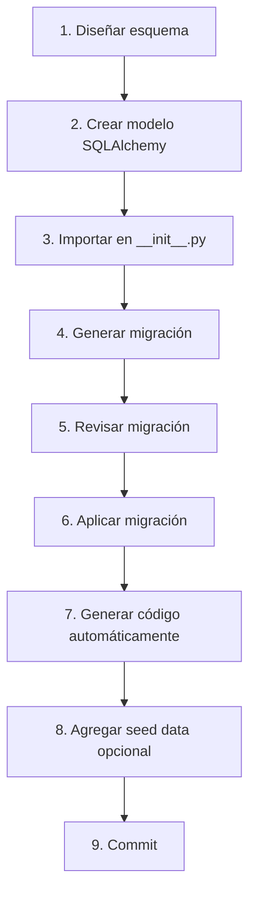

# 🚀 Guía Completa: Crear Nueva Tabla en Base de Datos

## Proceso Simplificado - Crear Solo 1 Modelo y Ejecutar Scripts

**Versión:** 2.0.0
**Última Actualización:** 2025-12-20
**Filosofía:** Crear solo el modelo SQLAlchemy, el resto se genera automáticamente

---

## 📋 Índice

1. [Introducción](#introducción)
2. [Herramientas Disponibles](#herramientas-disponibles)
3. [Workflow Simplificado](#workflow-simplificado)
4. [Ejemplo Completo: Tabla audit_logs](#ejemplo-completo-tabla-audit_logs)
5. [Comandos Make Disponibles](#comandos-make-disponibles)
6. [Script Automático](#script-automático)
7. [Buenas Prácticas](#buenas-prácticas)

---

## Introducción

Este documento describe el proceso actualizado para crear nuevas tablas en la base de datos. El enfoque se ha simplificado:

**Antes (proceso antiguo):**
- ✍️ Crear modelo SQLAlchemy manualmente
- ✍️ Crear Pydantic schemas manualmente
- ✍️ Crear queries SQL manualmente
- ✍️ Crear migración manualmente
- ✍️ Crear seed data manualmente

**Ahora (proceso nuevo):**
- ✍️ Crear **SOLO** el modelo SQLAlchemy
- 🤖 El resto se **genera automáticamente** con scripts

---

## Herramientas Disponibles

### 1. Makefile.database

Makefile dedicado a operaciones de base de datos con comandos especializados.

```bash
# Ver todos los comandos disponibles
make -f services/api/Makefile.database help
```

### 2. Script create_table.sh

Script interactivo que guía paso a paso la creación de una tabla.

```bash
# Ejecutar el script
./services/api/scripts/create_table.sh
```

### 3. Comandos Make en Makefile principal

Comandos accesibles desde la raíz del proyecto.

```bash
# Crear migración
make db-migrate-create MSG="add products table"

# Aplicar migraciones
make db-migrate

# Seed data
make db-seed
```

---

## Workflow Simplificado



### Paso a Paso

1. **Diseñar esquema** - Define las columnas, tipos, índices y constraints
2. **Crear modelo SQLAlchemy** - Solo este archivo, manualmente
3. **Importar en __init__.py** - Agregar import
4. **Generar migración** - Automático con Alembic
5. **Revisar migración** - Verificar el SQL generado
6. **Aplicar migración** - Ejecutar contra la DB
7. **Generar código** - Pydantic schemas + queries SQL (automático)
8. **Seed data** - Opcional, para testing
9. **Commit** - Git commit de todos los archivos

---

## Ejemplo Completo: Tabla audit_logs

Vamos a crear una tabla de auditoría para registrar acciones del sistema.

### Paso 1: Diseñar Esquema

```markdown
## Tabla: audit_logs

Propósito: Registrar acciones importantes del sistema para auditoría

Columnas:
- id (UUID, PK)
- user_id (UUID, FK -> users.id, nullable) - Usuario que realizó la acción
- action (ENUM, NOT NULL) - Tipo de acción (LOGIN, CREATE, UPDATE, etc.)
- entity_type (VARCHAR 100, nullable) - Tipo de entidad afectada
- entity_id (UUID, nullable) - ID de la entidad afectada
- description (TEXT, NOT NULL) - Descripción de la acción
- metadata (JSONB, nullable) - Datos adicionales
- ip_address (VARCHAR 45, nullable) - IP del cliente
- user_agent (TEXT, nullable) - User agent del cliente
- created_at (TIMESTAMP, NOT NULL)

Índices:
- idx_audit_logs_user_created (user_id, created_at)
- idx_audit_logs_action_created (action, created_at)
- idx_audit_logs_entity (entity_type, entity_id)
- idx_audit_logs_created_at (created_at)

Constraints:
- FK: user_id -> users.id (ON DELETE SET NULL)

Casos de uso:
- Rastrear logins/logouts
- Auditar cambios en datos críticos
- Monitorear errores del sistema
- Compliance y seguridad
```

### Paso 2: Crear Modelo SQLAlchemy

**Archivo:** `services/api/app/db_models/audit_log.py`

```python
"""
Audit Log SQLAlchemy Model (SOLO PARA ALEMBIC)

Este modelo NO se usa en runtime. Solo sirve para que Alembic
pueda autogenerar migraciones.
"""

from sqlalchemy import (
    Column,
    String,
    Text,
    DateTime,
    ForeignKey,
    Index,
    Enum as SQLEnum,
)
from sqlalchemy.dialects.postgresql import UUID, JSONB
from sqlalchemy.sql import func
import uuid
import enum

from . import Base


class AuditAction(str, enum.Enum):
    """Tipos de acciones auditables"""
    LOGIN = "LOGIN"
    LOGOUT = "LOGOUT"
    LOGIN_FAILED = "LOGIN_FAILED"
    CREATE = "CREATE"
    READ = "READ"
    UPDATE = "UPDATE"
    DELETE = "DELETE"
    CONFIG_CHANGE = "CONFIG_CHANGE"
    PERMISSION_CHANGE = "PERMISSION_CHANGE"
    ERROR = "ERROR"
    WARNING = "WARNING"
    INFO = "INFO"


class AuditLog(Base):
    """Modelo SQLAlchemy de Audit Log (solo para Alembic)"""

    __tablename__ = "audit_logs"

    # Identificación
    id = Column(UUID(as_uuid=True), primary_key=True, default=uuid.uuid4)

    # Usuario (nullable para acciones del sistema)
    user_id = Column(
        UUID(as_uuid=True),
        ForeignKey("users.id", ondelete="SET NULL"),
        nullable=True
    )

    # Acción
    action = Column(
        SQLEnum(AuditAction, name="audit_action_enum"),
        nullable=False,
        index=True
    )

    # Entidad afectada
    entity_type = Column(String(100), nullable=True, index=True)
    entity_id = Column(UUID(as_uuid=True), nullable=True)

    # Detalles
    description = Column(Text, nullable=False)
    metadata = Column(JSONB, nullable=True)

    # Cliente
    ip_address = Column(String(45), nullable=True)
    user_agent = Column(Text, nullable=True)

    # Timestamp
    created_at = Column(
        DateTime(timezone=True),
        nullable=False,
        server_default=func.now(),
        index=True
    )

    # Índices compuestos
    __table_args__ = (
        Index("idx_audit_logs_user_created", "user_id", "created_at"),
        Index("idx_audit_logs_action_created", "action", "created_at"),
        Index("idx_audit_logs_entity", "entity_type", "entity_id"),
        {
            "comment": "Registro de auditoría del sistema"
        }
    )
```

### Paso 3: Importar en __init__.py

**Archivo:** `services/api/app/db_models/__init__.py`

```python
# Importar todos los modelos para que Alembic los detecte
from .user import User
from .role import Role
from .user_role import UserRole
from .session import Session
from .audit_log import AuditLog, AuditAction  # ← AGREGAR ESTA LÍNEA

# Metadata para Alembic
metadata = Base.metadata

__all__ = [
    "Base",
    "metadata",
    "User",
    "Role",
    "UserRole",
    "Session",
    "AuditLog",      # ← AGREGAR
    "AuditAction",   # ← AGREGAR
]
```

### Paso 4: Generar Migración

```bash
# Opción A: Desde raíz del proyecto
make db-migrate-create MSG="add audit_logs table"

# Opción B: Usando Makefile de database
make -f services/api/Makefile.database db-migrate-create MSG="add audit_logs table"

# Opción C: Dentro del container
docker compose exec api alembic revision --autogenerate -m "add audit_logs table"
```

**Output esperado:**
```
INFO  [alembic.autogenerate.compare] Detected added table 'audit_logs'
INFO  [alembic.autogenerate.compare] Detected added index 'idx_audit_logs_user_created'
INFO  [alembic.autogenerate.compare] Detected added index 'idx_audit_logs_action_created'
...
Generating /app/alembic/versions/20251220_xxxx_add_audit_logs_table.py ... done
```

### Paso 5: Revisar Migración

```bash
# Ver el archivo generado
cat services/api/alembic/versions/20251220_*_add_audit_logs_table.py
```

Verificar:
- ✅ `op.create_table('audit_logs', ...)` con todas las columnas
- ✅ ENUM type creado
- ✅ Todos los índices presentes
- ✅ Foreign key a users
- ✅ `downgrade()` elimina la tabla correctamente

### Paso 6: Aplicar Migración

```bash
# Aplicar migración
make db-migrate

# O directamente
docker compose exec api alembic upgrade head
```

**Output esperado:**
```
INFO  [alembic.runtime.migration] Running upgrade abc123 -> def456, add audit_logs table
```

**Verificar en DB:**
```bash
# Conectar a psql
make db-shell

# Ver tabla creada
\d audit_logs

# Salir
\q
```

### Paso 7: Generar Código Automáticamente

```bash
# Generar Pydantic schemas y queries SQL
make -f services/api/Makefile.database db-generate-code MODEL=audit_log
```

**Archivos generados:**
- `services/api/app/models/audit_log.py` - Pydantic schemas
- `services/api/app/queries/audit_log.py` - Queries SQL

**Código generado incluye:**

#### Pydantic Schemas:
- `AuditLogBase` - Schema base
- `AuditLogCreate` - Para crear audit logs
- `AuditLogInDB` - Schema completo de DB
- `AuditLogPublic` - Schema público para API
- `AuditLogFilter` - Para filtrar logs

#### Queries SQL:
- `get_audit_log_by_id()` - Obtener por ID
- `get_audit_logs()` - Listar con filtros
- `count_audit_logs()` - Contar registros
- `create_audit_log()` - Crear nuevo log
- `delete_old_audit_logs()` - Limpieza de logs antiguos
- `get_audit_log_statistics()` - Estadísticas
- Y más...

### Paso 8: Actualizar __init__.py de models y queries

**Archivo:** `services/api/app/models/__init__.py`

```python
from .audit_log import (
    AuditLogBase,
    AuditLogCreate,
    AuditLogInDB,
    AuditLogPublic,
    AuditLogFilter,
    AuditActionEnum,
)

__all__ = [
    # ... otros ...
    "AuditLogBase",
    "AuditLogCreate",
    "AuditLogInDB",
    "AuditLogPublic",
    "AuditLogFilter",
    "AuditActionEnum",
]
```

**Archivo:** `services/api/app/queries/__init__.py`

```python
from . import audit_logs

__all__ = [
    # ... otros ...
    "audit_logs",
]
```

### Paso 9: Agregar Seed Data (Opcional)

**Archivo:** `services/api/scripts/seed_data.py`

```python
async def seed_audit_logs(conn: asyncpg.Connection):
    """Crear audit logs de ejemplo para testing"""
    print("\n📝 Creando audit logs de ejemplo...")

    # Obtener admin user ID
    admin_query = "SELECT id FROM users WHERE email = 'admin@example.com' LIMIT 1"
    admin = await conn.fetchrow(admin_query)

    if not admin:
        print("  ⚠️  Usuario admin no encontrado.")
        return

    admin_id = admin["id"]

    # Audit logs de ejemplo
    audit_logs = [
        (
            admin_id,
            "LOGIN",
            None,
            None,
            "Admin user logged in successfully",
            {"browser": "Chrome", "os": "Linux"},
            "127.0.0.1",
            "Mozilla/5.0..."
        ),
        # ... más ejemplos ...
    ]

    import json
    created_count = 0

    for user_id, action, entity_type, entity_id, description, metadata, ip, user_agent in audit_logs:
        check_query = """
            SELECT id FROM audit_logs
            WHERE action = $1 AND description = $2
            LIMIT 1
        """
        existing = await conn.fetchrow(check_query, action, description)

        if existing:
            continue

        create_query = """
            INSERT INTO audit_logs (
                user_id, action, entity_type, entity_id,
                description, metadata, ip_address, user_agent
            )
            VALUES ($1, $2, $3, $4, $5, $6, $7, $8)
            RETURNING id, action, description
        """

        log = await conn.fetchrow(
            create_query,
            user_id, action, entity_type, entity_id,
            description,
            json.dumps(metadata) if metadata else None,
            ip, user_agent
        )
        print(f"  ✅ Audit log creado: {log['action']}")
        created_count += 1

    print(f"✅ {created_count} audit logs creados")


# En main(), agregar:
async def main():
    # ...
    await seed_roles(conn)
    await seed_admin_user(conn)
    await seed_audit_logs(conn)  # ← AGREGAR
    # ...
```

**Ejecutar seed:**
```bash
make db-seed
```

### Paso 10: Verificar en Adminer

1. Abrir: http://localhost/database
2. Login con credenciales de PostgreSQL
3. Click en tabla `audit_logs`
4. Verificar:
   - ✅ Estructura correcta
   - ✅ Índices creados
   - ✅ Datos seed (si ejecutaste seed)

### Paso 11: Commit a Git

```bash
# Ver cambios
git status

# Agregar archivos
git add services/api/app/db_models/audit_log.py
git add services/api/app/db_models/__init__.py
git add services/api/app/models/audit_log.py
git add services/api/app/models/__init__.py
git add services/api/app/queries/audit_logs.py
git add services/api/app/queries/__init__.py
git add services/api/alembic/versions/20251220_*_add_audit_logs_table.py
git add services/api/scripts/seed_data.py

# Commit
git commit -m "feat(db): add audit_logs table with CRUD queries and seed data

- Add AuditLog SQLAlchemy model
- Generate migration for audit_logs table
- Auto-generate Pydantic schemas and SQL queries
- Add seed data for testing
- Add comprehensive indexes for performance"

# Push
git push
```

---

## Comandos Make Disponibles

### Desde el Makefile principal (raíz del proyecto)

```bash
# Migraciones
make db-migrate-create MSG="add products table"
make db-migrate
make db-migrate-down
make db-shell

# Seed data
make db-seed

# Backup/Reset
make db-backup
make db-reset
```

### Desde Makefile.database (comandos especializados)

```bash
cd services/api

# Ayuda
make -f Makefile.database help

# Migraciones
make -f Makefile.database db-migrate
make -f Makefile.database db-migrate-create MSG="add table"
make -f Makefile.database db-migrate-down
make -f Makefile.database db-migrate-history

# Inspección
make -f Makefile.database db-tables
make -f Makefile.database db-describe TABLE=users
make -f Makefile.database db-count TABLE=users
make -f Makefile.database db-indexes TABLE=users

# Generación automática
make -f Makefile.database db-generate-code MODEL=product
make -f Makefile.database db-generate-model TABLE=products

# Workflows completos
make -f Makefile.database db-new-table        # Interactivo
make -f Makefile.database db-quick-table TABLE=products MSG="add products"

# Estadísticas
make -f Makefile.database db-stats
make -f Makefile.database db-connections

# Backup
make -f Makefile.database db-backup
make -f Makefile.database db-restore BACKUP=backups/backup_xxx.sql
```

---

## Script Automático

El script `create_table.sh` automatiza todo el proceso:

```bash
# Dar permisos de ejecución
chmod +x services/api/scripts/create_table.sh

# Ejecutar
./services/api/scripts/create_table.sh
```

El script te guiará paso a paso:
1. ✅ Recopila información (nombre, descripción, etc.)
2. ✅ Crea template de modelo SQLAlchemy
3. ✅ Espera a que edites el modelo
4. ✅ Actualiza __init__.py automáticamente
5. ✅ Genera migración
6. ✅ Aplica migración
7. ✅ Genera Pydantic schemas y queries
8. ✅ Verifica en base de datos
9. ✅ Opcionalmente agrega seed data

---

## Buenas Prácticas

### ✅ DO

1. **Siempre revisar migraciones autogeneradas** antes de aplicar
2. **Usar nombres descriptivos** para migraciones
3. **Crear modelos atómicos** - una tabla a la vez
4. **Implementar downgrade()** completo en migraciones
5. **Agregar índices** para columnas usadas en WHERE/JOIN
6. **Documentar el modelo** con docstrings y comments
7. **Crear seed data** para testing
8. **Commitear en orden**:
   - Modelo + migración
   - Pydantic schemas + queries
   - Seed data (separado)

### ❌ DON'T

1. **NO editar migraciones ya aplicadas** en producción
2. **NO usar SQLAlchemy ORM en runtime** (solo para Alembic)
3. **NO crear migraciones gigantes** - dividir en pasos
4. **NO aplicar sin revisar** el SQL generado
5. **NO olvidar actualizar __init__.py** de db_models
6. **NO hardcodear datos** en seed scripts - usar variables

### 📝 Naming Conventions

- **Tablas:** plural, snake_case (ej: `audit_logs`, `user_roles`)
- **Clases:** singular, PascalCase (ej: `AuditLog`, `UserRole`)
- **Columnas:** snake_case (ej: `user_id`, `created_at`)
- **Índices:** `idx_<tabla>_<columnas>` (ej: `idx_users_email`)
- **Constraints:** `<tabla>_<columna>_<tipo>` (ej: `users_email_unique`)
- **Enums:** PascalCase con sufijo Enum (ej: `AuditActionEnum`)

---

## Troubleshooting

### Migration no detecta cambios

**Causa:** Modelo no importado en `__init__.py`

**Solución:**
```bash
# Verificar imports
cat services/api/app/db_models/__init__.py

# Asegurar que el modelo está importado y en __all__
```

### Error al aplicar migración

**Causa:** Constraint o tipo de dato inválido

**Solución:**
```bash
# Ver SQL de la migración
docker compose exec api alembic upgrade head --sql

# Identificar problema
# Editar migración manualmente
# Re-aplicar
```

### Seed data falla

**Causa:** Orden incorrecto de FK o datos duplicados

**Solución:**
```bash
# Verificar orden de seed functions
# Tablas sin FK primero, luego con FK

# Agregar verificación de existencia
SELECT id FROM tabla WHERE unique_field = $1
```

---

## Recursos Adicionales

- [WORKFLOW_DATABASE.md](./WORKFLOW_DATABASE.md) - Workflow completo
- [ALEMBIC_GUIDE.md](./ALEMBIC_GUIDE.md) - Guía de Alembic
- [DATABASE_CHEATSHEET.md](./DATABASE_CHEATSHEET.md) - Referencia rápida
- [SETUP_DATABASE.md](./SETUP_DATABASE.md) - Setup inicial

---

**Última Actualización:** 2025-12-20

**¡Listo para crear tablas de manera eficiente!** 🚀
