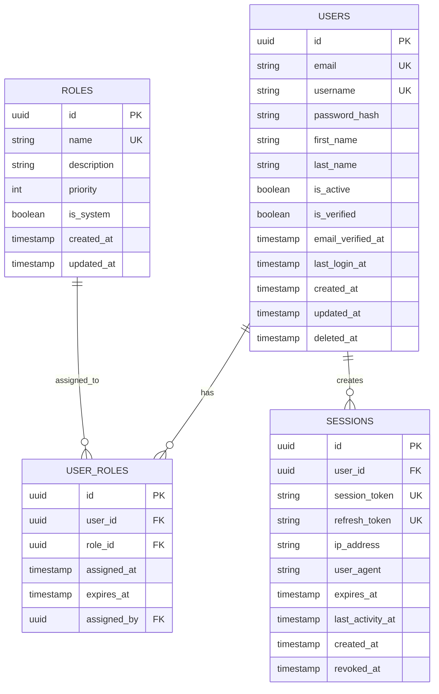

# 🗄️ Diseño de Esquema de Base de Datos

## Documento Técnico: Sistema de Autenticación Centralizado con RBAC

**Versión:** 1.0.0
**Fecha:** 2025-12-19
**Autor:** AI Assistant
**Propósito:** Documentación del esquema de base de datos para autenticación y autorización centralizada

---

## 📚 Tabla de Contenidos

| Sección | Contenido |
|---------|-----------|
| [1. Visión General](#1-visión-general) | Objetivos y arquitectura |
| [2. Modelo de Datos](#2-modelo-de-datos) | ERD y relaciones |
| [3. Tablas](#3-tablas) | Definición detallada |
| [4. Índices](#4-índices) | Optimización de queries |
| [5. Constraints](#5-constraints) | Reglas de integridad |
| [6. Triggers](#6-triggers) | Automatizaciones |
| [7. Queries Comunes](#7-queries-comunes) | Ejemplos de uso |

---

## 1. Visión General

### 1.1 Objetivos

Este esquema de base de datos está diseñado para:

- ✅ **Autenticación centralizada**: Un solo sistema de login para todas las aplicaciones (React, Dash, futuras apps)
- ✅ **RBAC (Role-Based Access Control)**: Control de acceso basado en roles
- ✅ **Escalabilidad**: Preparado para crecer con nuevas aplicaciones y usuarios
- ✅ **Seguridad**: Passwords hasheados, sesiones seguras, auditoría de accesos
- ✅ **Flexibilidad**: Soporte para múltiples roles por usuario

### 1.2 Principios de Diseño

| Principio | Descripción |
|-----------|-------------|
| **SQL Puro** | No usar ORM, escribir queries SQL directamente con asyncpg |
| **Normalización** | Esquema normalizado en 3NF para evitar redundancia |
| **Auditoría** | Timestamps de creación y actualización en todas las tablas |
| **Soft Deletes** | Usar flags de eliminación en lugar de DELETE físico |
| **UUIDs** | Primary keys con UUID para mejor distribución y seguridad |

---

## 2. Modelo de Datos

### 2.1 Diagrama ER (Entity-Relationship)



### 2.2 Relaciones

| Relación | Tipo | Descripción |
|----------|------|-------------|
| Users ↔ Roles | Many-to-Many | Un usuario puede tener múltiples roles, un rol puede asignarse a múltiples usuarios |
| Users → Sessions | One-to-Many | Un usuario puede tener múltiples sesiones activas (web, mobile, etc.) |
| User_Roles → Users | Many-to-One | Cada asignación pertenece a un usuario |
| User_Roles → Roles | Many-to-One | Cada asignación referencia un rol |

---

## 3. Tablas

### 3.1 Tabla: `users`

**Propósito**: Almacena información principal de usuarios del sistema.

```sql
CREATE TABLE users (
    -- Identificación
    id UUID PRIMARY KEY DEFAULT gen_random_uuid(),
    email VARCHAR(255) NOT NULL UNIQUE,
    username VARCHAR(100) NOT NULL UNIQUE,
    password_hash VARCHAR(255) NOT NULL,

    -- Información Personal
    first_name VARCHAR(100),
    last_name VARCHAR(100),

    -- Estado del Usuario
    is_active BOOLEAN NOT NULL DEFAULT TRUE,
    is_verified BOOLEAN NOT NULL DEFAULT FALSE,
    email_verified_at TIMESTAMP WITH TIME ZONE,
    last_login_at TIMESTAMP WITH TIME ZONE,

    -- Auditoría
    created_at TIMESTAMP WITH TIME ZONE NOT NULL DEFAULT NOW(),
    updated_at TIMESTAMP WITH TIME ZONE NOT NULL DEFAULT NOW(),
    deleted_at TIMESTAMP WITH TIME ZONE,

    -- Constraints
    CONSTRAINT users_email_check CHECK (email ~* '^[A-Za-z0-9._%+-]+@[A-Za-z0-9.-]+\.[A-Za-z]{2,}$'),
    CONSTRAINT users_username_check CHECK (LENGTH(username) >= 3 AND username ~ '^[a-zA-Z0-9_-]+$')
);

-- Índices
CREATE INDEX idx_users_email ON users(email) WHERE deleted_at IS NULL;
CREATE INDEX idx_users_username ON users(username) WHERE deleted_at IS NULL;
CREATE INDEX idx_users_is_active ON users(is_active) WHERE deleted_at IS NULL;
CREATE INDEX idx_users_created_at ON users(created_at);

-- Comentarios
COMMENT ON TABLE users IS 'Tabla principal de usuarios del sistema';
COMMENT ON COLUMN users.id IS 'Identificador único del usuario (UUID v4)';
COMMENT ON COLUMN users.email IS 'Email único del usuario (usado para login)';
COMMENT ON COLUMN users.username IS 'Nombre de usuario único (alfanumérico, -, _)';
COMMENT ON COLUMN users.password_hash IS 'Hash bcrypt del password (nunca almacenar en texto plano)';
COMMENT ON COLUMN users.is_active IS 'Si el usuario puede iniciar sesión';
COMMENT ON COLUMN users.is_verified IS 'Si el email fue verificado';
COMMENT ON COLUMN users.deleted_at IS 'Timestamp de soft delete (NULL = activo)';
```

**Campos Clave:**

| Campo | Tipo | Descripción |
|-------|------|-------------|
| `id` | UUID | Primary key, generado automáticamente |
| `email` | VARCHAR(255) | Email único, usado para login |
| `username` | VARCHAR(100) | Username único, alfanumérico |
| `password_hash` | VARCHAR(255) | Hash bcrypt del password |
| `is_active` | BOOLEAN | Controla si el usuario puede hacer login |
| `is_verified` | BOOLEAN | Si verificó su email |
| `deleted_at` | TIMESTAMP | Soft delete (NULL = activo) |

---

### 3.2 Tabla: `roles`

**Propósito**: Define roles del sistema para control de acceso.

```sql
CREATE TABLE roles (
    -- Identificación
    id UUID PRIMARY KEY DEFAULT gen_random_uuid(),
    name VARCHAR(50) NOT NULL UNIQUE,
    description TEXT,

    -- Configuración
    priority INTEGER NOT NULL DEFAULT 0,
    is_system BOOLEAN NOT NULL DEFAULT FALSE,

    -- Auditoría
    created_at TIMESTAMP WITH TIME ZONE NOT NULL DEFAULT NOW(),
    updated_at TIMESTAMP WITH TIME ZONE NOT NULL DEFAULT NOW(),

    -- Constraints
    CONSTRAINT roles_name_check CHECK (name ~ '^[A-Z_]+$'),
    CONSTRAINT roles_priority_check CHECK (priority >= 0 AND priority <= 1000)
);

-- Índices
CREATE INDEX idx_roles_name ON roles(name);
CREATE INDEX idx_roles_priority ON roles(priority DESC);

-- Comentarios
COMMENT ON TABLE roles IS 'Roles del sistema para RBAC';
COMMENT ON COLUMN roles.name IS 'Nombre del rol (UPPER_SNAKE_CASE, ej: ADMIN, USER, MODERATOR)';
COMMENT ON COLUMN roles.priority IS 'Prioridad del rol (mayor = más permisos, 0-1000)';
COMMENT ON COLUMN roles.is_system IS 'Si es un rol del sistema (no se puede eliminar)';
```

**Roles Predefinidos:**

| Nombre | Descripción | Prioridad | is_system |
|--------|-------------|-----------|-----------|
| `ADMIN` | Administrador del sistema | 1000 | true |
| `MODERATOR` | Moderador de contenido | 500 | true |
| `USER` | Usuario estándar | 100 | true |
| `GUEST` | Usuario invitado (lectura) | 10 | true |

---

### 3.3 Tabla: `user_roles`

**Propósito**: Tabla de unión para relación many-to-many entre usuarios y roles.

```sql
CREATE TABLE user_roles (
    -- Identificación
    id UUID PRIMARY KEY DEFAULT gen_random_uuid(),
    user_id UUID NOT NULL REFERENCES users(id) ON DELETE CASCADE,
    role_id UUID NOT NULL REFERENCES roles(id) ON DELETE CASCADE,

    -- Asignación
    assigned_at TIMESTAMP WITH TIME ZONE NOT NULL DEFAULT NOW(),
    expires_at TIMESTAMP WITH TIME ZONE,
    assigned_by UUID REFERENCES users(id) ON DELETE SET NULL,

    -- Constraints
    CONSTRAINT user_roles_unique UNIQUE (user_id, role_id)
);

-- Índices
CREATE INDEX idx_user_roles_user_id ON user_roles(user_id);
CREATE INDEX idx_user_roles_role_id ON user_roles(role_id);
CREATE INDEX idx_user_roles_expires_at ON user_roles(expires_at) WHERE expires_at IS NOT NULL;

-- Comentarios
COMMENT ON TABLE user_roles IS 'Asignación de roles a usuarios (many-to-many)';
COMMENT ON COLUMN user_roles.expires_at IS 'Fecha de expiración del rol (NULL = permanente)';
COMMENT ON COLUMN user_roles.assigned_by IS 'Usuario que asignó el rol (para auditoría)';
```

**Casos de Uso:**

- Usuario con múltiples roles: `user_id=123` puede tener `ADMIN` + `MODERATOR`
- Roles temporales: `expires_at` permite roles con tiempo limitado
- Auditoría: `assigned_by` registra quién asignó el rol

---

### 3.4 Tabla: `sessions`

**Propósito**: Gestiona sesiones activas de usuarios (JWT, tokens).

```sql
CREATE TABLE sessions (
    -- Identificación
    id UUID PRIMARY KEY DEFAULT gen_random_uuid(),
    user_id UUID NOT NULL REFERENCES users(id) ON DELETE CASCADE,

    -- Tokens
    session_token VARCHAR(500) NOT NULL UNIQUE,
    refresh_token VARCHAR(500) UNIQUE,

    -- Información de Sesión
    ip_address INET,
    user_agent TEXT,

    -- Temporalidad
    expires_at TIMESTAMP WITH TIME ZONE NOT NULL,
    last_activity_at TIMESTAMP WITH TIME ZONE NOT NULL DEFAULT NOW(),
    created_at TIMESTAMP WITH TIME ZONE NOT NULL DEFAULT NOW(),
    revoked_at TIMESTAMP WITH TIME ZONE,

    -- Constraints
    CONSTRAINT sessions_expires_check CHECK (expires_at > created_at)
);

-- Índices
CREATE INDEX idx_sessions_user_id ON sessions(user_id) WHERE revoked_at IS NULL;
CREATE INDEX idx_sessions_session_token ON sessions(session_token) WHERE revoked_at IS NULL;
CREATE INDEX idx_sessions_refresh_token ON sessions(refresh_token) WHERE revoked_at IS NULL AND refresh_token IS NOT NULL;
CREATE INDEX idx_sessions_expires_at ON sessions(expires_at) WHERE revoked_at IS NULL;

-- Comentarios
COMMENT ON TABLE sessions IS 'Sesiones activas de usuarios (JWT, refresh tokens)';
COMMENT ON COLUMN sessions.session_token IS 'Token de sesión (access token / JWT)';
COMMENT ON COLUMN sessions.refresh_token IS 'Token para renovar sesión';
COMMENT ON COLUMN sessions.revoked_at IS 'Timestamp de revocación manual (logout)';
```

**Características:**

- Múltiples sesiones por usuario (web, mobile, tablet)
- Revocación manual con `revoked_at`
- Limpieza automática de sesiones expiradas
- Auditoría de IP y User-Agent para seguridad

---

## 4. Índices

### 4.1 Estrategia de Indexación

| Tabla | Índice | Tipo | Propósito |
|-------|--------|------|-----------|
| `users` | `email` | B-tree | Login por email (WHERE email = ?) |
| `users` | `username` | B-tree | Login por username |
| `users` | `is_active` | Partial | Filtrar usuarios activos |
| `roles` | `name` | B-tree | Búsqueda por nombre de rol |
| `roles` | `priority` | B-tree DESC | Ordenar roles por prioridad |
| `user_roles` | `user_id` | B-tree | Obtener roles de un usuario |
| `user_roles` | `role_id` | B-tree | Obtener usuarios con un rol |
| `sessions` | `session_token` | B-tree | Validar token de sesión |
| `sessions` | `user_id` | B-tree | Listar sesiones de un usuario |

### 4.2 Índices Parciales (Performance)

Índices parciales con `WHERE` clause para optimizar queries comunes:

```sql
-- Solo indexar usuarios NO eliminados
CREATE INDEX idx_users_email ON users(email) WHERE deleted_at IS NULL;

-- Solo indexar sesiones NO revocadas
CREATE INDEX idx_sessions_session_token ON sessions(session_token) WHERE revoked_at IS NULL;
```

**Ventaja**: Índices más pequeños y rápidos al excluir filas irrelevantes.

---

## 5. Constraints

### 5.1 Constraints de Integridad

| Constraint | Tabla | Descripción |
|------------|-------|-------------|
| `users_email_check` | users | Email válido (regex) |
| `users_username_check` | users | Username alfanumérico, min 3 chars |
| `roles_name_check` | roles | Rol en UPPER_SNAKE_CASE |
| `roles_priority_check` | roles | Prioridad entre 0-1000 |
| `user_roles_unique` | user_roles | Usuario-Rol único (no duplicados) |
| `sessions_expires_check` | sessions | Expiración > creación |

### 5.2 Foreign Keys con Acciones

```sql
-- Cascade: Si se elimina un usuario, eliminar sus asignaciones de roles
user_id UUID REFERENCES users(id) ON DELETE CASCADE

-- Set NULL: Si se elimina quien asignó el rol, poner NULL
assigned_by UUID REFERENCES users(id) ON DELETE SET NULL
```

---

## 6. Triggers

### 6.1 Trigger: Auto-actualizar `updated_at`

```sql
-- Función para actualizar updated_at
CREATE OR REPLACE FUNCTION update_updated_at_column()
RETURNS TRIGGER AS $$
BEGIN
    NEW.updated_at = NOW();
    RETURN NEW;
END;
$$ LANGUAGE plpgsql;

-- Aplicar a users
CREATE TRIGGER update_users_updated_at
    BEFORE UPDATE ON users
    FOR EACH ROW
    EXECUTE FUNCTION update_updated_at_column();

-- Aplicar a roles
CREATE TRIGGER update_roles_updated_at
    BEFORE UPDATE ON roles
    FOR EACH ROW
    EXECUTE FUNCTION update_updated_at_column();
```

### 6.2 Trigger: Validar Email antes de Insertar

```sql
CREATE OR REPLACE FUNCTION validate_user_email()
RETURNS TRIGGER AS $$
BEGIN
    -- Convertir email a lowercase
    NEW.email = LOWER(TRIM(NEW.email));

    -- Validar formato
    IF NEW.email !~* '^[A-Za-z0-9._%+-]+@[A-Za-z0-9.-]+\.[A-Za-z]{2,}$' THEN
        RAISE EXCEPTION 'Email inválido: %', NEW.email;
    END IF;

    RETURN NEW;
END;
$$ LANGUAGE plpgsql;

CREATE TRIGGER validate_user_email_trigger
    BEFORE INSERT OR UPDATE ON users
    FOR EACH ROW
    EXECUTE FUNCTION validate_user_email();
```

---

## 7. Queries Comunes

### 7.1 Autenticación

**Login por Email:**
```sql
-- Obtener usuario por email para validar password
SELECT
    id,
    email,
    username,
    password_hash,
    is_active,
    is_verified
FROM users
WHERE email = $1
  AND deleted_at IS NULL
  AND is_active = TRUE;
```

**Crear Sesión:**
```sql
INSERT INTO sessions (
    user_id,
    session_token,
    refresh_token,
    ip_address,
    user_agent,
    expires_at
)
VALUES ($1, $2, $3, $4, $5, $6)
RETURNING id, session_token, expires_at;
```

### 7.2 Autorización (RBAC)

**Obtener Roles de un Usuario:**
```sql
SELECT r.name, r.priority, ur.expires_at
FROM user_roles ur
JOIN roles r ON ur.role_id = r.id
WHERE ur.user_id = $1
  AND (ur.expires_at IS NULL OR ur.expires_at > NOW());
```

**Verificar si Usuario tiene Rol:**
```sql
SELECT EXISTS (
    SELECT 1
    FROM user_roles ur
    JOIN roles r ON ur.role_id = r.id
    WHERE ur.user_id = $1
      AND r.name = $2
      AND (ur.expires_at IS NULL OR ur.expires_at > NOW())
) AS has_role;
```

### 7.3 Gestión de Usuarios

**Crear Usuario:**
```sql
INSERT INTO users (
    email,
    username,
    password_hash,
    first_name,
    last_name
)
VALUES ($1, $2, $3, $4, $5)
RETURNING id, email, username, created_at;
```

**Asignar Rol a Usuario:**
```sql
INSERT INTO user_roles (user_id, role_id, assigned_by)
VALUES ($1, $2, $3)
ON CONFLICT (user_id, role_id) DO NOTHING
RETURNING id, assigned_at;
```

**Soft Delete de Usuario:**
```sql
UPDATE users
SET deleted_at = NOW(),
    updated_at = NOW()
WHERE id = $1 AND deleted_at IS NULL
RETURNING id, email, deleted_at;
```

### 7.4 Gestión de Sesiones

**Validar Token de Sesión:**
```sql
SELECT s.id, s.user_id, s.expires_at, u.email, u.username
FROM sessions s
JOIN users u ON s.user_id = u.id
WHERE s.session_token = $1
  AND s.revoked_at IS NULL
  AND s.expires_at > NOW()
  AND u.is_active = TRUE
  AND u.deleted_at IS NULL;
```

**Revocar Sesión (Logout):**
```sql
UPDATE sessions
SET revoked_at = NOW()
WHERE session_token = $1 AND revoked_at IS NULL
RETURNING id, user_id, revoked_at;
```

**Limpiar Sesiones Expiradas:**
```sql
DELETE FROM sessions
WHERE expires_at < NOW() - INTERVAL '7 days';
```

---

## 8. Datos Iniciales (Seed)

### 8.1 Roles del Sistema

```sql
-- Insertar roles predefinidos
INSERT INTO roles (name, description, priority, is_system) VALUES
    ('ADMIN', 'Administrador con acceso completo', 1000, TRUE),
    ('MODERATOR', 'Moderador de contenido y usuarios', 500, TRUE),
    ('USER', 'Usuario estándar con acceso básico', 100, TRUE),
    ('GUEST', 'Usuario invitado con acceso de solo lectura', 10, TRUE)
ON CONFLICT (name) DO NOTHING;
```

### 8.2 Usuario Admin por Defecto

```sql
-- Crear usuario admin (password: "admin123" hasheado con bcrypt)
INSERT INTO users (
    email,
    username,
    password_hash,
    first_name,
    last_name,
    is_active,
    is_verified,
    email_verified_at
) VALUES (
    'admin@example.com',
    'admin',
    '$2b$12$LQv3c1yqBWVHxkd0LHAkCOYz6TtxMQJqhN8/LewY5NU7dpU.WQzp.', -- admin123
    'System',
    'Administrator',
    TRUE,
    TRUE,
    NOW()
)
ON CONFLICT (email) DO NOTHING
RETURNING id;

-- Asignar rol ADMIN al usuario admin
INSERT INTO user_roles (user_id, role_id)
SELECT
    (SELECT id FROM users WHERE email = 'admin@example.com'),
    (SELECT id FROM roles WHERE name = 'ADMIN')
ON CONFLICT DO NOTHING;
```

---

## 9. Seguridad

### 9.1 Mejores Prácticas

| Práctica | Implementación |
|----------|----------------|
| **Password Hashing** | Usar bcrypt con cost factor 12+ |
| **SQL Injection** | SIEMPRE usar parámetros ($1, $2) nunca concatenar strings |
| **Soft Deletes** | No eliminar físicamente usuarios (GDPR compliance) |
| **Audit Trail** | Registrar `assigned_by` en cambios de roles |
| **Rate Limiting** | Implementar en API, no en DB |
| **Session Expiry** | Tokens con expiración corta (15-30 min) |

### 9.2 Queries Seguros (asyncpg)

```python
# ✅ CORRECTO - Usar parámetros
email = "user@example.com"
result = await conn.fetchrow(
    "SELECT * FROM users WHERE email = $1",
    email
)

# ❌ INCORRECTO - NUNCA hacer esto
email = "user@example.com"
result = await conn.fetchrow(
    f"SELECT * FROM users WHERE email = '{email}'"  # SQL Injection!
)
```

---

## 10. Próximos Pasos

### 10.1 Extensiones Futuras

| Feature | Descripción | Prioridad |
|---------|-------------|-----------|
| **Permisos Granulares** | Tabla `permissions` + `role_permissions` | Media |
| **Multi-Factor Auth** | Tabla `mfa_secrets` con TOTP | Alta |
| **OAuth Providers** | Tabla `oauth_accounts` (Google, GitHub) | Media |
| **User Preferences** | Tabla `user_settings` con JSONB | Baja |
| **Audit Logs** | Tabla `audit_logs` para acciones críticas | Alta |

---

## 11. Mantenimiento

### 11.1 Jobs Programados

```sql
-- Limpiar sesiones expiradas (ejecutar diariamente)
DELETE FROM sessions WHERE expires_at < NOW() - INTERVAL '7 days';

-- Limpiar usuarios sin verificar después de 30 días
UPDATE users
SET deleted_at = NOW()
WHERE is_verified = FALSE
  AND created_at < NOW() - INTERVAL '30 days'
  AND deleted_at IS NULL;
```

---

**FIN DEL DOCUMENTO**
