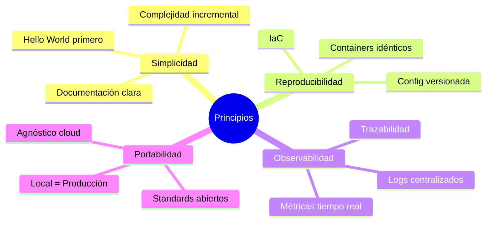
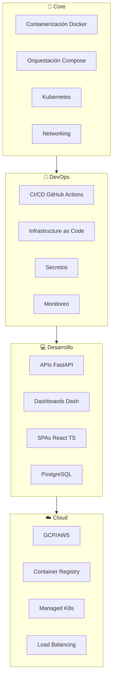
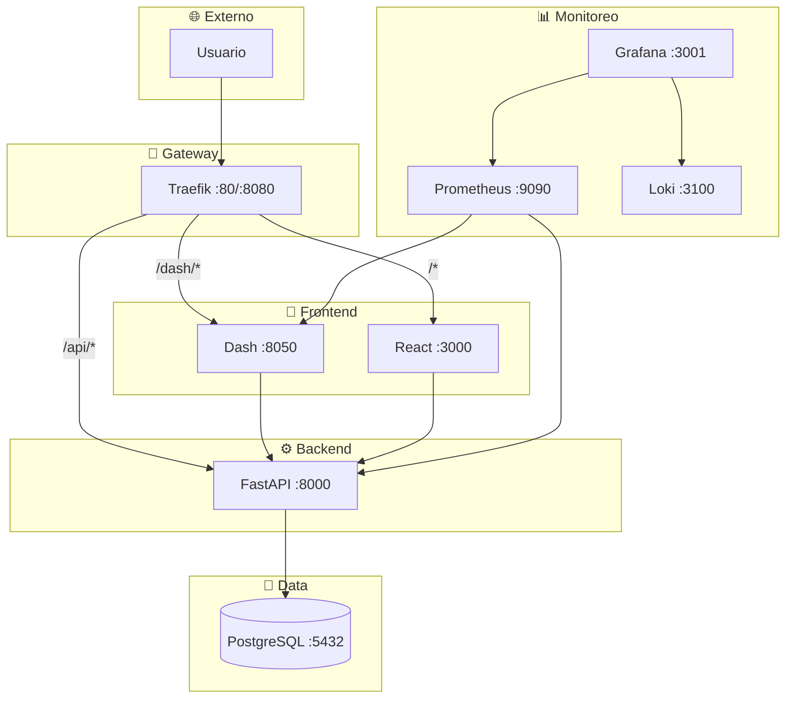
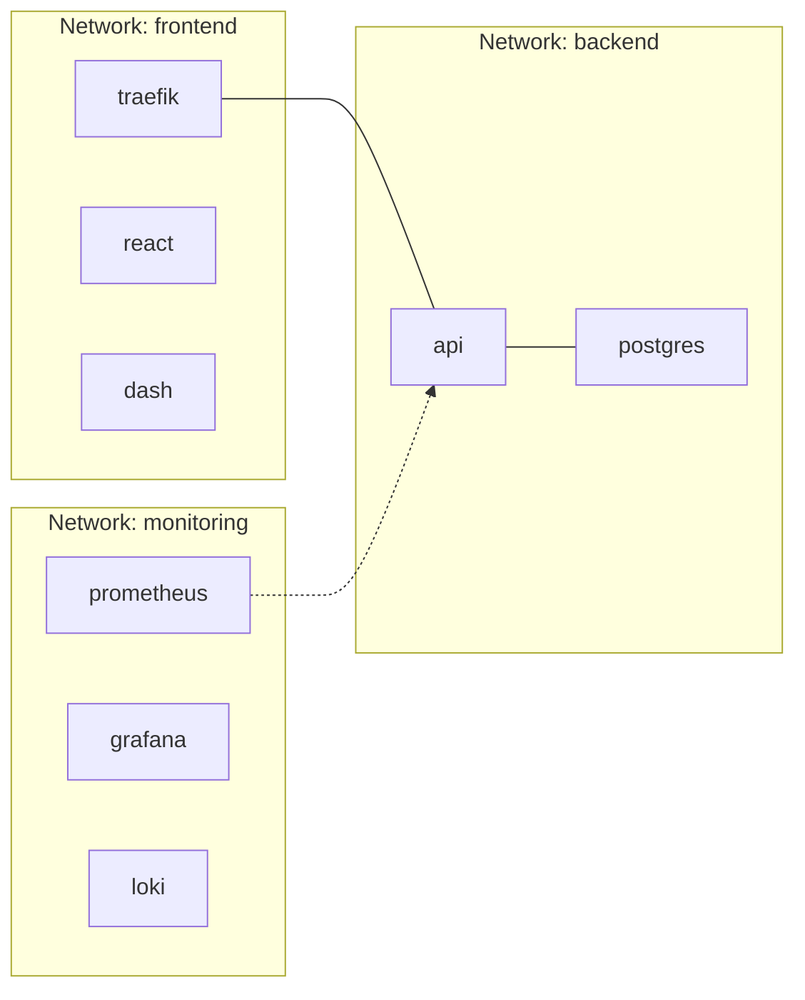
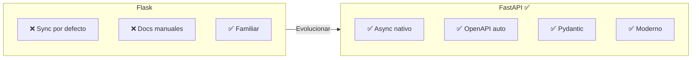
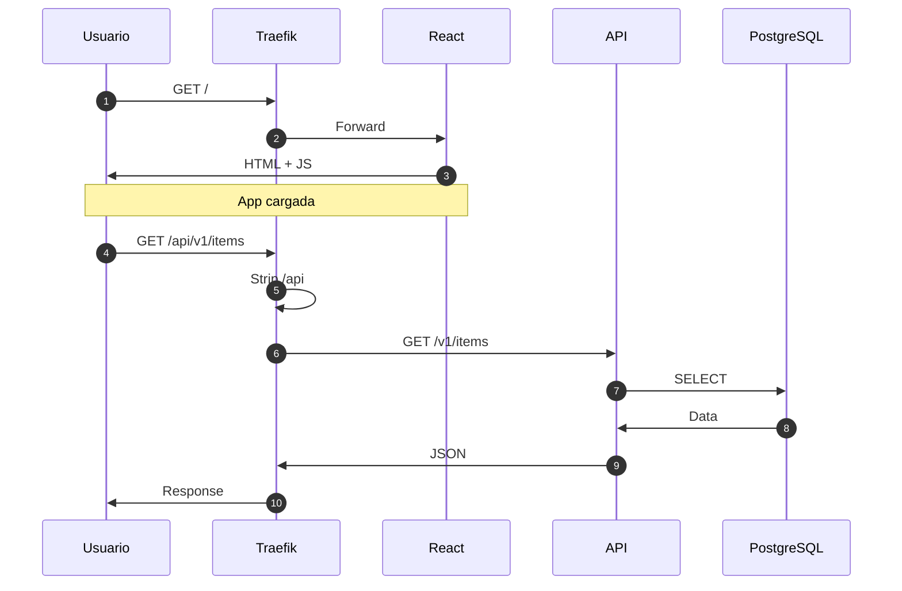
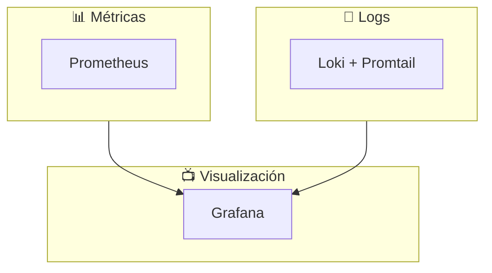
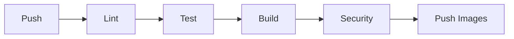
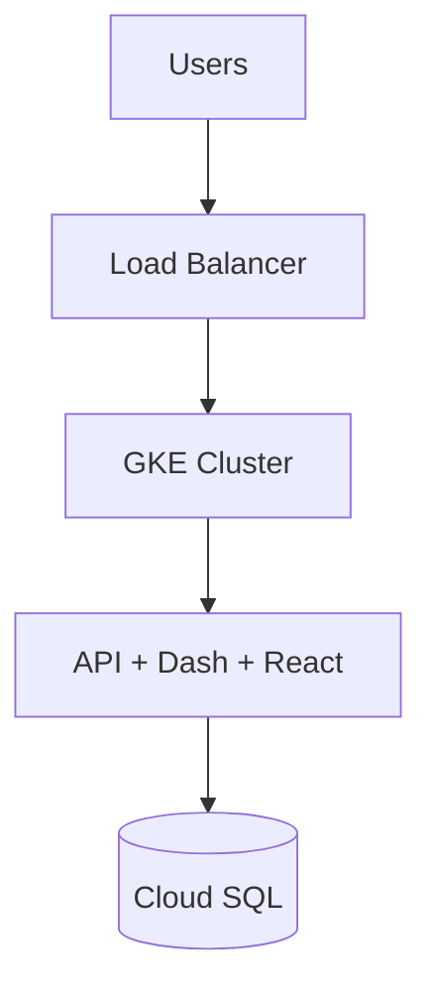

# 🚀 Proyecto Cloud-Native Microservices Learning Platform

## Documento Maestro de Planificación y Arquitectura

**Versión:** 1.0.0  
**Fecha:** 2024-12-19  
**Autor:** Javier (con asistencia de Claude)  
**Propósito:** Documento de contexto completo para implementación con Claude Code en WSL

---

## 📋 Índice Rápido

| Sección | Contenido |
|---------|-----------|
| [1. Visión General](#1-visión-general) | Qué es, principios, contexto |
| [2. Objetivos](#2-objetivos-de-aprendizaje) | Competencias, roadmap |
| [3. Arquitectura](#3-arquitectura-del-sistema) | Diagramas, capas, componentes |
| [4. Stack Tecnológico](#4-stack-tecnológico) | Decisiones, justificaciones |
| [5. Estructura](#5-estructura-del-proyecto) | Árbol de directorios |
| [6. Servicios](#6-servicios-y-componentes) | PostgreSQL, API, Dash, React, Traefik |
| [7. Flujo de Datos](#7-flujo-de-datos) | Secuencias, requests |
| [8. Desarrollo Local](#8-desarrollo-local) | Docker Compose, .env, comandos |
| [9. Monitoreo](#9-sistema-de-monitoreo) | Prometheus, Grafana, Loki |
| [10. CI/CD](#10-pipeline-cicd) | GitHub Actions, deploy |
| [11. Cloud](#11-despliegue-en-la-nube) | GCP, Kubernetes |
| [12. Fases](#12-guías-por-fases) | Implementación paso a paso |
| [13. Makefile](#13-comandos-make) | Todos los comandos |
| [14. Troubleshooting](#14-troubleshooting) | FAQ, problemas comunes |
| [15. Prompt Claude Code](#15-prompt-para-claude-code) | Cómo usar este documento |

---

## 1. Visión General

### 1.1 ¿Qué es este proyecto?

Una **plataforma de aprendizaje práctica** para dominar arquitecturas de microservicios cloud-native. Implementa una aplicación completa con:

- ✅ Múltiples servicios containerizados
- ✅ API Gateway con Traefik
- ✅ Base de datos PostgreSQL
- ✅ Frontend React TypeScript + Dashboard Dash Python
- ✅ Monitoreo completo (Prometheus/Grafana/Loki)
- ✅ CI/CD automatizado con GitHub Actions
- ✅ Despliegue a Kubernetes en GCP

### 1.2 Diagrama de Contexto

```mermaid
C4Context
    title Diagrama de Contexto - Microservices Learning Platform

    Person(dev, "Desarrollador", "Aprende microservicios")
    
    System_Boundary(platform, "Learning Platform") {
        System(api, "API Backend", "FastAPI")
        System(dash, "Dash App", "Python Dashboard")
        System(react, "React App", "TypeScript SPA")
        System(db, "PostgreSQL", "Base de datos")
    }
    
    System_Ext(cloud, "GCP", "Kubernetes")
    System_Ext(github, "GitHub", "CI/CD")
    System_Ext(monitoring, "Monitoreo", "Prometheus/Grafana")
    
    Rel(dev, platform, "Desarrolla")
    Rel(platform, cloud, "Deploy")
    Rel(platform, github, "Código")
    Rel(monitoring, platform, "Observa")
```

### 1.3 Principios de Diseño



---

## 2. Objetivos de Aprendizaje

### 2.1 Competencias a Desarrollar



### 2.2 Roadmap de Fases

| Fase | Enfoque | Tecnologías | Duración Est. |
|------|---------|-------------|---------------|
| **1** | Estructura Base | Git, Makefile, Docker | 1-2 días |
| **2** | Hello World | FastAPI, Dash, React, PostgreSQL | 3-4 días |
| **3** | Integración | Traefik, Docker networks | 2 días |
| **4** | Monitoreo | Prometheus, Grafana, Loki | 2-3 días |
| **5** | CI/CD | GitHub Actions, tests | 2 días |
| **6** | Cloud | Kubernetes, GKE | 3-4 días |

---

## 3. Arquitectura del Sistema

### 3.1 Arquitectura de Alto Nivel



### 3.2 Redes Docker



---

## 4. Stack Tecnológico

### 4.1 Decisiones y Justificaciones

| Componente | Tecnología | ¿Por qué? |
|------------|------------|-----------|
| **API** | FastAPI | Async, tipado, docs automáticos |
| **ORM** | SQLAlchemy 2.0 | Async support, maduro |
| **Dashboard** | Dash + Plotly | Python nativo, interactivo |
| **Frontend** | React + TypeScript + Vite | Rápido, tipado, moderno |
| **Styling** | Tailwind CSS | Utility-first |
| **Data Fetching** | TanStack Query | Server state management |
| **Database** | PostgreSQL 16 | ACID, extensible, cloud-ready |
| **Gateway** | Traefik v3 | Dinámico, Docker labels |
| **Containers** | Docker + Compose | Estándar industria |
| **Orchestration** | Kubernetes | Escalabilidad producción |
| **CI/CD** | GitHub Actions | Integración nativa |
| **Metrics** | Prometheus | Estándar de facto |
| **Visualization** | Grafana | Dashboards potentes |
| **Logs** | Loki | Integración Grafana |
| **Cloud** | GCP (GKE) | USD 300 gratis, simple |

### 4.2 ¿Por qué FastAPI sobre Flask?



---

## 5. Estructura del Proyecto

### 5.1 Árbol de Directorios

```
microservices-learning-platform/
├── .github/workflows/          # CI/CD pipelines
│   ├── ci.yml
│   ├── cd-staging.yml
│   └── cd-production.yml
│
├── services/                   # Microservicios
│   ├── api/                    # FastAPI Backend
│   │   ├── app/
│   │   │   ├── main.py
│   │   │   ├── config.py
│   │   │   ├── database.py
│   │   │   ├── models/
│   │   │   ├── schemas/
│   │   │   ├── routers/
│   │   │   └── services/
│   │   ├── tests/
│   │   ├── Dockerfile
│   │   ├── Dockerfile.dev
│   │   ├── requirements.txt
│   │   └── requirements-dev.txt
│   │
│   ├── dash-app/               # Dashboard Python
│   │   ├── app/
│   │   │   ├── main.py
│   │   │   ├── layouts/
│   │   │   ├── components/
│   │   │   └── callbacks/
│   │   ├── assets/
│   │   ├── Dockerfile
│   │   └── requirements.txt
│   │
│   └── react-app/              # Frontend React
│       ├── src/
│       │   ├── main.tsx
│       │   ├── App.tsx
│       │   ├── components/
│       │   ├── pages/
│       │   ├── hooks/
│       │   ├── services/
│       │   └── types/
│       ├── Dockerfile
│       ├── package.json
│       ├── tsconfig.json
│       └── vite.config.ts
│
├── infrastructure/             # Configuración infra
│   ├── docker/
│   │   ├── docker-compose.yml
│   │   ├── docker-compose.dev.yml
│   │   └── docker-compose.monitoring.yml
│   ├── traefik/
│   ├── prometheus/
│   ├── grafana/
│   ├── loki/
│   └── kubernetes/
│       ├── base/
│       └── overlays/
│           ├── staging/
│           └── production/
│
├── scripts/                    # Scripts utilidad
├── docs/                       # Documentación
├── Makefile                    # Comandos principales
├── .env.example
├── .gitignore
└── README.md
```

---

## 6. Servicios y Componentes

### 6.1 PostgreSQL

- **Imagen:** postgres:16-alpine
- **Puerto:** 5432
- **Volume:** pg_data (persistencia)
- **Health check:** pg_isready

### 6.2 API FastAPI

**Endpoints principales:**
- \`GET /health\` - Health check
- \`GET /ready\` - Readiness (incluye DB)
- \`GET /metrics\` - Prometheus metrics
- \`GET /docs\` - Swagger UI
- \`CRUD /v1/items\` - Ejemplo de recurso

**Características:**
- Async/await con asyncpg
- Validación con Pydantic
- OpenAPI automático
- CORS configurado

### 6.3 Dash App

- Framework: Dash + Plotly
- Puerto: 8050
- Conecta a API vía HTTP
- Gráficos interactivos

### 6.4 React App

- Build: Vite
- State: TanStack Query
- Styling: Tailwind CSS
- Router: React Router DOM

### 6.5 Traefik

**Routing:**
- \`/api/*\` → API (strip prefix)
- \`/dash/*\` → Dash App
- \`/*\` → React (catch-all, priority 1)

**Dashboard:** http://localhost:8080

---

## 7. Flujo de Datos

### 7.1 Request Típico



---

## 8. Desarrollo Local

### 8.1 Prerequisitos

- Docker Desktop (o Engine 24+)
- Docker Compose v2
- Git
- Make

### 8.2 Variables de Entorno (.env.example)

```bash
# General
COMPOSE_PROJECT_NAME=mlp
ENVIRONMENT=development

# PostgreSQL
POSTGRES_HOST=postgres
POSTGRES_PORT=5432
POSTGRES_DB=mlp_db
POSTGRES_USER=mlp_user
POSTGRES_PASSWORD=mlp_secret

# API
DATABASE_URL=postgresql+asyncpg://\${POSTGRES_USER}:\${POSTGRES_PASSWORD}@\${POSTGRES_HOST}:\${POSTGRES_PORT}/\${POSTGRES_DB}
API_DEBUG=true

# Dash
API_URL=http://api:8000
DASH_DEBUG=true

# React
VITE_API_URL=http://localhost/api

# Monitoring
GRAFANA_ADMIN_USER=admin
GRAFANA_ADMIN_PASSWORD=admin
```

### 8.3 Docker Compose Principal

Ver archivo completo en: \`infrastructure/docker/docker-compose.yml\`

Servicios incluidos:
- postgres (healthcheck)
- api (labels traefik)
- dash (labels traefik)
- react (labels traefik)
- traefik (gateway)

---

## 9. Sistema de Monitoreo

### 9.1 Stack



### 9.2 Acceso

- **Prometheus:** http://localhost:9090
- **Grafana:** http://localhost:3001 (admin/admin)

---

## 10. Pipeline CI/CD

### 10.1 Pipeline CI



### 10.2 GitHub Actions

Archivos en \`.github/workflows/\`:
- \`ci.yml\` - Lint, test, build, push
- \`cd-staging.yml\` - Auto-deploy a staging
- \`cd-production.yml\` - Deploy manual a prod

---

## 11. Despliegue en la Nube

### 11.1 Por qué GCP

- USD 300 créditos gratis (90 días)
- GKE Autopilot simple
- Buena documentación

### 11.2 Arquitectura GCP



---

## 12. Guías por Fases

### Fase 1: Estructura Base
- [ ] Crear directorios
- [ ] Inicializar Git
- [ ] Crear Makefile
- [ ] Crear .env.example

### Fase 2: Hello World
- [ ] PostgreSQL container
- [ ] API /health responde
- [ ] Dash página básica
- [ ] React página básica
- [ ] make dev-up funciona

### Fase 3: Integración
- [ ] Traefik configurado
- [ ] Routing por path funciona
- [ ] Dashboard Traefik accesible

### Fase 4: Monitoreo
- [ ] Prometheus scrapeando
- [ ] Grafana con dashboards
- [ ] Logs en Loki

### Fase 5: CI/CD
- [ ] Pipeline CI funciona
- [ ] Tests pasan
- [ ] Images se publican

### Fase 6: Cloud
- [ ] Cuenta GCP activa
- [ ] Cluster GKE creado
- [ ] App desplegada

---

## 13. Comandos Make

```makefile
# 🚀 Desarrollo
make dev-up          # Levantar todo
make dev-down        # Detener todo
make dev-logs        # Ver logs
make dev-status      # Estado containers

# 🔨 Build
make build           # Build all images
make build-api       # Build solo API

# 🧪 Testing
make test            # Todos los tests
make lint            # Verificar código
make lint-fix        # Auto-corregir

# 📊 Monitoreo
make monitoring-up   # Levantar stack
make monitoring-down # Detener stack

# 🐘 Database
make db-shell        # Conectar psql
make db-seed         # Cargar datos

# ☁️ Cloud
make deploy-staging  # Deploy staging
make deploy-prod     # Deploy producción

# 🧹 Limpieza
make clean           # Limpiar todo
make urls            # Mostrar URLs
make check-deps      # Verificar deps
```

---

## 14. Troubleshooting

### Problemas Comunes

| Problema | Solución |
|----------|----------|
| Container no inicia | \`make dev-logs\` para ver error |
| Puerto en uso | \`lsof -i :PORT\` y \`kill PID\` |
| API no conecta DB | Verificar .env, esperar healthcheck |
| Hot reload no funciona | Verificar volumes en compose.dev |
| Permisos Docker | \`sudo usermod -aG docker $USER\` |

---

## 15. Prompt para Claude Code

```markdown
He preparado un documento maestro para un proyecto de microservicios 
cloud-native. Incluye arquitectura, stack, estructura, configs, 
CI/CD, monitoreo y despliegue a Kubernetes.

Por favor, ayúdame a implementar paso a paso, comenzando por 
la Fase 1 (Estructura Base).

Requisitos:
- Directorio: microservices-learning-platform
- Seguir estructura documentada exactamente
- Makefile completo desde inicio
- .env.example con todas variables
- Inicializar Git
- Comentarios explicativos en código

Mi ambiente: WSL2 Ubuntu, Docker Desktop, Node 20, Python 3.12

¿Comenzamos con Fase 1?
```

---

## Historial

| Versión | Fecha | Cambios |
|---------|-------|---------|
| 1.0.0 | 2024-12-19 | Versión inicial |

---

**FIN DEL DOCUMENTO**

*Generado para uso con Claude Code*
