# Documentación del Modelo de Datos para Monitoreo de Procesos Mineros Cu/Mo

Esta documentación describe el modelo de datos relacional propuesto para el monitoreo de procesos en minería de cobre y molibdeno de baja ley. Se basa en la arquitectura en capas del plan proporcionado, utilizando PostgreSQL 16 como base de datos. Incluye diagramas Mermaid para representar el modelo Entidad-Relación (ER), la estructura jerárquica de capas y relaciones clave entre tablas.

## Resumen General

El modelo se organiza en 5 capas jerárquicas:
- **Capa 1: Entidades Maestras** - Datos estáticos o de catálogo (e.g., yacimientos, equipos).
- **Capa 2: Datos Operacionales** - Datos en tiempo real o de alta frecuencia (e.g., lecturas de sensores).
- **Capa 3: Análisis Químico** - Datos de laboratorio y análisis (e.g., leyes de minerales).
- **Capa 4: Mantenimiento** - Datos de gestión de activos (e.g., órdenes de trabajo).
- **Capa 5: Esquema Dimensional (Star Schema)** - Para análisis OLAP, con dimensiones y hechos para KPIs.

Se crean 25 tablas en total, junto con ENUMs para tipado estricto. Las fórmulas críticas (e.g., recuperación metalúrgica) se calculan en vistas o queries.

## Diagrama de Capas Jerárquicas (Mermaid Flowchart)

Este diagrama muestra el flujo descendente de las capas, donde las entidades maestras alimentan las operacionales, y así sucesivamente.

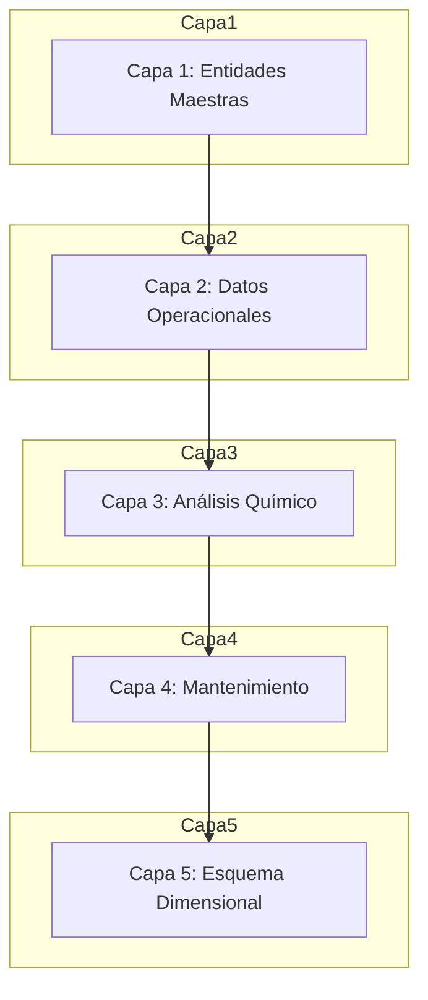

## Modelo Entidad-Relación (ER) Completo (Mermaid ER Diagram)

Este diagrama ER representa las entidades principales y sus relaciones. Se agrupan por grupos del plan. Las claves primarias (PK) y foráneas (FK) se indican. Para simplicidad, se muestran relaciones clave; en implementación, se usarán constraints en PostgreSQL.

```mermaid
erDiagram
    DEPOSITS ||--o{ MINES : "1:N"
    DEPOSITS ||--o{ COORDINATES : "1:N"
    DEPOSITS ||--o{ MINERALOGY : "1:N"
    MINES ||--o{ MINE_PHASES : "1:N"
    MINE_PHASES ||--o{ BLOCKS : "1:N"
    EQUIPMENT_TYPES ||--o{ EQUIPMENT : "1:N"
    EQUIPMENT ||--o{ EQUIPMENT_SENSORS : "1:N"
    OPERATORS ||--o{ TRANSPORT_CYCLES : "1:N"
    REAGENTS ||--o{ PROCESS_CHEMISTRY : "1:N"
    PROCESS_AREAS ||--o{ SENSOR_READINGS : "1:N"

    SENSOR_READINGS ||--o| PROCESS_CHEMISTRY : "relaciona"
    SENSOR_READINGS ||--o| TRANSPORT_CYCLES : "relaciona"
    SENSOR_READINGS ||--o| PRODUCTION_SHIFTS : "relaciona"

    FEED_ANALYSIS ||--o| CONCENTRATE_ANALYSIS : "alimenta"
    CONCENTRATE_ANALYSIS ||--o| TAILING_ANALYSIS : "contrasta"

    WORK_ORDERS ||--o{ EQUIPMENT_HEALTH : "monitorea"
    EQUIPMENT ||--o{ WORK_ORDERS : "1:N"
    EQUIPMENT ||--o{ EQUIPMENT_HEALTH : "1:N"

    DIM_TIME ||--|{ FACT_PRODUCTION : "dimensiona"
    DIM_PROCESS ||--|{ FACT_PRODUCTION : "dimensiona"
    DIM_MATERIAL ||--|{ FACT_PRODUCTION : "dimensiona"
    DIM_TIME ||--|{ FACT_MAINTENANCE : "dimensiona"
    MARKET_PRICES ||--o| FACT_PRODUCTION : "referencia"

    DEPOSITS {
        UUID id PK
        string name
        enum mine_type_enum
    }
    MINES {
        UUID id PK
        UUID deposit_id FK
    }
    MINE_PHASES {
        UUID id PK
        UUID mine_id FK
        string phase_name
    }
    BLOCKS {
        UUID id PK
        UUID mine_phase_id FK
        float volume
    }
    COORDINATES {
        UUID id PK
        UUID deposit_id FK
        float latitude
        float longitude
    }
    MINERALOGY {
        UUID id PK
        UUID deposit_id FK
        enum mineral_type_enum
    }
    EQUIPMENT_TYPES {
        UUID id PK
        enum equipment_type_enum
    }
    EQUIPMENT {
        UUID id PK
        UUID equipment_type_id FK
        enum equipment_status_enum
    }
    EQUIPMENT_SENSORS {
        UUID id PK
        UUID equipment_id FK
        string sensor_type
    }
    OPERATORS {
        UUID id PK
        string name
    }
    REAGENTS {
        UUID id PK
        string name
    }
    PROCESS_AREAS {
        UUID id PK
        enum process_area_enum
    }
    SENSOR_READINGS {
        UUID id PK
        UUID equipment_id FK
        UUID process_area_id FK
        timestamptz recorded_at
    }
    PROCESS_CHEMISTRY {
        UUID id PK
        UUID reagent_id FK
        float ph
        float orp
    }
    TRANSPORT_CYCLES {
        UUID id PK
        UUID operator_id FK
        timestamptz start_at
        timestamptz end_at
    }
    PRODUCTION_SHIFTS {
        UUID id PK
        timestamptz shift_start
        timestamptz shift_end
    }
    FEED_ANALYSIS {
        UUID id PK
        float cu_grade
        float mo_grade
    }
    CONCENTRATE_ANALYSIS {
        UUID id PK
        float cu_concentrate
        float mo_concentrate
    }
    TAILING_ANALYSIS {
        UUID id PK
        float cu_tailing
        float mo_tailing
    }
    WORK_ORDERS {
        UUID id PK
        UUID equipment_id FK
        enum work_order_status_enum
        enum work_order_priority_enum
        enum maintenance_type_enum
    }
    EQUIPMENT_HEALTH {
        UUID id PK
        UUID equipment_id FK
        float vibration
        float temperature
    }
    DIM_TIME {
        UUID id PK
        int year
        int month
        int day
    }
    DIM_PROCESS {
        UUID id PK
        string area
        string circuit
    }
    DIM_MATERIAL {
        UUID id PK
        enum mineral_type_enum
    }
    FACT_PRODUCTION {
        UUID id PK
        UUID time_id FK
        UUID process_id FK
        UUID material_id FK
        float tonnage
        float recovery_pct
    }
    FACT_MAINTENANCE {
        UUID id PK
        UUID time_id FK
        float mttr
        float mtbf
    }
    MARKET_PRICES {
        UUID id PK
        float cu_price
        float mo_price
        date price_date
    }
```

## Diagrama ER - Grupo 1: Entidades Maestras

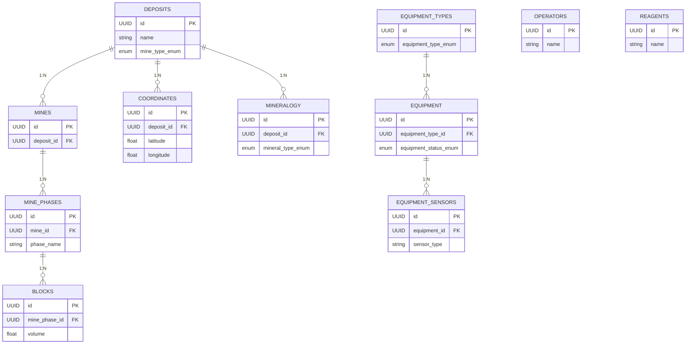

## Diagrama ER - Grupo 2: Datos Operacionales

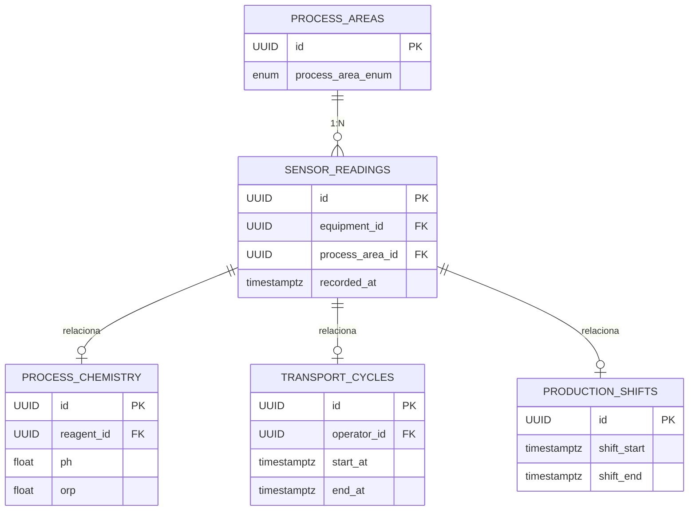

## Diagrama ER - Grupo 3: Análisis Químico

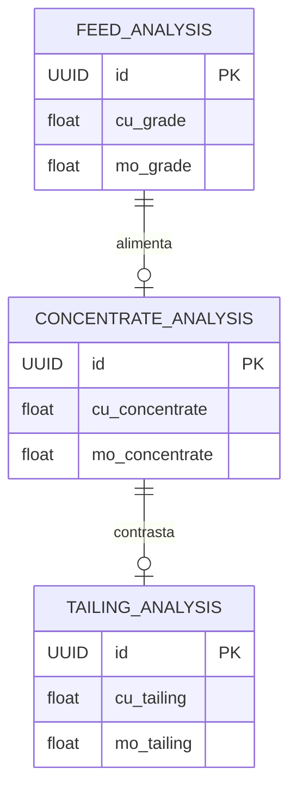

## Diagrama ER - Grupo 4: Mantenimiento

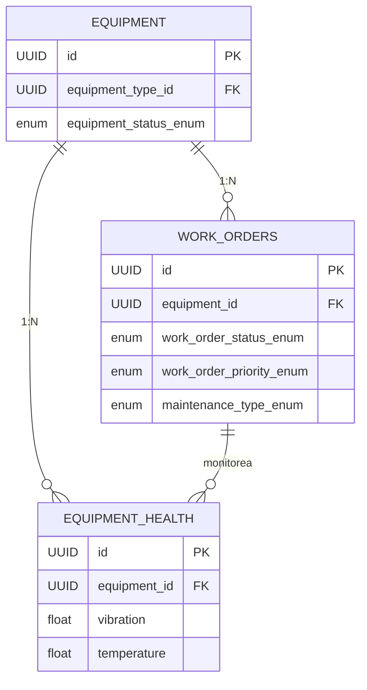

## Diagrama ER - Grupo 5: Dimensional/KPIs

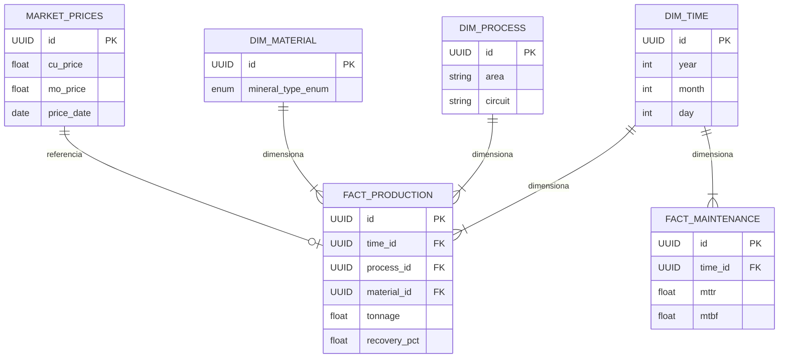

### Notas sobre el ER Diagram

- Relaciones 1:N indican "uno a muchos" (e.g., un depósito tiene múltiples minas).
- ENUMs se aplican a campos como mine_type_enum en DEPOSITS.
- Para particionamiento en SENSOR_READINGS, no se representa aquí, pero se detalla abajo.
- Se han agregado campos clave a cada entidad para mayor claridad.

## Detalle de Tablas por Grupo

### Grupo 1: Entidades Maestras (10 tablas)

| Tabla | Descripción | Relaciones | Campos Clave (Ejemplos) |
|-------|-------------|------------|--------------------------|
| deposits | Yacimientos mineros | 1:N → mines, coordinates, mineralogy | id (PK), name, mine_type_enum, description |
| mines | Operaciones mineras | N:1 → deposits, 1:N → mine_phases | id (PK), deposit_id (FK), name, start_date |
| mine_phases | Fases de explotación | N:1 → mines, 1:N → blocks | id (PK), mine_id (FK), phase_name, status |
| blocks | Bloques de minado | N:1 → mine_phases | id (PK), mine_phase_id (FK), volume, grade_cu |
| coordinates | Coordenadas geoespaciales | N:1 → deposits | id (PK), deposit_id (FK), latitude, longitude |
| mineralogy | Mineralogía del yacimiento | N:1 → deposits | id (PK), deposit_id (FK), mineral_type_enum, composition |
| equipment_types | Tipos de equipos (catálogo) | 1:N → equipment | id (PK), equipment_type_enum, description |
| equipment | Equipos físicos | N:1 → equipment_types, 1:N → equipment_sensors | id (PK), equipment_type_id (FK), serial_number, equipment_status_enum |
| operators | Operadores de equipos | 1:N → transport_cycles | id (PK), name, license_number |
| reagents | Reactivos químicos (catálogo) | 1:N → process_chemistry | id (PK), name, chemical_formula |

### Grupo 2: Datos Operacionales (4 tablas)

| Tabla | Descripción | Frecuencia | Campos Clave (Ejemplos) |
|-------|-------------|------------|--------------------------|
| sensor_readings | Lecturas de sensores SCADA | Alta (segundos) | id (PK), equipment_id (FK), process_area_id (FK), recorded_at, value |
| process_chemistry | Química de proceso | Media (minutos) | id (PK), reagent_id (FK), ph, orp, dosage |
| transport_cycles | Ciclos de transporte | Por evento | id (PK), operator_id (FK), start_at, end_at, load_tons |
| production_shifts | Turnos de producción | Por turno | id (PK), shift_start, shift_end, total_production |

### Grupo 3: Análisis Químico (3 tablas)

| Tabla | Descripción | Variables Clave | Campos Clave (Ejemplos) |
|-------|-------------|-----------------|--------------------------|
| feed_analysis | Análisis de cabeza | Ley CuT, Ley Mo, % Sólidos, P80 | id (PK), cu_grade, mo_grade, solids_pct, p80 |
| concentrate_analysis | Análisis concentrado | Ley Cu, Ley Mo, As, Sb, Bi | id (PK), cu_concentrate, mo_concentrate, as_content |
| tailing_analysis | Análisis de colas | Ley Cu_cola, Ley Mo_cola | id (PK), cu_tailing, mo_tailing |

### Grupo 4: Mantenimiento (2 tablas)

| Tabla | Descripción | ISO 14224 | Campos Clave (Ejemplos) |
|-------|-------------|-----------|--------------------------|
| work_orders | Órdenes de trabajo | Sí | id (PK), equipment_id (FK), work_order_status_enum, priority_enum, maintenance_type_enum |
| equipment_health | Salud predictiva | Sensores IoT | id (PK), equipment_id (FK), vibration, temperature, prediction_score |

### Grupo 5: Dimensional/KPIs (6 tablas)

| Tabla | Tipo | Uso | Campos Clave (Ejemplos) |
|-------|------|-----|--------------------------|
| dim_time | Dimensión | Agregaciones temporales | id (PK), year, month, day, hour |
| dim_process | Dimensión | Drill-down por área | id (PK), area, circuit, stage |
| dim_material | Dimensión | Análisis por tipo mineral | id (PK), mineral_type_enum |
| fact_production | Hecho | KPIs de producción | id (PK), time_id (FK), process_id (FK), material_id (FK), tonnage, recovery_pct |
| fact_maintenance | Hecho | KPIs de mantenimiento | id (PK), time_id (FK), mttr, mtbf, availability |
| market_prices | Referencia | Precios LME/Platts | id (PK), cu_price, mo_price, price_date |

## ENUMs Definidos

Los ENUMs aseguran consistencia en los datos categóricos.

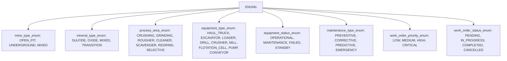

## Fórmulas Críticas

Estas se implementan en vistas SQL o queries.

**Recuperación Metalúrgica:**
```
recovery_pct = (concentrate_grade * (head_grade - tail_grade)) / (head_grade * (concentrate_grade - tail_grade)) * 100
```

**Cash Cost (C1):**
```
cash_cost_c1 = (direct_costs - (mo_credits + other_credits)) / cu_pounds_produced
```

**NSR (Net Smelter Return):**
```
nsr = tonnage * grade * market_price - treatment_charges
```

## Consideraciones Técnicas

### Particionamiento (sensor_readings)

Para datos de alta frecuencia, usar particionamiento por rango de fecha:

```sql
CREATE TABLE sensor_readings (
    id UUID PRIMARY KEY,
    equipment_id UUID NOT NULL,
    process_area_id UUID NOT NULL,
    recorded_at TIMESTAMPTZ NOT NULL
    -- campos adicionales...
) PARTITION BY RANGE (recorded_at);

-- Ejemplo de partición
CREATE TABLE sensor_readings_2024_01 PARTITION OF sensor_readings FOR VALUES FROM ('2024-01-01') TO ('2024-02-01');
```

### Índices Críticos

- idx_sensor_readings_equipment_time: (equipment_id, recorded_at)
- idx_fact_production_time: (time_id)
- idx_work_orders_equipment_status: (equipment_id, status)

### Constraints de Validación

- Leyes entre 0-100%
- Recuperación entre 0-100%
- Tonelajes positivos
- Fechas coherentes (start_at < end_at)

## Plan de Implementación y Seed Data

Ver el plan original para fases, archivos y migraciones. Seed data incluye ejemplos realistas como yacimientos tipo "El Teniente", equipos variados, etc.

# Guía para Diseñar Sistemas de Bases de Datos para Monitoreo de Procesos Mineros

Esta guía proporciona una visión general sobre cómo diseñar sistemas de bases de datos relacionales para monitoreo en minería, basada en principios de ciencia de la computación. Incluye teoría, mejores prácticas, repasos de conceptos clave y diagramas Mermaid para ilustrar ideas. Se enfoca en el contexto de minería de Cu/Mo, pero es generalizable.

## Introducción a la Teoría de Bases de Datos (Ciencia de la Computación)

En ciencia de la computación, las bases de datos relacionales se basan en el modelo relacional de E.F. Codd (1970), que usa tablas, filas y columnas con relaciones definidas por claves. Ventajas: integridad, consultas eficientes via SQL, escalabilidad.

### Diagrama Básico del Modelo Relacional (Mermaid)

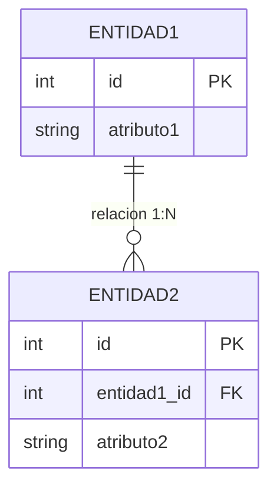

## Pasos para Diseñar el Sistema

1. **Análisis de Requisitos**: Identificar entidades (e.g., equipos, sensores) y relaciones. Usar diagramas ER.
2. **Modelado ER**: Crear un diagrama ER para visualizar.
3. **Normalización**: Aplicar formas normales (1NF, 2NF, 3NF, BCNF) para evitar redundancias.

### Repaso de Normalización

- **1NF**: Atributos atómicos, sin multivalores.
- **2NF**: Eliminar dependencias parciales.
- **3NF**: Eliminar dependencias transitivas.

### Diagrama de Normalización (Mermaid Flowchart)

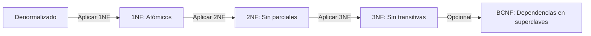

4. **Elección de DBMS**: PostgreSQL para soporte de JSON, geospatial, particionamiento.
5. **Diseño de Capas**: Usar arquitectura en capas para separación de preocupaciones (e.g., maestras vs. operacionales).
6. **Índices y Optimización**: Basado en teoría de algoritmos, usar B-trees para índices.
7. **Particionamiento y Escalabilidad**: Para big data en minería (e.g., sensores), particionar tablas.
8. **Seguridad y ACID**: Asegurar Atomicidad, Consistencia, Aislamiento, Durabilidad.

## Teoría Específica para Monitoreo Minero

- **Series Temporales**: Usar TimescaleDB (extensión de PostgreSQL) para datos de sensores.
- **Star Schema para OLAP**: En capa 5, para análisis multidimensional. Teoría: Kimball's dimensional modeling.

### Diagrama Star Schema Ejemplo (Mermaid)

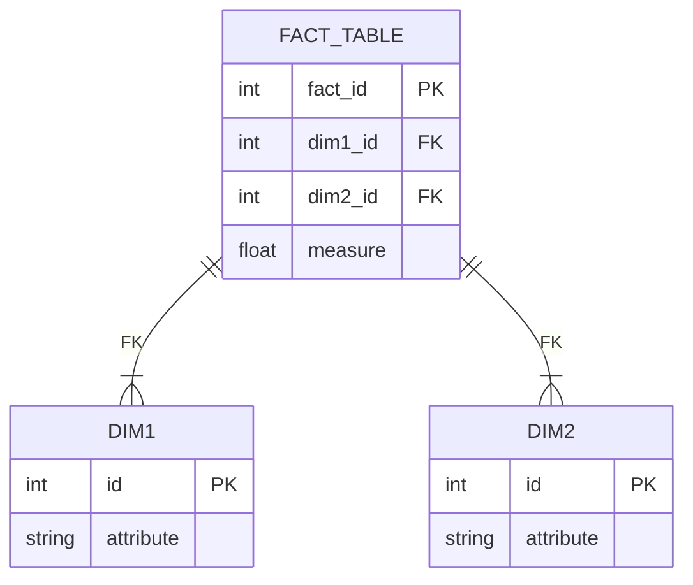

- **KPIs y Fórmulas**: Integrar con teoría de data mining y estadísticas.

## Mejores Prácticas y Repasos

- **Migraciones**: Usar Alembic para versionado.
- **ORM**: SQLAlchemy para Python.
- **Validación**: Constraints y triggers.
- **Seed Data**: Generar datos realistas para testing.

### Teoría CS Avanzada: Grafos para relaciones complejas (e.g., ciclos de transporte como grafos dirigidos)

### Diagrama de Grafo para Ciclos (Mermaid Graph)


## Conclusión

Diseñar siguiendo estos principios asegura robustez. Para minería, enfócate en datos en tiempo real y análisis predictivo. Consulta recursos como "Database System Concepts" de Silberschatz para teoría profunda.