# 🚪 Configuración de Enrutamiento Traefik - Guía Completa

## Documento Técnico: Configuración de Reverse Proxy y Path-Based Routing

**Versión:** 1.0.0
**Fecha:** 2024-12-19
**Propósito:** Documentación completa de la configuración de Traefik para microservicios con routing path-based

---

## 📚 Tabla de Contenidos

| Sección | Contenido |
|---------|-----------|
| [1. Teoría Previa](#1-teoría-previa) | Conceptos fundamentales de reverse proxy |
| [2. El Problema](#2-el-problema) | ¿Por qué fallaba el routing? |
| [3. Arquitectura](#3-arquitectura-del-sistema) | Diagramas de componentes |
| [4. Configuración Traefik](#4-configuración-traefik) | Labels y reglas de routing |
| [5. Flujo de Requests](#5-flujo-de-requests) | Cómo funciona el enrutamiento |
| [6. Solución Implementada](#6-solución-implementada) | Cambios realizados |
| [7. Configuración por Servicio](#7-configuración-por-servicio) | Detalles específicos |
| [8. Troubleshooting](#8-troubleshooting) | Problemas comunes |

---

## 1. Teoría Previa

### 1.1 ¿Qué es un Reverse Proxy?

Un **reverse proxy** es un servidor que se sitúa entre los clientes y los servidores backend, actuando como intermediario. Recibe requests de clientes y los reenvía a los servidores apropiados.


**Beneficios:**
- **Load balancing**: Distribuye carga entre múltiples instancias
- **SSL termination**: Maneja certificados HTTPS
- **Caching**: Almacena respuestas para mejorar rendimiento
- **Security**: Filtra requests maliciosos
- **Routing**: Enruta requests basado en reglas (path, host, headers)

### 1.2 Path-Based Routing vs Host-Based Routing

#### Path-Based Routing
Enruta basado en la **ruta URL**:
- `example.com/api/*` → API Service
- `example.com/dashboard/*` → Dashboard Service
- `example.com/*` → Frontend (catch-all)

#### Host-Based Routing
Enruta basado en el **dominio/subdominio**:
- `api.example.com` → API Service
- `dashboard.example.com` → Dashboard Service
- `www.example.com` → Frontend

#### Ventajas del Path-Based Routing:
- ✅ Un solo dominio/IP
- ✅ Fácil configuración local
- ✅ No requiere DNS adicional
- ✅ Ideal para microservicios

### 1.3 Traefik: Dynamic Reverse Proxy

**Traefik** es un reverse proxy moderno que:
- **Auto-discovery**: Detecta servicios automáticamente via Docker labels
- **Dynamic configuration**: Configuración en caliente sin reinicios
- **Multiple providers**: Docker, Kubernetes, File, etc.
- **Middleware**: Strip prefix, rate limiting, authentication, etc.

### 1.4 Root Path en Aplicaciones Web

Cuando una aplicación está detrás de un reverse proxy con path prefix, necesita conocer su "root path" para:
- Generar URLs correctas en HTML/JS
- Configurar rutas de API correctamente
- Funcionar con frameworks que generan rutas automáticamente

**Ejemplo:**
- Proxy: `example.com/api/*` → `api:8000`
- La app debe saber que está en `/api` para generar URLs como `/api/docs` en lugar de `/docs`

---

## 2. El Problema

### 2.1 Síntomas Iniciales

❌ `http://localhost/prometheus` → Mostraba aplicación React  
❌ `http://localhost/grafana` → Mostraba aplicación React  
❌ `http://localhost/loki` → Mostraba aplicación React  
✅ `http://localhost:9090` → Prometheus funcionaba  
✅ `http://localhost:3001` → Grafana funcionaba  
✅ `http://localhost:3100` → Loki funcionaba  

### 2.2 Causa Raíz

**Conflicto de reglas de routing en Traefik:**


**Problema:** La regla catch-all de React (`PathPrefix('/')`) tenía mayor precedencia efectiva porque era más simple y genérica.

### 2.3 Problema Adicional: FastAPI detrás de Proxy

FastAPI generaba URLs incorrectas cuando estaba detrás de Traefik:
- `/docs` en lugar de `/api/docs`
- `/openapi.json` en lugar de `/api/openapi.json`

**Swagger UI intentaba cargar:** `http://localhost/openapi.json`  
**Pero necesitaba:** `http://localhost/api/openapi.json`

---

## 3. Arquitectura del Sistema

### 3.1 Arquitectura General

```mermaid
graph TB
    subgraph "🌐 Cliente"
        Browser[Browser]
    end

    subgraph "🚪 Traefik Proxy"
        Router[Router Engine]
        Middleware[Middleware Pipeline]
    end

    subgraph "🏗️ Servicios"
        React[React App 
        localhost/]
        API[FastAPI
        localhost/api/*]
        Dash[Dash App
        localhost/dash/*]
        Prometheus[Prometheus
        localhost/prometheus/*]
        Grafana[Grafana
        localhost/grafana/*]
        Loki[Loki
        localhost/loki/*]
    end

    Browser --> Router
    Router --> Middleware
    Middleware --> React
    Middleware --> API
    Middleware --> Dash
    Middleware --> Prometheus
    Middleware --> Grafana
    Middleware --> Loki
```



### 3.2 Redes Docker


### 3.3 Flujo de Configuración


---

## 4. Configuración Traefik

### 4.1 Labels de Traefik

Los servicios se configuran mediante **Docker labels** que Traefik lee automáticamente:

```yaml
labels:
  - "traefik.enable=true"
  - "traefik.http.routers.service.rule=Host(`localhost`) && PathPrefix(`/service`)"
  - "traefik.http.routers.service.entrypoints=web"
  - "traefik.http.services.service.loadbalancer.server.port=PORT"
  - "traefik.http.middlewares.service-stripprefix.stripprefix.prefixes=/service"
  - "traefik.http.routers.service.middlewares=service-stripprefix"
  - "traefik.http.routers.service.priority=20"
```

### 4.2 Componentes de una Regla

| Componente | Descripción | Ejemplo |
|------------|-------------|---------|
| **Router** | Define cuándo enrutar | `Host('localhost') && PathPrefix('/api')` |
| **Service** | Define el backend | `loadbalancer.server.port=8000` |
| **Middleware** | Procesa el request | `stripprefix.prefixes=/api` |
| **Entrypoint** | Puerto de entrada | `web` (puerto 80) |
| **Priority** | Orden de evaluación | `20` (mayor = más prioritario) |

### 4.3 Middleware StripPrefix

**¿Qué hace?**
- Remueve el prefijo de la URL antes de enviar al backend
- Ejemplo: `/api/health` → `/health`

**Configuración:**
```yaml
traefik.http.middlewares.api-stripprefix.stripprefix.prefixes=/api
```

**Flujo:**
```
Request:  /api/health
Strip:    /api
Result:   /health
```

---

## 5. Flujo de Requests

### 5.1 Request Típico a API

```mermaid
sequenceDiagram
    participant Client
    participant Traefik
    participant Middleware
    participant FastAPI

    Client->>Traefik: GET /api/health
    Traefik->>Traefik: Evalúa reglas de routing
    Traefik->>Middleware: Aplica strip prefix
    Middleware->>FastAPI: GET /health
    FastAPI->>Middleware: Response
    Middleware->>Traefik: Response
    Traefik->>Client: Response
```



### 5.2 Request a Servicio de Monitoreo


### 5.3 Algoritmo de Routing

```mermaid
flowchart TD
    A[Request llega] --> B[Parse Host + Path]
    B --> C[Buscar routers que coincidan]

    C --> D{¿Múltiples matches?}
    D -->|Sí| E[Seleccionar por priority]
    D -->|No| F[Usar router único]

    E --> F
    F --> G{Aplicar middleware}
    G --> H[Strip prefix si aplica]
    H --> I[Forward a backend]
    I --> J[Return response]
```



---

## 6. Solución Implementada

### 6.1 Cambios en FastAPI

**Archivo:** `services/api/app/main.py`

```python
app = FastAPI(
    title="API",
    # ... otros parámetros ...
    root_path=settings.ROOT_PATH,  # "/api" - configurable
)
```

**Archivo:** `services/api/app/config.py`

```python
ROOT_PATH: str = os.getenv("API_ROOT_PATH", "/api")
```

### 6.2 Cambios en Traefik (Servicios de Monitoreo)

**Antes (Problemático):**
```yaml
labels:
  - "traefik.http.routers.prometheus.rule=PathPrefix(`/prometheus`)"
  - "traefik.http.routers.prometheus.priority=10"
```

**Después (Solucionado):**
```yaml
labels:
  - "traefik.http.routers.prometheus.rule=Host(`localhost`) && PathPrefix(`/prometheus`)"
  - "traefik.http.routers.prometheus.priority=20"
```

### 6.3 Cambios en React App

**Archivo:** `services/react-app/src/App.tsx`

```tsx
// Antes
<a href="http://localhost:9090">Prometheus</a>

// Después
<a href="/prometheus">Prometheus</a>
```

### 6.4 Cambios en Docker Compose

**React (catch-all rule):**
```yaml
labels:
  # Antes: PathPrefix('/') - capturaba todo
  - "traefik.http.routers.react.rule=Host(`localhost`)"
```

---

## 7. Configuración por Servicio

### 7.1 API FastAPI

```yaml
api:
  labels:
    - "traefik.enable=true"
    - "traefik.http.routers.api.rule=PathPrefix(`/api`)"
    - "traefik.http.routers.api.entrypoints=web"
    - "traefik.http.services.api.loadbalancer.server.port=8000"
    - "traefik.http.middlewares.api-stripprefix.stripprefix.prefixes=/api"
    - "traefik.http.routers.api.middlewares=api-stripprefix"
```

**Configuración FastAPI:**
```python
app = FastAPI(root_path="/api")
```

### 7.2 Prometheus

```yaml
prometheus:
  command:
    - '--web.route-prefix=/prometheus'
    - '--web.external-url=http://localhost/prometheus'
  labels:
    - "traefik.enable=true"
    - "traefik.http.routers.prometheus.rule=Host(`localhost`) && PathPrefix(`/prometheus`)"
    - "traefik.http.routers.prometheus.entrypoints=web"
    - "traefik.http.services.prometheus.loadbalancer.server.port=9090"
    - "traefik.http.routers.prometheus.priority=20"
```

**Importante:** Prometheus requiere las opciones `--web.route-prefix` y `--web.external-url` para funcionar correctamente detrás de un proxy con sub-rutas. NO se debe usar stripprefix con Prometheus cuando está configurado de esta manera.

### 7.3 Grafana

```yaml
grafana:
  environment:
    - GF_SERVER_ROOT_URL=http://localhost/grafana
    - GF_SERVER_SERVE_FROM_SUB_PATH=true
  labels:
    - "traefik.enable=true"
    - "traefik.http.routers.grafana.rule=Host(`localhost`) && PathPrefix(`/grafana`)"
    - "traefik.http.routers.grafana.entrypoints=web"
    - "traefik.http.services.grafana.loadbalancer.server.port=3000"
    - "traefik.http.routers.grafana.priority=20"
```

**Importante:** Grafana tiene soporte nativo para sub-rutas mediante las variables de entorno `GF_SERVER_ROOT_URL` y `GF_SERVER_SERVE_FROM_SUB_PATH`. NO se debe usar stripprefix con Grafana cuando está configurado de esta manera.

### 7.4 Loki

```yaml
loki:
  labels:
    - "traefik.enable=true"
    - "traefik.http.routers.loki.rule=Host(`localhost`) && PathPrefix(`/loki`)"
    - "traefik.http.routers.loki.entrypoints=web"
    - "traefik.http.services.loki.loadbalancer.server.port=3100"
    - "traefik.http.routers.loki.priority=20"
```

**Configuración de Loki (`loki-config.yml`):**
```yaml
server:
  http_listen_port: 3100
  grpc_listen_port: 9096
  http_path_prefix: /loki
```

**Importante:** Loki soporta sub-rutas mediante la configuración `http_path_prefix` en su archivo de configuración. NO se debe usar stripprefix con Loki cuando está configurado de esta manera.

### 7.5 React (Frontend)

```yaml
react:
  labels:
    - "traefik.enable=true"
    - "traefik.http.routers.react.rule=Host(`localhost`)"
    - "traefik.http.routers.react.entrypoints=web"
    - "traefik.http.services.react.loadbalancer.server.port=80"
    - "traefik.http.routers.react.priority=1"
```

---

## 8. Troubleshooting

### 8.1 Problemas Comunes

| Problema | Síntoma | Solución |
|----------|---------|----------|
| **Routing conflict** | `/service` muestra React | Aumentar priority, usar Host+Path |
| **FastAPI URLs wrong** | `/docs` en lugar de `/api/docs` | Configurar `root_path="/api"` |
| **Middleware not applied** | Prefix not stripped | Verificar nombre del middleware |
| **Service not discovered** | 404 en ruta | Verificar labels y redes Docker |
| **Priority issues** | Regla incorrecta aplicada | Ajustar valores de priority |

### 8.2 Debugging Traefik

```bash
# Ver configuración actual
docker logs traefik

# Ver routers activos
curl http://localhost:8080/api/http/routers

# Ver servicios
curl http://localhost:8080/api/http/services
```

### 8.3 Comandos Útiles

```bash
# Reiniciar Traefik
docker-compose down traefik
docker-compose up -d traefik

# Ver logs en tiempo real
docker-compose logs -f traefik

# Ver configuración de red
docker network ls
docker network inspect mlp_frontend
```

---

## 9. Conclusión

La configuración implementada permite:

✅ **Path-based routing** funcional para todos los servicios  
✅ **FastAPI correctamente configurado** detrás de proxy  
✅ **URLs consistentes** a través de Traefik  
✅ **Escalabilidad** para agregar nuevos servicios  
✅ **Desarrollo local** sin conflictos de puertos  

**URLs finales:**
- Frontend: `http://localhost/`
- API Docs: `http://localhost/api/docs`
- Prometheus: `http://localhost/prometheus`
- Grafana: `http://localhost/grafana`
- Loki: `http://localhost/loki`

**Lección aprendida:** En sistemas de microservicios con reverse proxy, la configuración de routing debe ser precisa y las prioridades deben establecerse correctamente para evitar conflictos.

---

**FIN DEL DOCUMENTO**</content>
<parameter name="filePath">e:\Projects\Cloud-Native-Microservices-Learning-Platform\Cloud-Native-Microservices-Learning-Platform\docs\TRAEFIK_ROUTING_CONFIG.md