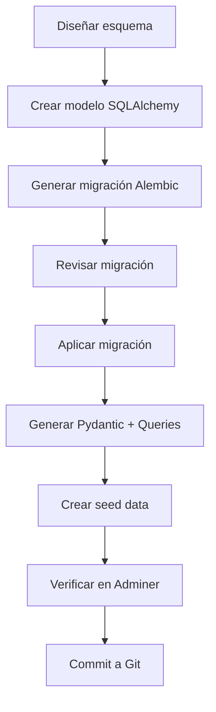
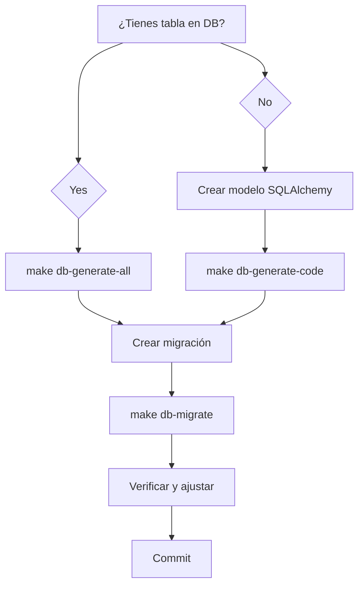
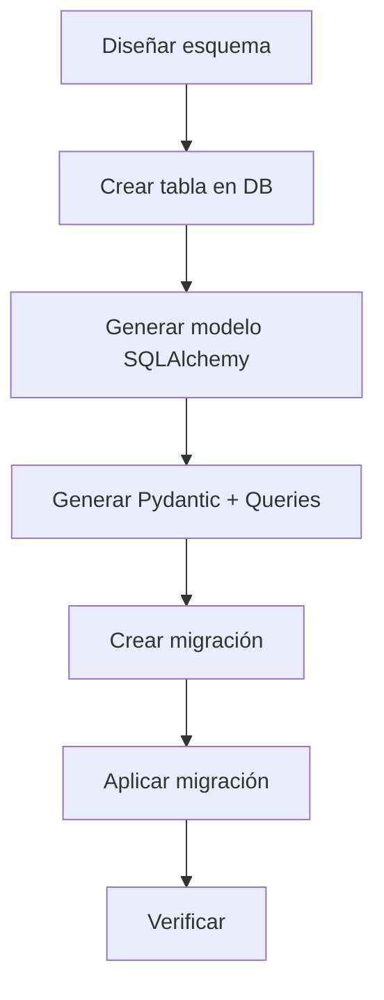
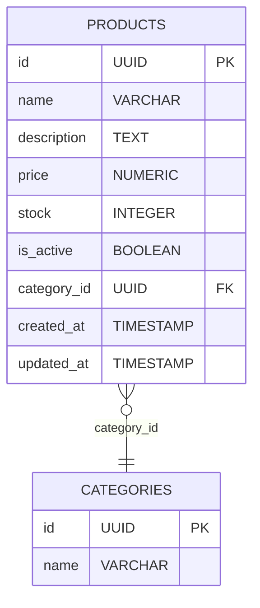
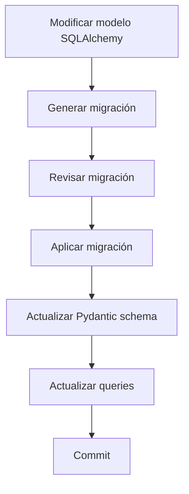
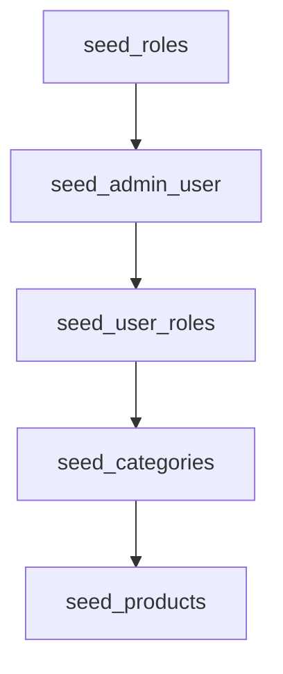

# 🔄 Workflow de Base de Datos - Guía Práctica

## Guía Paso a Paso para Agregar Tablas, Migraciones y Seed Data

**Versión:** 1.0.0
**Última Actualización:** 2025-12-20
**Propósito:** Workflow estandarizado para cambios en la base de datos

---


## 📋 Checklist General



Cada vez que agregues una nueva tabla o modifiques el esquema:

- [ ] 1. Diseñar esquema en papel/diagrama
- [ ] 2. Crear modelo SQLAlchemy (manual o generado)
- [ ] 3. Generar migración de Alembic
- [ ] 4. Aplicar migración
- [ ] 5. Generar Pydantic schemas + queries SQL automáticamente
- [ ] 6. Crear seed data (si aplica)
- [ ] 7. Verificar en Adminer
- [ ] 8. Commit a Git

---

## 🤖 Generación Automática de Código

### 📋 Scripts Disponibles

| Script | Descripción | Comando |
|--------|-------------|---------|
| `generate_model.py` | Genera modelo SQLAlchemy desde DB | `make db-generate-model TABLE=tabla` |
| `generate_code.py` | Genera Pydantic + queries desde modelo | `make db-generate-code MODEL=modelo` |
| Workflow completo | Modelo + código + migración | `make db-generate-all TABLE=tabla` |

### 🔧 Cómo Funciona la Generación Automática

#### 1. **generate_model.py** - SQLAlchemy desde Database
- Usa `sqlacodegen` para inspeccionar la base de datos
- Genera modelos SQLAlchemy precisos
- **Requiere:** Tabla existente en DB

#### 2. **generate_code.py** - Pydantic + Queries desde SQLAlchemy
- Convierte modelos SQLAlchemy a Pydantic schemas
- Genera queries SQL CRUD completas
- **Requiere:** Modelo SQLAlchemy existente

### 💡 Casos de Uso

#### Caso 1: DB First (Tabla existe en DB)
```bash
# Si ya tienes la tabla en la DB
make db-generate-all TABLE=products
```

#### Caso 2: Code First (Crear desde cero)
```bash
# Crear modelo manualmente
# services/api/app/db_models/product.py

# Generar código automáticamente
make db-generate-code MODEL=product

# Crear migración
make db-migrate-create MSG="add products table"
make db-migrate
```

#### Caso 3: Modificar tabla existente
```bash
# Modificar modelo SQLAlchemy
# Regenerar código
make db-generate-code MODEL=product

# Crear migración de cambios
make db-migrate-create MSG="modify products table"
make db-migrate
```

### ⚠️ Limitaciones de la Generación Automática

- **Tipos complejos:** Algunos tipos SQL pueden necesitar ajuste manual
- **Relaciones complejas:** FKs múltiples requieren revisión
- **Validaciones personalizadas:** Reglas de negocio deben agregarse manualmente
- **Queries avanzadas:** Solo genera CRUD básico, queries complejas manuales

### 🔄 Flujo de Trabajo Recomendado



---

## ⚡ Nuevo Workflow Automatizado (Recomendado)

### 🎯 Workflow Simplificado con Generación Automática



**Comandos para workflow automatizado:**

```bash
# 1. Crear tabla manualmente en DB (o diseñar primero)
# 2. Generar modelo desde DB existente
make db-generate-model TABLE=nueva_tabla

# 3. Generar Pydantic schemas y queries automáticamente
make db-generate-code MODEL=nueva_tabla

# 4. O hacer todo en uno:
make db-generate-all TABLE=nueva_tabla

# 5. Crear y aplicar migración
make db-migrate-create MSG="add nueva_tabla"
make db-migrate
```

---

## 🚀 Ejemplo Práctico: Agregar Tabla `products` (Simplificado)

### Opción A: Code First (Recomendado)

```bash
# 1. Crear modelo SQLAlchemy (solo esto manualmente)
# services/api/app/db_models/product.py

# 2. Generar TODO lo demás automáticamente
make db-generate-code MODEL=product

# 3. Crear migración
make db-migrate-create MSG="add products table"

# 4. Aplicar
make db-migrate

# 5. Verificar
make db-shell
\d products
```

### Opción B: DB First

```bash
# 1. Crear tabla manualmente en DB
# 2. Generar todo automáticamente
make db-generate-all TABLE=products

# 3. Crear migración (si no existe)
make db-migrate-create MSG="add products table"
make db-migrate
```

### 🎯 Resultado Automático

**Archivos generados:**
- `services/api/app/models/product.py` - Pydantic schemas
- `services/api/app/queries/product.py` - Queries SQL CRUD

**Código generado incluye:**
- ✅ `ProductBase`, `ProductCreate`, `ProductUpdate`, `ProductInDB`, `ProductPublic`
- ✅ `get_product_by_id()`, `get_all_products()`, `create_product()`, `update_product()`, `delete_product()`

---

## 🆕 Workflow Completo: Agregar Nueva Tabla


### Ejemplo: Agregar tabla `products`

#### Diagrama ER de `products` y relación con `categories`



---


### 📝 PASO 1: Diseñar el Esquema

**Documenta primero:**
```markdown
## Tabla: products

Almacena productos del catálogo.

Columnas:
- id (UUID, PK)
- name (VARCHAR 255, NOT NULL)
- description (TEXT, nullable)
- price (NUMERIC 10,2, NOT NULL)
- stock (INTEGER, default 0)
- is_active (BOOLEAN, default TRUE)
- category_id (UUID, FK -> categories.id)
- created_at (TIMESTAMP)
- updated_at (TIMESTAMP)

Índices:
- idx_products_name
- idx_products_category_id
- idx_products_is_active

Constraints:
- price >= 0
- stock >= 0
```

**Agrega esto a:** `docs/DATABASE_SCHEMA_DESIGN.md` (sección nueva)

---


### 🔧 PASO 2: Crear Modelo SQLAlchemy (SOLO para Alembic)

**Archivo:** `services/api/app/db_models/product.py`

```python
"""
Product SQLAlchemy Model (SOLO PARA ALEMBIC)

Este modelo NO se usa en runtime. Solo sirve para que Alembic
pueda autogenerar migraciones.
"""

from sqlalchemy import (
    Column,
    String,
    Boolean,
    Integer,
    Numeric,
    DateTime,
    ForeignKey,
    CheckConstraint,
    Index,
    Text,
)
from sqlalchemy.dialects.postgresql import UUID
from sqlalchemy.sql import func
import uuid

from . import Base


class Product(Base):
    """Modelo SQLAlchemy de Product (solo para Alembic)"""

    __tablename__ = "products"

    # Identificación
    id = Column(UUID(as_uuid=True), primary_key=True, default=uuid.uuid4)
    name = Column(String(255), nullable=False)
    description = Column(Text, nullable=True)

    # Precio y Stock
    price = Column(Numeric(10, 2), nullable=False)
    stock = Column(Integer, nullable=False, default=0, server_default="0")

    # Estado
    is_active = Column(Boolean, nullable=False, default=True, server_default="true")

    # Relaciones
    category_id = Column(
        UUID(as_uuid=True),
        ForeignKey("categories.id", ondelete="SET NULL"),
        nullable=True
    )

    # Auditoría
    created_at = Column(DateTime(timezone=True), nullable=False, server_default=func.now())
    updated_at = Column(DateTime(timezone=True), nullable=False, server_default=func.now(), onupdate=func.now())

    # Constraints
    __table_args__ = (
        CheckConstraint("price >= 0", name="products_price_check"),
        CheckConstraint("stock >= 0", name="products_stock_check"),
        Index("idx_products_name", "name"),
        Index("idx_products_category_id", "category_id"),
        Index("idx_products_is_active", "is_active"),
        {
            "comment": "Productos del catálogo"
        }
    )
```

**Importar en:** `services/api/app/db_models/__init__.py`

```python
# Agregar al inicio
from .product import Product

# Agregar a __all__
__all__ = [
    "Base",
    "metadata",
    "User",
    "Role",
    "UserRole",
    "Session",
    "Product",  # NUEVO
]
```

---


### 📦 PASO 3: Crear Schemas Pydantic (para API)

**Archivo:** `services/api/app/models/product.py`

```python
"""
Product Pydantic Schemas

Schemas para validación de requests/responses relacionados con productos.
NO son modelos de ORM - se usan para validar datos.
"""

from datetime import datetime
from typing import Optional
from uuid import UUID
from pydantic import BaseModel, Field
from decimal import Decimal


# Base Schema
class ProductBase(BaseModel):
    """Schema base con campos comunes"""
    name: str = Field(..., min_length=1, max_length=255)
    description: Optional[str] = None
    price: Decimal = Field(..., ge=0, decimal_places=2)
    stock: int = Field(default=0, ge=0)
    category_id: Optional[UUID] = None


# Create Schema (Request)
class ProductCreate(ProductBase):
    """Schema para crear producto (POST request)"""
    pass


# Update Schema (Request)
class ProductUpdate(BaseModel):
    """Schema para actualizar producto (PUT/PATCH request)"""
    name: Optional[str] = Field(None, min_length=1, max_length=255)
    description: Optional[str] = None
    price: Optional[Decimal] = Field(None, ge=0, decimal_places=2)
    stock: Optional[int] = Field(None, ge=0)
    is_active: Optional[bool] = None
    category_id: Optional[UUID] = None


# Database Schema (Internal)
class ProductInDB(ProductBase):
    """Schema con todos los campos de la DB (uso interno)"""
    id: UUID
    is_active: bool
    created_at: datetime
    updated_at: datetime

    model_config = {"from_attributes": True}


# Public Schema (Response)
class ProductPublic(ProductBase):
    """Schema público (response API)"""
    id: UUID
    is_active: bool
    created_at: datetime

    model_config = {"from_attributes": True}
```

**Importar en:** `services/api/app/models/__init__.py`

```python
# Agregar import
from .product import (
    Product,
    ProductCreate,
    ProductUpdate,
    ProductInDB,
    ProductPublic,
)

# Agregar a __all__
__all__ = [
    # ... otros ...
    "Product",
    "ProductCreate",
    "ProductUpdate",
    "ProductInDB",
    "ProductPublic",
]
```

---


### 🔄 PASO 4: Generar Migración de Alembic

```bash
# Generar migración automáticamente
make db-migrate-create MSG="add products table"
```

**Output esperado:**
```
INFO  [alembic.autogenerate.compare] Detected added table 'products'
INFO  [alembic.autogenerate.compare] Detected added index 'idx_products_name' on ('name',)
INFO  [alembic.autogenerate.compare] Detected added index 'idx_products_category_id' on ('category_id',)
INFO  [alembic.autogenerate.compare] Detected added index 'idx_products_is_active' on ('is_active',)
  Generating /app/alembic/versions/20251220_xxxx_add_products_table.py ... done
```

---


### ✅ PASO 5: Revisar Migración Generada

```bash
# Ver el archivo generado
cat services/api/alembic/versions/20251220_*_add_products_table.py
```

**Verifica:**
- ✅ `upgrade()` crea la tabla con todas las columnas
- ✅ Todos los índices están presentes
- ✅ Constraints (CHECK) están configurados
- ✅ Foreign keys correctas
- ✅ `downgrade()` elimina la tabla

**Si algo falta, edita el archivo manualmente.**

---


### 🚀 PASO 6: Aplicar Migración

```bash
# Aplicar migración
make db-migrate
```

**Output esperado:**
```
INFO  [alembic.runtime.migration] Running upgrade abc123 -> def456, add products table
```

**Verificar en DB:**
```bash
# Conectar a psql
make db-shell

# Ver tabla creada
\d products

# Salir
\q
```

---


### 📝 PASO 7: Crear Queries SQL Helpers

**Archivo:** `services/api/app/queries/products.py`

```python
"""
Product SQL Queries

Queries SQL puras para operaciones CRUD de productos.
Ejecutar con asyncpg usando los helpers en app/database.py
"""

from typing import Optional
from uuid import UUID
from decimal import Decimal
import asyncpg


# ============================================================================
# READ QUERIES
# ============================================================================

async def get_product_by_id(pool: asyncpg.Pool, product_id: UUID) -> Optional[asyncpg.Record]:
    """Obtener producto por ID"""
    query = """
        SELECT
            id,
            name,
            description,
            price,
            stock,
            is_active,
            category_id,
            created_at,
            updated_at
        FROM products
        WHERE id = $1
    """
    async with pool.acquire() as conn:
        return await conn.fetchrow(query, product_id)


async def get_all_products(
    pool: asyncpg.Pool,
    limit: int = 100,
    offset: int = 0,
    is_active: Optional[bool] = True
) -> list[asyncpg.Record]:
    """Obtener lista de productos con paginación"""
    query = """
        SELECT
            id,
            name,
            description,
            price,
            stock,
            is_active,
            created_at
        FROM products
        WHERE ($3::boolean IS NULL OR is_active = $3)
        ORDER BY created_at DESC
        LIMIT $1 OFFSET $2
    """
    async with pool.acquire() as conn:
        return await conn.fetch(query, limit, offset, is_active)


# ============================================================================
# CREATE QUERIES
# ============================================================================

async def create_product(
    pool: asyncpg.Pool,
    name: str,
    price: Decimal,
    description: Optional[str] = None,
    stock: int = 0,
    category_id: Optional[UUID] = None
) -> asyncpg.Record:
    """Crear nuevo producto"""
    query = """
        INSERT INTO products (
            name,
            description,
            price,
            stock,
            category_id
        )
        VALUES ($1, $2, $3, $4, $5)
        RETURNING
            id,
            name,
            description,
            price,
            stock,
            is_active,
            created_at
    """
    async with pool.acquire() as conn:
        return await conn.fetchrow(
            query,
            name,
            description,
            price,
            stock,
            category_id
        )


# ============================================================================
# UPDATE QUERIES
# ============================================================================

async def update_product(
    pool: asyncpg.Pool,
    product_id: UUID,
    name: Optional[str] = None,
    description: Optional[str] = None,
    price: Optional[Decimal] = None,
    stock: Optional[int] = None,
    is_active: Optional[bool] = None
) -> Optional[asyncpg.Record]:
    """Actualizar producto"""
    query = """
        UPDATE products
        SET
            name = COALESCE($2, name),
            description = COALESCE($3, description),
            price = COALESCE($4, price),
            stock = COALESCE($5, stock),
            is_active = COALESCE($6, is_active),
            updated_at = NOW()
        WHERE id = $1
        RETURNING
            id,
            name,
            description,
            price,
            stock,
            is_active,
            updated_at
    """
    async with pool.acquire() as conn:
        return await conn.fetchrow(
            query,
            product_id,
            name,
            description,
            price,
            stock,
            is_active
        )


# ============================================================================
# DELETE QUERIES
# ============================================================================

async def delete_product(pool: asyncpg.Pool, product_id: UUID) -> bool:
    """Eliminar producto (hard delete)"""
    query = """
        DELETE FROM products
        WHERE id = $1
        RETURNING id
    """
    async with pool.acquire() as conn:
        result = await conn.fetchrow(query, product_id)
        return result is not None
```

**Importar en:** `services/api/app/queries/__init__.py`

```python
from . import products

__all__ = [
    # ... otros ...
    "products",
]
```

---


### 🌱 PASO 8: Crear Seed Data (Opcional)

**Editar:** `services/api/scripts/seed_data.py`

Agregar función al final (antes de `main()`):

```python
async def seed_products(conn: asyncpg.Connection):
    """Crear productos de ejemplo"""
    print("\n📦 Creando productos de ejemplo...")

    # Obtener categoría (si existe tabla categories)
    # category_id = await conn.fetchval("SELECT id FROM categories WHERE name = 'Electronics' LIMIT 1")

    products = [
        ("Laptop HP", "Laptop HP 15 pulgadas", 899.99, 10, None),
        ("Mouse Logitech", "Mouse inalámbrico Logitech", 29.99, 50, None),
        ("Teclado Mecánico", "Teclado mecánico RGB", 79.99, 25, None),
    ]

    created_count = 0
    for name, description, price, stock, category_id in products:
        # Check if product exists
        check_query = "SELECT id FROM products WHERE name = $1"
        existing = await conn.fetchrow(check_query, name)

        if existing:
            print(f"  ℹ️  Producto ya existe: {name}")
        else:
            # Create product
            create_query = """
                INSERT INTO products (name, description, price, stock, category_id)
                VALUES ($1, $2, $3, $4, $5)
                RETURNING id, name
            """
            product = await conn.fetchrow(
                create_query,
                name,
                description,
                price,
                stock,
                category_id
            )
            print(f"  ✅ Producto creado: {product['name']}")
            created_count += 1

    if created_count > 0:
        print(f"✅ {created_count} productos creados")
```

**Agregar en `main()`:**

```python
async def main():
    # ... código existente ...

    await seed_roles(conn)
    await seed_admin_user(conn)

    # NUEVO - Agregar aquí
    await seed_products(conn)  # <-- AGREGAR ESTA LÍNEA

    # ... resto del código ...
```

**Ejecutar seed:**

```bash
make db-seed
```

---


### 🔍 PASO 9: Verificar en Adminer

1. Abrir: **http://localhost/database**
2. Clic en tabla `products`
3. Verificar:
   - ✅ Estructura de columnas correcta
   - ✅ Índices creados
   - ✅ Datos seed (si ejecutaste seed)

**SQL de verificación:**

```sql
-- Ver estructura
\d products

-- Ver datos
SELECT * FROM products;

-- Verificar constraints
SELECT constraint_name, constraint_type
FROM information_schema.table_constraints
WHERE table_name = 'products';

-- Verificar índices
SELECT indexname, indexdef
FROM pg_indexes
WHERE tablename = 'products';
```

---


### 📦 PASO 10: Commit a Git

```bash
# Agregar archivos
git add services/api/app/db_models/product.py
git add services/api/app/models/product.py
git add services/api/app/queries/products.py
git add services/api/alembic/versions/20251220_*_add_products_table.py
git add services/api/scripts/seed_data.py
git add docs/DATABASE_SCHEMA_DESIGN.md

# Commit
git commit -m "feat(db): add products table with CRUD queries and seed data"

# Push
git push
```

---


## 🔄 Workflow Simplificado: Modificar Tabla Existente




### Ejemplo: Agregar columna `sku` a `products`

```bash
# 1. Modificar modelo SQLAlchemy
# services/api/app/db_models/product.py
# Agregar: sku = Column(String(100), unique=True, nullable=True)

# 2. Generar migración
make db-migrate-create MSG="add sku column to products"

# 3. Revisar migración
cat services/api/alembic/versions/20251220_*_add_sku_column_to_products.py

# 4. Aplicar migración
make db-migrate

# 5. Actualizar Pydantic schema (si es necesario)
# services/api/app/models/product.py
# Agregar: sku: Optional[str] = None

# 6. Actualizar queries (si es necesario)
# services/api/app/queries/products.py

# 7. Commit
git add .
git commit -m "feat(db): add sku column to products table"
```

---


## 🌱 Guía de Seed Data

### Estructura de Script de Seed

```python
async def seed_<entity>(conn: asyncpg.Connection):
    """Crear datos de <entity>"""
    print(f"\n📦 Creando {entity}...")

    # Datos a insertar
    items = [
        (field1, field2, field3),
        (field1, field2, field3),
    ]

    created_count = 0
    for field1, field2, field3 in items:
        # 1. Verificar si ya existe
        check_query = "SELECT id FROM table WHERE unique_field = $1"
        existing = await conn.fetchrow(check_query, field1)

        if existing:
            print(f"  ℹ️  Ya existe: {field1}")
            continue

        # 2. Insertar nuevo
        create_query = """
            INSERT INTO table (field1, field2, field3)
            VALUES ($1, $2, $3)
            RETURNING id, field1
        """
        result = await conn.fetchrow(create_query, field1, field2, field3)
        print(f"  ✅ Creado: {result['field1']}")
        created_count += 1

    if created_count > 0:
        print(f"✅ {created_count} items creados")
    else:
        print("ℹ️  Todos los items ya existían")
```


### Orden de Seed (Importante!)



**Seguir orden de dependencias de Foreign Keys:**

```python
async def main():
    # 1. Primero: Tablas sin FK
    await seed_roles(conn)

    # 2. Luego: Tablas que dependen de roles
    await seed_admin_user(conn)

    # 3. Luego: Relaciones
    await seed_user_roles(conn)

    # 4. Finalmente: Otras tablas
    await seed_categories(conn)  # Sin FK
    await seed_products(conn)     # FK -> categories
```

---


## 📊 Comandos de Verificación

```bash
# Ver historial de migraciones
make db-migrate-history

# Ver migración actual
docker compose exec api alembic current -v

# Ver tablas en DB
make db-shell
\dt

# Ver estructura de tabla
make db-shell
\d products

# Ver datos de tabla
make db-shell
SELECT * FROM products LIMIT 10;

# Contar registros
make db-shell
SELECT COUNT(*) FROM products;
```

---


## ⚠️ Reglas Importantes

### ❌ NO Hacer

1. **NO modificar migrations ya aplicadas** (crear nueva migration en su lugar)
2. **NO usar SQLAlchemy ORM en runtime** (solo para Alembic autogenerate)
3. **NO hacer DELETE sin WHERE** en seed scripts
4. **NO hacer FK a tablas que no existen** (crear tablas en orden)
5. **NO commitear sin probar la migration** (aplicar localmente primero)

### ✅ SÍ Hacer

1. **SÍ revisar siempre las migrations generadas** antes de aplicar
2. **SÍ usar SQL puro en queries** (asyncpg)
3. **SÍ documentar el schema** en DATABASE_SCHEMA_DESIGN.md
4. **SÍ crear seed data idempotente** (verificar existencia primero)
5. **SÍ hacer backup antes de migrations grandes** (`make db-backup`)

---


## 🔧 Troubleshooting Común

### Migration no detecta cambios

```bash
# Verificar que el modelo esté importado
docker compose exec api python -c "from app.db_models import metadata; print(metadata.tables.keys())"

# Debe aparecer tu tabla en la lista
```

### Seed data falla

```bash
# Ver logs detallados
docker compose exec api python -m scripts.seed_data

# Verificar orden de FK
# Asegurar que tablas dependientes se crean DESPUÉS
```

### Migration falla al aplicar

```bash
# Ver el SQL generado sin aplicar
docker compose exec api alembic upgrade head --sql

# Revertir última migration
make db-migrate-down

# Editar migration y re-aplicar
```

---


## 📚 Documentos Relacionados

- `docs/DATABASE_SCHEMA_DESIGN.md` - Diseño completo del esquema
- `docs/ALEMBIC_GUIDE.md` - Guía completa de Alembic
- `docs/SETUP_DATABASE.md` - Setup inicial de DB
- `Makefile` - Todos los comandos disponibles

---

**Última Actualización:** 2025-12-20

**Este documento debe actualizarse cada vez que se agregue una nueva práctica o patrón al workflow.**

---

**FIN DEL DOCUMENTO**
