# 📚 Documentación de Makefiles - Cloud-Native Microservices Platform

## Índice

1. [Introducción](#introducción)
2. [Estructura de Makefiles](#estructura-de-makefiles)
3. [Guía Rápida](#guía-rápida)
4. [Comandos Docker - Teoría](#comandos-docker---teoría)
5. [Docker Compose - Teoría](#docker-compose---teoría)
6. [Workflows de Desarrollo](#workflows-de-desarrollo)
7. [Troubleshooting](#troubleshooting)

---

## Introducción

Este proyecto utiliza una **arquitectura modular de Makefiles** que permite:

- 🐳 **Desarrollo con Docker** (recomendado): Aislamiento completo y configuración consistente
- 🐍 **Desarrollo local**: Python/Node.js local para desarrollo rápido sin containers
- 📊 **Monitoreo integrado**: Prometheus, Grafana y Loki listos para usar
- 🔧 **Comandos especializados**: Cada servicio tiene su propio Makefile con comandos específicos

### Filosofía de Diseño

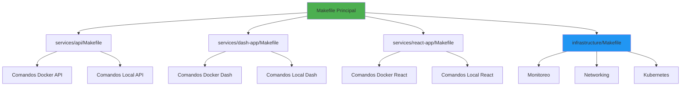

---

## Estructura de Makefiles

### Jerarquía

```
Cloud-Native-Microservices-Learning-Platform/
├── Makefile                          # 🎯 Orquestación principal
├── services/
│   ├── api/Makefile                  # 🐍 FastAPI (Docker + Local)
│   ├── dash-app/Makefile             # 📊 Dash (Docker + Local)
│   └── react-app/Makefile            # ⚛️  React (Docker + Local)
└── infrastructure/Makefile           # 🏗️  Infraestructura y monitoreo
```

### Responsabilidades

| Makefile | Propósito | Comandos Clave |
|----------|-----------|----------------|
| **Makefile principal** | Orquestación de todo el proyecto | `dev-up`, `dev-down`, `test`, `ci-local` |
| **services/api/Makefile** | Desarrollo específico de FastAPI | `dev`, `local-dev`, `test`, `db-migrate` |
| **services/dash-app/Makefile** | Desarrollo específico de Dash | `dev`, `local-dev`, `lint` |
| **services/react-app/Makefile** | Desarrollo específico de React | `dev`, `local-dev`, `test`, `build-prod` |
| **infrastructure/Makefile** | Monitoreo, networking, Kubernetes | `monitoring-up`, `health-all`, `k8s-apply-dev` |

---

## Guía Rápida

### Primera Ejecución

```bash
# 1. Verificar prerequisitos (Docker, Docker Compose, Git)
make check-deps

# 2. Configuración inicial (crea .env)
make first-run

# 3. Levantar todos los servicios
make dev-up

# 4. Ver URLs de acceso
make urls
```

### Comandos Más Usados

```bash
# Ver ayuda completa
make help

# Desarrollo
make dev-up              # Levantar todos los servicios
make dev-down            # Detener todos los servicios
make dev-logs            # Ver logs en tiempo real
make dev-status          # Ver estado de containers

# Servicios individuales
make api-dev             # Solo FastAPI
make react-dev           # Solo React
make dash-dev            # Solo Dash

# Monitoreo
make monitoring-up       # Levantar Prometheus + Grafana + Loki
make infra-health        # Health check de todos los servicios

# Testing y calidad
make test                # Tests de todos los servicios
make lint                # Linting de todos los servicios
make ci-local            # Simular pipeline CI

# Base de datos
make db-shell            # Conectar a PostgreSQL
make db-migrate          # Ejecutar migraciones
make db-seed             # Cargar datos de ejemplo
```

### Modo Local (Sin Docker)

```bash
# Setup inicial de entornos locales
make api-setup           # Crear virtualenv de API
make react-setup         # Instalar deps de React
make dash-setup          # Crear virtualenv de Dash

# Ejecutar servicios localmente
make api-local           # FastAPI en http://localhost:8000
make react-local         # React en http://localhost:5173
make dash-local          # Dash en http://localhost:8050
```

---

## Comandos Docker - Teoría

### ¿Qué es Docker?

Docker es una plataforma que permite **empaquetar aplicaciones** y sus dependencias en **containers aislados**. Cada container es como una "mini máquina virtual" ligera que contiene todo lo necesario para ejecutar la aplicación.

### Conceptos Clave

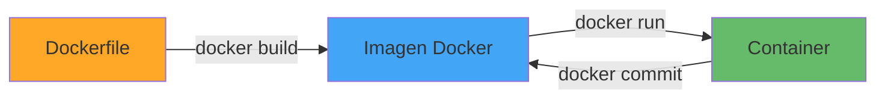

#### 1. **Dockerfile**
Archivo de texto que define cómo construir una imagen.

**Ejemplo del proyecto (services/api/Dockerfile):**
```dockerfile
FROM python:3.11-alpine

WORKDIR /app

# Instalar dependencias
COPY requirements.txt .
RUN pip install --no-cache-dir -r requirements.txt

# Copiar código
COPY . .

# Comando por defecto
CMD ["uvicorn", "app.main:app", "--host", "0.0.0.0", "--port", "8000"]
```

#### 2. **Imagen Docker**
Plantilla inmutable que contiene:
- Sistema operativo base (ej: Alpine Linux)
- Dependencias (Python, Node.js, etc.)
- Código de la aplicación
- Configuración

**Comandos útiles:**
```bash
# Listar imágenes
docker images

# Construir imagen desde Dockerfile
docker build -t nombre-imagen:tag .

# Eliminar imagen
docker rmi nombre-imagen:tag

# Ver capas de una imagen
docker history nombre-imagen:tag
```

#### 3. **Container**
Instancia en ejecución de una imagen.

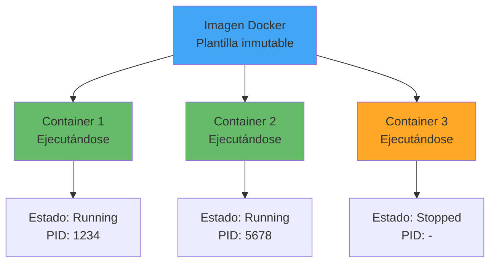

**Comandos esenciales:**

```bash
# Ejecutar container desde imagen
docker run -d --name mi-container -p 8000:8000 nombre-imagen:tag

# Listar containers en ejecución
docker ps

# Listar todos los containers (incluidos detenidos)
docker ps -a

# Ver logs de un container
docker logs -f nombre-container

# Ejecutar comando en container en ejecución
docker exec -it nombre-container /bin/sh

# Detener container
docker stop nombre-container

# Iniciar container detenido
docker start nombre-container

# Eliminar container
docker rm nombre-container

# Ver estadísticas de recursos
docker stats nombre-container
```

### Anatomía de un Comando Docker

```bash
docker run -d --name api-container -p 8000:8000 -v $(pwd):/app -e DEBUG=true mi-api:latest

# docker run       : Comando principal
# -d               : Detached mode (background)
# --name           : Nombre del container
# -p 8000:8000     : Port mapping (host:container)
# -v $(pwd):/app   : Volume mount (compartir archivos)
# -e DEBUG=true    : Variable de entorno
# mi-api:latest    : Imagen a usar
```

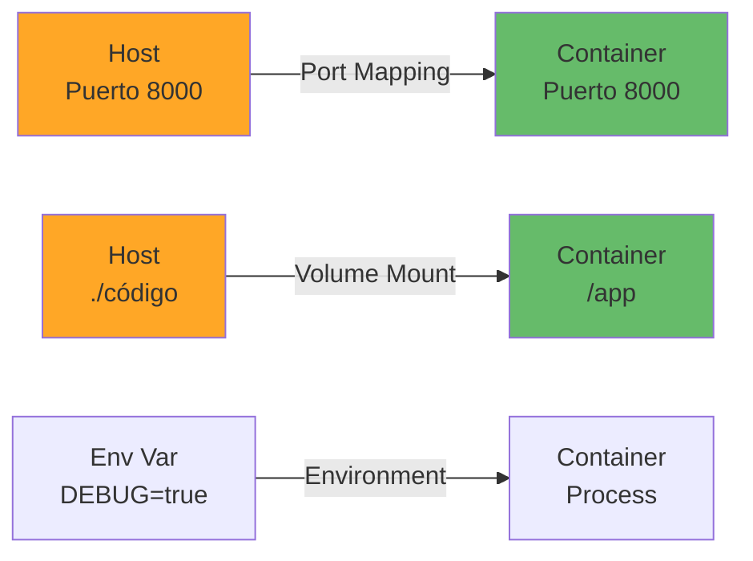

### Networking en Docker

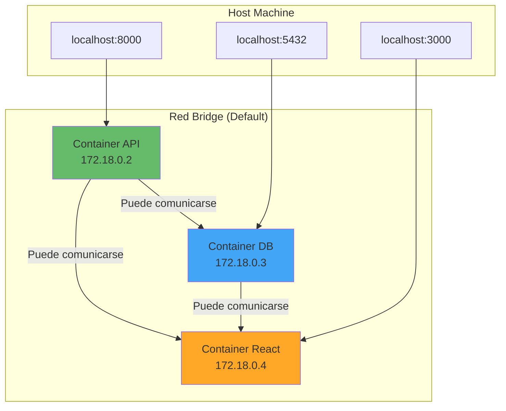

**Comandos de networking:**

```bash
# Listar redes
docker network ls

# Inspeccionar red
docker network inspect nombre-red

# Crear red custom
docker network create --driver bridge mi-red

# Conectar container a red
docker network connect mi-red nombre-container

# Ver IP de container
docker inspect -f '{{range .NetworkSettings.Networks}}{{.IPAddress}}{{end}}' nombre-container
```

### Volúmenes Docker

Los volúmenes permiten **persistir datos** más allá del ciclo de vida del container.

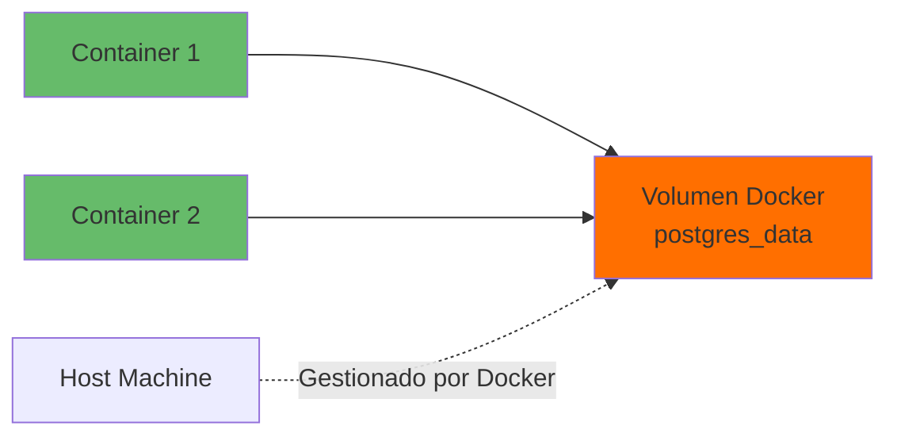

**Tipos de volúmenes:**

1. **Named Volumes** (recomendado para datos de producción)
```bash
docker volume create postgres_data
docker run -v postgres_data:/var/lib/postgresql/data postgres:15
```

2. **Bind Mounts** (compartir código durante desarrollo)
```bash
docker run -v $(pwd):/app mi-imagen
```

3. **tmpfs** (datos temporales en memoria)
```bash
docker run --tmpfs /tmp mi-imagen
```

**Comandos de volúmenes:**

```bash
# Listar volúmenes
docker volume ls

# Inspeccionar volumen
docker volume inspect nombre-volumen

# Eliminar volumen
docker volume rm nombre-volumen

# Limpiar volúmenes no usados
docker volume prune
```

---

## Docker Compose - Teoría

### ¿Qué es Docker Compose?

Docker Compose permite **definir y ejecutar aplicaciones multi-container** usando un archivo YAML.

### Ventajas

✅ Orquestación de múltiples servicios
✅ Configuración declarativa
✅ Reproducibilidad
✅ Networking automático
✅ Gestión de volúmenes simplificada

### Archivo docker-compose.yml

**Estructura básica:**

```yaml
version: '3.8'

services:
  api:                          # Nombre del servicio
    build: ./services/api       # Dockerfile location
    ports:
      - "8000:8000"             # Port mapping
    environment:
      - DEBUG=true              # Variables de entorno
    volumes:
      - ./services/api:/app     # Volume mounts
    depends_on:
      - postgres                # Dependencias
    networks:
      - backend                 # Redes

  postgres:
    image: postgres:15
    environment:
      - POSTGRES_PASSWORD=secret
    volumes:
      - postgres_data:/var/lib/postgresql/data
    networks:
      - backend

networks:
  backend:                      # Definir redes
    driver: bridge

volumes:
  postgres_data:                # Definir volúmenes
```

### Flujo de Docker Compose

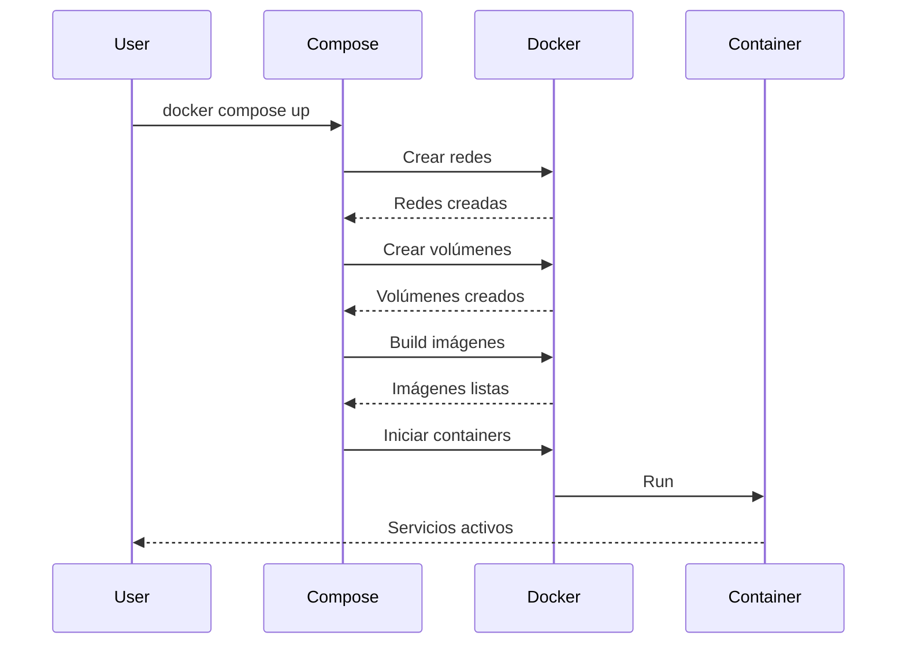

### Comandos Docker Compose Esenciales

#### Gestión del Stack

```bash
# Levantar servicios (foreground)
docker compose up

# Levantar servicios (background)
docker compose up -d

# Detener servicios (mantiene containers)
docker compose stop

# Detener y eliminar containers
docker compose down

# Detener, eliminar containers Y volúmenes
docker compose down -v

# Reiniciar servicios
docker compose restart

# Ver estado
docker compose ps
```

#### Build y Rebuild

```bash
# Build todas las imágenes
docker compose build

# Build sin usar cache
docker compose build --no-cache

# Build servicio específico
docker compose build api

# Rebuild y recrear containers
docker compose up -d --build

# Forzar recreación de containers
docker compose up -d --force-recreate
```

#### Logs y Debugging

```bash
# Ver logs de todos los servicios
docker compose logs

# Seguir logs en tiempo real
docker compose logs -f

# Logs de servicio específico
docker compose logs -f api

# Últimas 100 líneas
docker compose logs --tail=100

# Logs desde timestamp
docker compose logs --since 2023-01-01T00:00:00
```

#### Ejecutar Comandos

```bash
# Ejecutar comando en servicio corriendo
docker compose exec api /bin/sh

# Ejecutar comando one-time (crea nuevo container)
docker compose run --rm api pytest

# Ejecutar con variables de entorno
docker compose run -e DEBUG=true api python script.py

# Ejecutar como usuario específico
docker compose exec -u root api /bin/sh
```

### Arquitectura de Nuestro docker-compose.yml

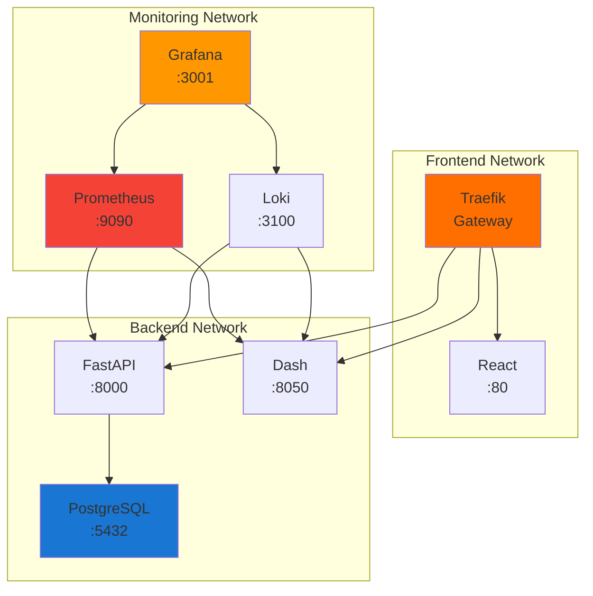

### docker-compose.yml vs docker-compose.dev.yml

Usamos **múltiples archivos de compose** para diferentes entornos:

```bash
# Archivo base (producción)
infrastructure/docker/docker-compose.yml

# Overrides para desarrollo
infrastructure/docker/docker-compose.dev.yml

# Monitoreo separado
infrastructure/docker/docker-compose.monitoring.yml
```

**Ejemplo de override:**

```yaml
# docker-compose.yml (base)
services:
  api:
    build: ./services/api
    environment:
      - DEBUG=false

# docker-compose.dev.yml (override)
services:
  api:
    build:
      context: ./services/api
      dockerfile: Dockerfile.dev
    volumes:
      - ./services/api:/app    # Hot reload
    environment:
      - DEBUG=true             # Override
    ports:
      - "5678:5678"            # Debug port
```

**Usar múltiples archivos:**

```bash
docker compose -f docker-compose.yml -f docker-compose.dev.yml up -d
```

---

## Workflows de Desarrollo

### Workflow 1: Desarrollo Full Docker (Recomendado)

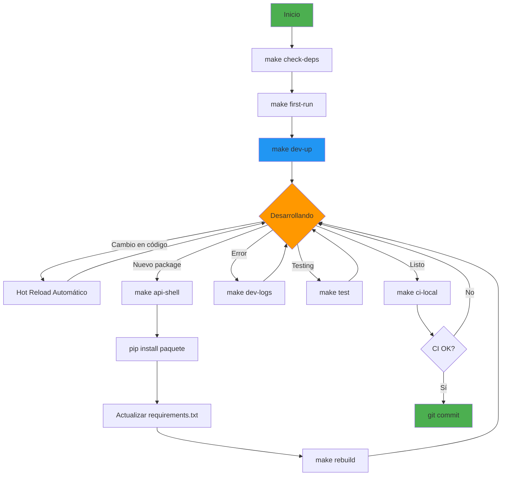

**Comandos paso a paso:**

```bash
# 1. Setup inicial
make first-run

# 2. Levantar servicios
make dev-up

# 3. Ver logs mientras desarrollas
make dev-logs

# 4. Si necesitas instalar dependencia
make api-shell
# Dentro del container:
pip install nuevo-paquete
pip freeze > requirements.txt
exit
# Rebuild
make rebuild

# 5. Testing
make test
make lint

# 6. Antes de commit
make ci-local
```

### Workflow 2: Desarrollo Local (Sin Docker)

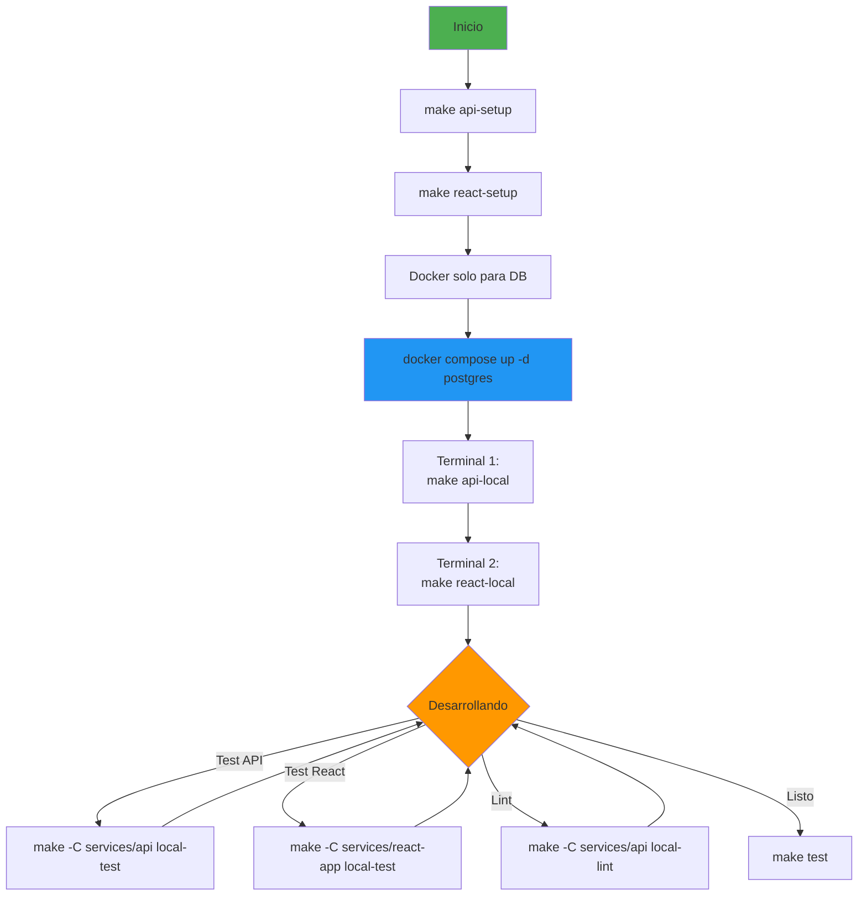

**Comandos:**

```bash
# 1. Setup entornos locales
make api-setup
make react-setup

# 2. Solo DB en Docker
docker compose up -d postgres

# 3. API local (Terminal 1)
cd services/api
source venv/bin/activate
make local-dev

# 4. React local (Terminal 2)
cd services/react-app
make local-dev

# 5. Tests locales
make -C services/api local-test
make -C services/react-app local-test

# 6. Cleanup
make clean-services
```

### Workflow 3: Desarrollo de un Solo Servicio

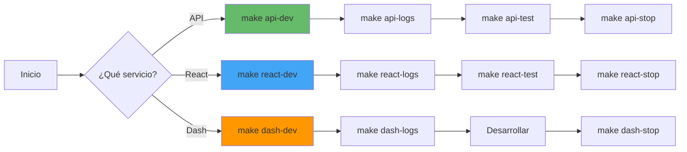

### Workflow 4: Debugging

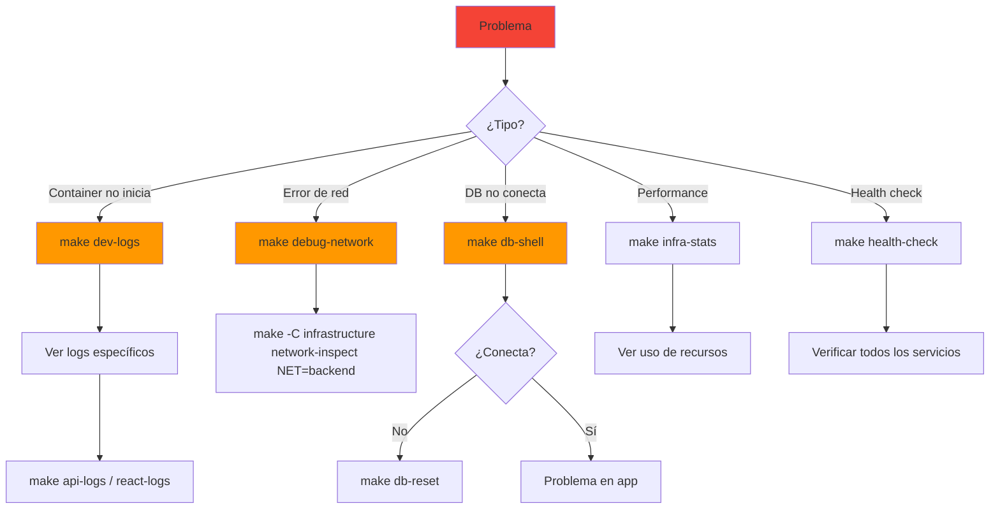

**Comandos de debugging:**

```bash
# Ver todos los logs
make dev-logs

# Logs de servicio específico
make api-logs
make react-logs

# Health check
make health-check
make infra-health

# Networking
make debug-network
make -C infrastructure network-containers

# Inspeccionar container
make api-shell
# Dentro:
env | grep DB_    # Ver variables
ping postgres     # Test conectividad
curl localhost:8000/health  # Test endpoint

# Estadísticas de recursos
make infra-stats

# Ver procesos en containers
docker compose exec api ps aux
```

---

## Troubleshooting

### Problemas Comunes

#### 1. "Port already in use"

```bash
# Ver qué usa el puerto
lsof -i :8000  # Linux/Mac
netstat -ano | findstr :8000  # Windows

# Solución: Cambiar puerto o matar proceso
kill -9 PID
```

#### 2. "Container exited with code 1"

```bash
# Ver logs para entender el error
make dev-logs
make api-logs

# Ver últimos comandos ejecutados
docker compose ps -a

# Rebuild si es problema de dependencias
make rebuild
```

#### 3. "Cannot connect to database"

```bash
# Verificar que postgres está corriendo
docker compose ps | grep postgres

# Ver logs de postgres
docker compose logs postgres

# Resetear DB
make db-reset
```

#### 4. "No space left on device"

```bash
# Limpiar Docker
make clean-all

# Limpieza profunda
docker system prune -af --volumes

# Ver uso de disco
docker system df
```

#### 5. "Changes not reflecting (Hot Reload not working)"

```bash
# Verificar que volumen está montado
docker compose exec api ls -la /app

# Recrear container
make rebuild

# Para modo local, verificar que el watcher está activo
make api-local  # Debe usar --reload
```

### Comandos de Diagnóstico

```bash
# Estado general
make status

# Health check
make health-check

# Ver todas las redes
make debug-network

# Ver todos los volúmenes
make debug-volumes

# Ver variables de entorno
make debug-env

# Estadísticas de recursos
make infra-stats
```

---

## Comandos Avanzados

### Trabajar con Múltiples Archivos Compose

```bash
# Usar base + dev
docker compose -f docker-compose.yml -f docker-compose.dev.yml up -d

# Usar base + monitoring
docker compose -f docker-compose.yml -f docker-compose.monitoring.yml up -d

# Todos juntos
docker compose \
  -f docker-compose.yml \
  -f docker-compose.dev.yml \
  -f docker-compose.monitoring.yml \
  up -d
```

### Escalar Servicios

```bash
# Múltiples instancias de API
docker compose up -d --scale api=3

# Ver instancias
docker compose ps
```

### Ejecutar Tests en Container Temporal

```bash
# Run tests sin afectar servicios corriendo
docker compose run --rm api pytest tests/ -v

# Con coverage
docker compose run --rm api pytest --cov=app tests/
```

### Debugging con Debugger

```bash
# API con debugpy (puerto 5678)
make api-local-debug

# En VS Code, configurar launch.json:
{
  "name": "Python: Remote Attach",
  "type": "python",
  "request": "attach",
  "connect": {
    "host": "localhost",
    "port": 5678
  },
  "pathMappings": [
    {
      "localRoot": "${workspaceFolder}/services/api",
      "remoteRoot": "/app"
    }
  ]
}
```

---

## Mejores Prácticas

### ✅ DO

- Usa `make dev-up` para desarrollo normal
- Ejecuta `make ci-local` antes de cada commit
- Usa `make clean` regularmente para liberar espacio
- Lee los logs cuando algo falla: `make dev-logs`
- Usa `make api-setup` si quieres desarrollo local rápido

### ❌ DON'T

- No modifiques archivos dentro de containers (se perderán)
- No uses `docker compose` directamente; usa los Makefiles
- No hagas `docker system prune -af` sin estar seguro
- No ignores los tests: `make test` debe pasar siempre

---

## Referencias

- [Docker Documentation](https://docs.docker.com/)
- [Docker Compose Documentation](https://docs.docker.com/compose/)
- [Make Documentation](https://www.gnu.org/software/make/manual/)
- [Proyecto en GitHub](#) *(actualizar con tu URL)*

---

## Próximos Pasos

1. **Aprende Docker**: [docker-basics.md](./docker-basics.md)
2. **Aprende Compose**: [docker-compose-guide.md](./docker-compose-guide.md)
3. **Workflows Avanzados**: [development-workflows.md](./development-workflows.md)
4. **Kubernetes**: [kubernetes-guide.md](./kubernetes-guide.md)

---

**Creado por**: Cloud-Native Team
**Última actualización**: 2024
