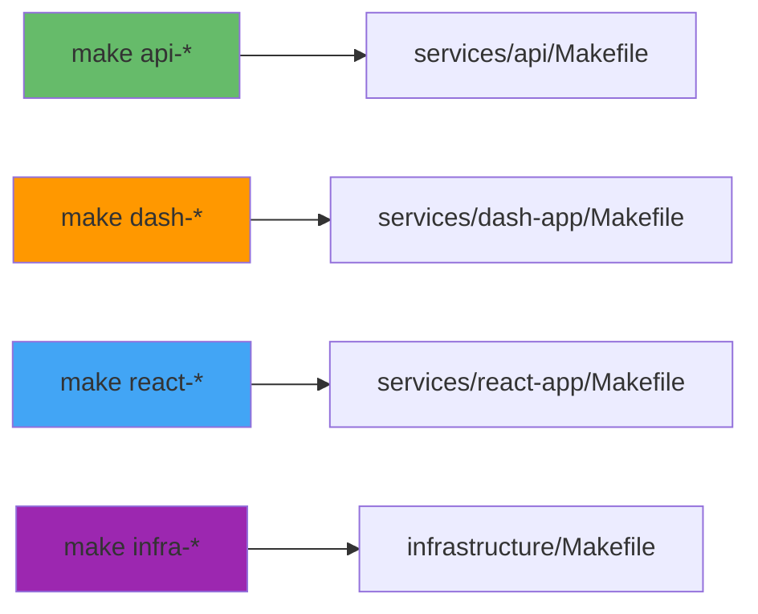
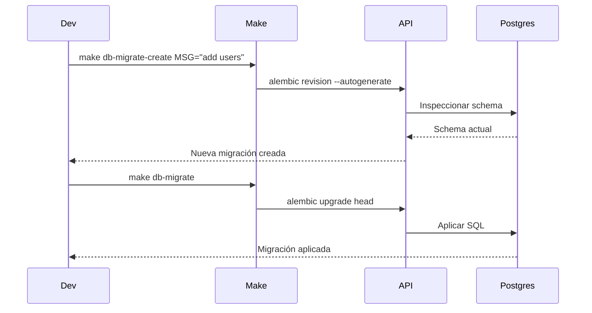
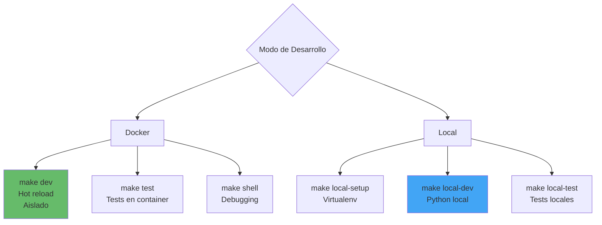
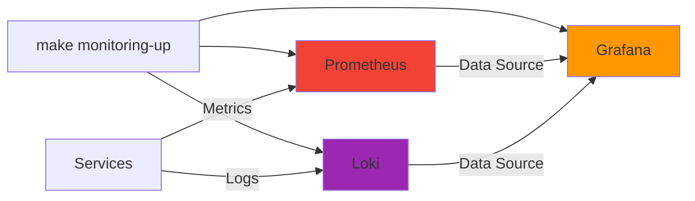

# 📖 Guía Detallada de Makefiles por Servicio

## Índice

1. [Makefile Principal](#makefile-principal)
2. [API Service (FastAPI)](#api-service-fastapi)
3. [Dash Service](#dash-service)
4. [React Service](#react-service)
5. [Infrastructure](#infrastructure)

---

## Makefile Principal

**Ubicación**: `./Makefile`

### Propósito

Orquestador central del proyecto. Delega comandos a Makefiles específicos de servicios.

### Comandos por Categoría

#### 🚀 Desarrollo

| Comando | Descripción | Uso |
|---------|-------------|-----|
| `make dev-up` | Levantar todos los servicios | Inicio de desarrollo |
| `make dev-down` | Detener todos los servicios | Fin de sesión |
| `make dev-restart` | Reiniciar servicios | Aplicar cambios de config |
| `make dev-logs` | Ver logs en tiempo real | Debugging |
| `make dev-status` | Estado de containers | Ver qué está corriendo |
| `make dev-full` | Servicios + monitoreo | Setup completo |

**Ejemplo de flujo:**

```bash
# Día 1 - Primera vez
make check-deps
make first-run
make dev-up

# Día 2+ - Desarrollo normal
make dev-up
make dev-logs  # En otra terminal

# Al terminar
make dev-down
```

#### 🐳 Servicios Individuales



| Prefijo | Ejemplos | Delegado a |
|---------|----------|------------|
| `api-*` | `api-dev`, `api-test`, `api-local` | `services/api/Makefile` |
| `dash-*` | `dash-dev`, `dash-logs` | `services/dash-app/Makefile` |
| `react-*` | `react-dev`, `react-test` | `services/react-app/Makefile` |
| `infra-*` | `infra-health`, `infra-stats` | `infrastructure/Makefile` |

**Ejemplos:**

```bash
# Solo levantar API
make api-dev

# Ver logs de React
make react-logs

# Tests de API
make api-test

# Health check de infraestructura
make infra-health
```

#### 🧪 Testing & Quality

| Comando | Qué hace | Output |
|---------|----------|--------|
| `make test` | Tests de API + React | Reporte de tests |
| `make test-coverage` | Tests con coverage | HTML en `htmlcov/` |
| `make lint` | Linting de todos los servicios | Errores de código |
| `make lint-fix` | Auto-corregir problemas | Código formateado |
| `make format` | Formatear código | Black + Prettier |

**Workflow de calidad:**

```bash
# Antes de commit
make lint           # Verificar
make lint-fix       # Arreglar automático
make test           # Asegurar que pasa
make ci-local       # Simular CI completo
```

#### 🐘 Base de Datos



| Comando | Uso | Notas |
|---------|-----|-------|
| `make db-shell` | Conectar a PostgreSQL | Para queries manuales |
| `make db-migrate` | Aplicar migraciones | Ejecutar cambios pendientes |
| `make db-migrate-create MSG="..."` | Crear migración | Después de cambiar modelos |
| `make db-seed` | Datos de ejemplo | Para desarrollo |
| `make db-backup` | Backup a archivo | Antes de cambios grandes |
| `make db-reset` | Reset COMPLETO | ⚠️ PELIGRO: Borra todo |

**Ejemplo de workflow con migraciones:**

```bash
# 1. Modificas modelo en app/db_models/user.py
# 2. Crear migración
make db-migrate-create MSG="add email to users"

# 3. Revisar migración generada
cat services/api/alembic/versions/XXXX_add_email_to_users.py

# 4. Aplicar migración
make db-migrate

# 5. Verificar
make db-shell
# En psql:
\d users
```

#### 📊 Monitoreo

| Comando | Abre | Puerto |
|---------|------|--------|
| `make monitoring-up` | Prometheus + Grafana + Loki | 9090, 3001, 3100 |
| `make urls` | Ver todas las URLs | - |

#### 🎯 Workflows Completos

| Comando | Cuándo usarlo |
|---------|---------------|
| `make first-run` | Primera vez que clonas el repo |
| `make setup-local-all` | Setup de entornos Python/Node locales |
| `make ci-local` | Antes de hacer commit/push |
| `make clean` | Liberar espacio en disco |
| `make clean-all` | Reset profundo del proyecto |

---

## API Service (FastAPI)

**Ubicación**: `services/api/Makefile`

### Modos de Operación



### Modo Docker

#### Desarrollo

```bash
# Levantar API en Docker
cd services/api
make dev

# Ver logs
make logs

# Shell interactivo
make shell
# Dentro:
python
>>> from app.main import app
>>> app
```

#### Testing

```bash
# Tests completos
make test

# Solo tests unitarios
make test-unit

# Solo integración
make test-integration

# Con coverage
make test-cov
```

#### Database desde API

```bash
# Ejecutar migraciones
make db-migrate

# Crear nueva migración
make db-migrate-create MSG="add users table"

# Ver historial
make db-migrate-history

# Revertir última
make db-migrate-down

# Seed data
make db-seed
```

### Modo Local

#### Setup Inicial

```bash
cd services/api

# Crear virtualenv e instalar deps
make local-setup

# Activar virtualenv (manual)
source venv/bin/activate
```

#### Desarrollo Local

```bash
# Ejecutar servidor local
make local-dev
# API en http://localhost:8000
# Docs en http://localhost:8000/docs

# Con debugger
make local-dev-debug
# Attach debugger en puerto 5678
```

**Ventajas del modo local:**
- ✅ Startup más rápido
- ✅ No necesita rebuild
- ✅ Debugging directo con IDE
- ✅ Menos uso de recursos

**Desventajas:**
- ❌ Necesita Python 3.11+ instalado
- ❌ Dependencias del sistema (si hay)
- ❌ Base de datos sigue en Docker

#### Testing Local

```bash
# Tests locales
make local-test

# Coverage
make local-test-cov

# Watch mode (re-run on changes)
make local-test-watch
```

#### Calidad Local

```bash
# Lint
make local-lint

# Fix automático
make local-lint-fix

# Type checking
make local-type-check
```

### Utilidades API

```bash
# Ver dependencias desactualizadas
make deps-update

# Instalar nueva dependencia
make deps-install PKG=httpx
# Esto instala y actualiza requirements.txt

# Health check
make health          # Via Traefik (http://localhost/api/health)
make health-local    # Directo (http://localhost:8000/health)
```

### Workflow Completo API

**Escenario: Agregar nuevo endpoint**

```bash
# 1. Modo local para desarrollo rápido
cd services/api
source venv/bin/activate
make local-dev

# 2. En otro terminal, tests en watch mode
make local-test-watch

# 3. Desarrollar en app/routers/users.py
# Guardar archivo -> tests se ejecutan automáticamente

# 4. Lint y format
make local-lint-fix

# 5. Coverage final
make local-test-cov

# 6. Probar en Docker (entorno real)
make dev
make test

# 7. CI local
cd ../..  # Volver a root
make ci-local
```

---

## Dash Service

**Ubicación**: `services/dash-app/Makefile`

### Comandos Principales

| Categoría | Comando | Uso |
|-----------|---------|-----|
| **Docker** | `make dev` | Levantar Dash en container |
| | `make logs` | Ver logs |
| | `make shell` | Shell en container |
| **Local** | `make local-setup` | Setup virtualenv |
| | `make local-dev` | Correr local (puerto 8050) |
| | `make local-dev-debug` | Con modo debug |
| **Quality** | `make lint` | Verificar código |
| | `make local-lint-fix` | Arreglar problemas |

### Ejemplo de Uso

```bash
cd services/dash-app

# Primera vez
make local-setup

# Desarrollo
make local-dev
# Dashboard en http://localhost:8050

# En Docker
make dev
# Dashboard en http://localhost/dash
```

---

## React Service

**Ubicación**: `services/react-app/Makefile`

### Modo Docker

```bash
cd services/react-app

# Desarrollo
make dev
# App en http://localhost

# Logs (útil para ver errores de build)
make logs

# Shell
make shell
```

### Modo Local

```bash
# Setup (requiere Node.js 18+)
make local-setup

# Desarrollo local
make local-dev
# App en http://localhost:5173
# Con hot reload

# Desarrollo accesible desde red
make local-dev-host
# Útil para probar en móvil
```

### Testing React

```bash
# Tests (modo run once)
make test

# Tests con UI
make local-test-ui
# Abre interfaz de Vitest

# Watch mode
make local-test-watch

# Coverage
make test-coverage
```

### Build de Producción

```bash
# Build optimizado
make local-build
# Output en dist/

# Preview del build
make local-preview

# Analizar tamaño de bundle
make local-analyze
```

### Calidad

```bash
# Lint TypeScript
make lint

# Fix automático
make lint-fix

# Type checking
make local-type-check

# Formatear con Prettier
make local-format
```

### Gestión de Dependencias

```bash
# Ver deps desactualizadas
make deps-update

# Instalar dependencia de producción
make deps-install PKG=axios

# Instalar dev dependency
make deps-install-dev PKG=@types/node

# Auditar vulnerabilidades
make deps-audit

# Arreglar vulnerabilidades
make deps-audit-fix
```

### Workflow React Completo

**Escenario: Nuevo componente**

```bash
cd services/react-app

# 1. Desarrollo local (más rápido)
make local-dev

# 2. Tests en watch mode (otra terminal)
make local-test-watch

# 3. Crear componente en src/components/UserCard.tsx
# Crear test en src/components/UserCard.test.tsx

# 4. Lint y format
make local-lint-fix
make local-format

# 5. Type checking
make local-type-check

# 6. Build final
make local-build

# 7. Preview
make local-preview

# 8. Tests en Docker (CI)
make test
```

---

## Infrastructure

**Ubicación**: `infrastructure/Makefile`

### Monitoreo



#### Comandos de Monitoreo

```bash
cd infrastructure

# Levantar stack completo
make monitoring-up

# Ver URLs
make monitoring-urls

# Servicios individuales
make prometheus-up
make grafana-up
make loki-up

# Recargar config de Prometheus
make prometheus-reload

# Ver targets de Prometheus
make prometheus-targets

# Query a Prometheus
make query-prom Q="up"

# Query a Loki
make query-loki Q='{job="api"}'

# Resetear password de Grafana
make grafana-reset-password
```

### Docker Management

```bash
# Ver todos los containers
make docker-ps

# Estadísticas de recursos
make docker-stats

# Procesos en containers
make docker-top

# Inspeccionar container
make docker-inspect CONTAINER=api

# Limpieza
make docker-prune           # Básica
make docker-prune-all       # Profunda (⚠️ incluye volúmenes)

# Gestión de imágenes
make docker-images-ls
make docker-images-rm

# Gestión de volúmenes
make docker-volumes-ls
make docker-volumes-rm
```

### Networking

```bash
# Listar redes
make network-ls

# Inspeccionar red
make network-inspect NET=backend

# Ver containers por red
make network-containers

# Test DNS
make network-test-dns

# Ping entre containers
make network-test-ping FROM=api TO=postgres

# Test HTTP interno
make network-curl-test
```

### Health Checks

```bash
# Health check de TODOS los servicios
make health-all

# Salida ejemplo:
# API:        ✅ OK
# Dash:       ✅ OK
# React:      ✅ OK
# Prometheus: ✅ OK
# Grafana:    ✅ OK
# Loki:       ✅ OK

# Health de DB
make health-db
```

### Kubernetes

```bash
# Ver contexto actual
make k8s-context

# Listar contextos
make k8s-contexts

# Cambiar a minikube
make k8s-use-minikube

# Deploy a staging
make k8s-apply-dev

# Deploy a producción
make k8s-apply-prod

# Ver pods
make k8s-pods

# Ver services
make k8s-services

# Logs de pod
make k8s-logs POD=api-deployment-xyz

# Shell en pod
make k8s-shell POD=api-deployment-xyz

# Port forward
make k8s-port-forward-api
make k8s-port-forward-grafana
```

### Debugging Avanzado

```bash
# Ver variables de entorno de container
make debug-env CONTAINER=api

# Uso de disco en containers
make debug-disk

# Puertos mapeados
make debug-ports

# Configuración de Traefik
make debug-traefik

# Buscar errores en logs
make logs-errors

# Buscar patrón en logs
make logs-grep PATTERN="ERROR"

# Logs desde hace 5 minutos
make logs-since TIME="5m"
```

---

## Tips y Trucos

### 1. Desarrollo Híbrido

```bash
# DB y monitoreo en Docker, servicios locales
docker compose up -d postgres
make monitoring-up
make api-local
make react-local
```

### 2. Debugging de Network Issues

```bash
# 1. Ver qué redes existen
make -C infrastructure network-ls

# 2. Ver containers en red backend
make -C infrastructure network-inspect NET=backend

# 3. Test DNS desde API a postgres
docker exec mlp-api-1 nslookup postgres

# 4. Test conectividad
docker exec mlp-api-1 nc -zv postgres 5432
```

### 3. Performance Profiling

```bash
# Ver uso de recursos
make infra-stats

# Top procesos en API
docker exec mlp-api-1 top

# Ver conexiones de red
docker exec mlp-api-1 netstat -tulpn
```

### 4. Hot Reload Issues

```bash
# Si el hot reload no funciona en Docker:

# 1. Verificar volume mount
docker inspect mlp-api-1 | grep Mounts -A 10

# 2. Verificar permisos
make api-shell
ls -la /app

# 3. Forzar recreación
make rebuild
```

---

## Cheat Sheet

```bash
# 🚀 INICIO RÁPIDO
make first-run && make dev-up

# 🔍 VER TODO
make status && make urls

# 🧪 TESTS
make test && make lint

# 🏥 HEALTH
make health-check

# 🧹 LIMPIEZA
make clean

# 📊 MONITOREO
make monitoring-up

# 🐛 DEBUG
make dev-logs
make api-shell
make infra-health

# 🎯 CI LOCAL
make ci-local

# 🌐 LOCAL
make api-local
make react-local
```

---

**Siguiente**: [Development Workflows](./development-workflows.md)
